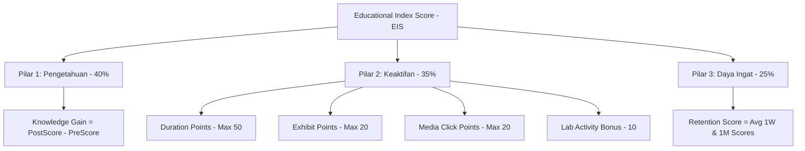

# 🧮 Kalkulator Algoritma EIS (Educational Index Score) — docs/features/01-utilities/05-eis-calculator.md

**Status**: ✅ Selesai | **Priority Order**: #1.5

---

## 📌 Deskripsi Fitur
Fungsi jantung kecerdasan buatan dari platform **EIS Engine** berpusat pada modul **Educational Index Score (EIS)**. EIS dirancang untuk mengevaluasi dampak kognitif belajar secara terukur dari kunjungan pengunjung kebun binatang.

Modul helper `src/utils/eisCalculator.js` berisikan formula matematika deterministik untuk menghitung tiga pilar utama penilaian (Pilar Pengetahuan/Cognitive Gain, Pilar Keaktifan/Engagement, dan Pilar Daya Ingat/Retention), menggabungkannya ke dalam skor akhir (*Final EIS Score*), serta memetakannya ke dalam predikat huruf kelulusan (*Grade*) dan lencana kehormatan digital (*Badge*).

---

## ⚙️ Detail Formula Matematika & Pilar EIS

Kalkulasi EIS disusun dari tiga dimensi penilaian terbobot dengan skala nilai masing-masing **0 - 100**:



### 1. Pilar 1: Peningkatan Pengetahuan (Knowledge Gain Score)
Mengukur selisih nilai kuis pasca-kunjungan (`postZooScore`) dengan kuis pra-kunjungan (`preZooScore`). Sistem menjamin nilai tidak boleh negatif jika terjadi penurunan kognitif pasca-kunjungan.
$$\text{Knowledge Gain Score} = \max(0, \text{postZooScore} - \text{preZooScore})$$

### 2. Pilar 2: Ketertarikan Interaksi (Engagement Score)
Mengukur tingkat keaktifan belajar selama menjelajah kandang satwa fisik, dihitung akumulatif dengan batas maksimal skor 100:
* **Poin Durasi Belajar (Duration Points):** Diperoleh 1 poin untuk setiap kelipatan 5 menit (300 detik) pengunjung berdiam di kandang satwa (Maksimal 50 poin).
  $$\text{Duration Points} = \min\left(50, \left\lfloor \frac{\text{durationSeconds}}{300} \right\rfloor\right)$$
* **Poin Penjelajahan Kandang (Exhibit Points):** Diperoleh 2 poin untuk setiap scan check-in kandang satwa unik (Maksimal 20 poin).
  $$\text{Exhibit Points} = \min(20, \text{exhibitsVisited} \times 2)$$
* **Poin Konsumsi Media (Media Click Points):** Diperoleh 5 poin untuk setiap klik berkas media pembelajaran audio/video/infografis unik (Maksimal 20 poin).
  $$\text{Media Points} = \min(20, \text{mediaClicked} \times 5)$$
* **Bonus Game Simulator (Interactive Lab Bonus):** Mendapatkan tambahan instan 10 poin jika pengunjung mencoba minimal 1 kali game simulasi sains interaktif di kebun binatang.
  $$\text{Lab Bonus} = \begin{cases} 10, & \text{jika mencicipi lab game} \\ 0, & \text{jika tidak} \end{cases}$$
* **Formula Agregasi:**
  $$\text{Engagement Score} = \min(100, \text{Duration Points} + \text{Exhibit Points} + \text{Media Points} + \text{Lab Bonus})$$

### 3. Pilar 3: Daya Ingat Belajar (Retention Score)
Mengukur hasil kuis ingatan berjarak H+7 (`score1w`) dan H+30 (`score1m`) untuk menilai memori jangka pendek dan panjang.
* **Kasus Sempurna (Kedua kuis dikerjakan):**
  $$\text{Retention Score} = \text{round}\left( \frac{\text{score1w} + \text{score1m}}{2} \right)$$
* **Kasus Parsial (Hanya kuis H+7 dikerjakan):**
  $$\text{Retention Score} = \text{round}(\text{score1w} \times 0.5)$$
* **Kasus Nihil (Kuis belum dikerjakan):**
  $$\text{Retention Score} = 0$$

### 4. Skor EIS Akhir (Final EIS Score)
Skor akhir dirumuskan menggunakan pembobotan kontribusi pilar (Pengetahuan 40%, Keaktifan 35%, Daya Ingat 25%), lalu dibulatkan ke bilangan bulat terdekat:
$$\text{Final EIS Score} = \text{round}((\text{Knowledge Gain} \times 0.40) + (\text{Engagement} \times 0.35) + (\text{Retention} \times 0.25))$$

---

## ⚙️ Detail Pemetaan Predikat & Badge (Grade Mapper)

Skor Akhir EIS dikonversikan secara dinamis ke dalam label kelulusan dan lencana kehormatan:

| Rentang Skor Akhir | Predikat (*Grade*) | Lencana Penghargaan (*Badge*) | Deskripsi Kelompok |
| :--- | :---: | :--- | :--- |
| **90 - 100** | **`S`** | **`Naturalis Master`** (Master Naturalist) | Pengunjung super aktif dengan daya kognitif dan ingatan luar biasa. |
| **75 - 89** | **`A`** | **`Penjelajah Konservasi`** (Conservation Explorer) | Pengunjung yang tekun menjelajah kandang dan memahami materi konservasi. |
| **60 - 74** | **`B`** | **`Pengamat Satwa`** (Fauna Observer) | Pengunjung yang cukup aktif berinteraksi dengan media satwa. |
| **45 - 59** | **`C`** | **`Pengunjung Aktif`** (Active Visitor) | Pengunjung umum yang menyukai petualangan dasar. |
| **Kurang dari 45** | **`D`** | **`Penjelajah Pemula`** (Green Novice) | Pengunjung pemula (termasuk default pengunjung baru terdaftar). |

---

## 🛠️ Referensi Implementasi Kode

Seluruh logika matematika didefinisikan bersih dengan pengamanan parameter input (`safe` guard) agar terhindar dari error nilai `NaN` atau `null` pada [eisCalculator.js](file:///home/rafi/Documents/tugas-kuliah/semester4/software%20engginer%20prak/EIS-engine/src/utils/eisCalculator.js):

```javascript
// Guard helper: nilai non-number, null, undefined, atau NaN dianggap 0
const safe = (val) => (typeof val !== 'number' || isNaN(val) ? 0 : val);

export const calculateKnowledgeGain = (preScore, postScore) => {
  const _pre = safe(preScore);
  const _post = safe(postScore);
  const gain = _post - _pre;
  return gain > 0 ? gain : 0;
};

export const calculateEngagementScore = (durationSeconds, exhibitsVisited, mediaClicked, hasLabActivity) => {
  const _duration = safe(durationSeconds);
  const _exhibits = safe(exhibitsVisited);
  const _media = safe(mediaClicked);
  const durationPoints = Math.min(50, Math.floor(_duration / 300));
  const exhibitPoints = Math.min(20, _exhibits * 2);
  const mediaPoints = Math.min(20, _media * 5);
  const labBonus = hasLabActivity ? 10 : 0;

  return Math.min(100, durationPoints + exhibitPoints + mediaPoints + labBonus);
};

export const calculateRetentionScore = (score1w, score1m) => {
  const has1w = score1w !== null && score1w !== undefined;
  const has1m = score1m !== null && score1m !== undefined;

  if (has1w && has1m) {
    return Math.round((safe(score1w) + safe(score1m)) / 2);
  }

  if (has1w) {
    return Math.round(safe(score1w) * 0.5);
  }

  return 0;
};

export const calculateFinalEis = (knowledgeGain, engagement, retention) => {
  const _kg = safe(knowledgeGain);
  const _eng = safe(engagement);
  const _ret = safe(retention);
  const final = (_kg * 0.40) + (_eng * 0.35) + (_ret * 0.25);
  return Math.round(final);
};

export const assignGrade = (finalScore) => {
  const _score = safe(finalScore);
  if (_score >= 90) return { grade: 'S', badge: 'Naturalis Master' };
  if (_score >= 75) return { grade: 'A', badge: 'Penjelajah Konservasi' };
  if (_score >= 60) return { grade: 'B', badge: 'Pengamat Satwa' };
  if (_score >= 45) return { grade: 'C', badge: 'Pengunjung Aktif' };
  return { grade: 'D', badge: 'Penjelajah Pemula' };
};
```

---

## 🏆 Aturan Bisnis (Business Rules)

1. **Keamanan Masukan Tipe Data (Safe Data Type Guard):**
   Mengingat nilai-nilai dari database seperti `durationSeconds` atau kuis retensi H+30 bernilai opsional (*nullable*), fungsi `safe` membungkus setiap operasi kueri. Jika parameter dikirimkan bernilai `null` atau `undefined`, sistem mengonversinya menjadi angka `0` agar operasi perkalian dan pembagian matematika terhindar dari hasil `NaN` yang merusak database.
2. **Keadilan Skor Pengetahuan (Knowledge Gain Bottom Limit):**
   Apabila seorang pengunjung mengalami nasib buruk di mana nilai kuis pasca-kunjungan lebih rendah dibanding kuis pra-kunjungan (misal pra = 80, pasca = 40), selisih nilai tidak boleh bernilai negatif (`-40`). Fungsi `calculateKnowledgeGain` secara otomatis membatasi nilai terendah adalah **`0`** agar tidak mengurangi skor EIS di pilar keaktifan lainnya.
3. **Penyusutan Nilai Retensi Parsial (Partial Retention Decay):**
   Untuk menghargai ingatan jangka pendek meskipun pengunjung belum sempat/lupa mengerjakan kuis H+30, kuis H+7 yang dikerjakan tetap menyumbang poin sebesar **50% dari nilai aslinya**.
