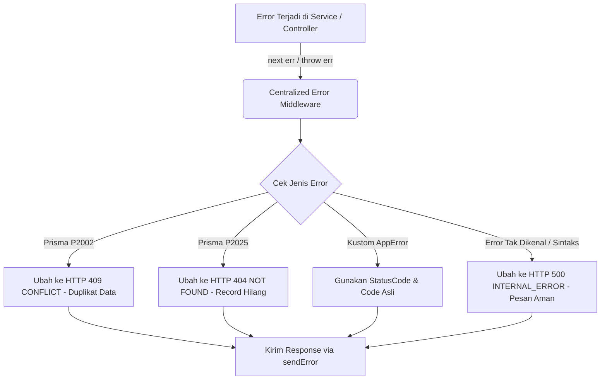

# 🛡️ Middleware Penanganan Error Terpusat — docs/features/01-utilities/07-error-middleware.md

**Status**: ✅ Selesai | **Priority Order**: #1.7

---

## 📌 Deskripsi Fitur
Dalam pengembangan web application berskala besar, kebocoran detail kesalahan internal server (*raw stack trace* / detail error query database SQL) kepada client sangat berbahaya karena dapat dieksploitasi oleh penyerang (*attacker*) untuk memetakan kelemahan sistem.

Platform **EIS Engine** menerapkan arsitektur **Centralized Error Handler Middleware** di berkas `src/middleware/error.middleware.js`. Middleware ini bertindak sebagai jaring pengaman global paling bawah di Express yang bertugas menyaring seluruh kegagalan dari layer controller, menangkap error spesifik basis data **Prisma**, merapikan pesan log, dan mengembalikan respon kegagalan JSON yang seragam, bersih, dan aman.

---

## 🔄 Alur Penangkapan Error Terpusat

Berikut adalah diagram alur bagaimana error ditangkap dan disaring sebelum diserahkan ke client:



---

## 🛠️ Referensi Implementasi Kode

Komponen penanganan error terpusat diimplementasikan secara kokoh pada [error.middleware.js](file:///home/rafi/Documents/tugas-kuliah/semester4/software%20engginer%20prak/EIS-engine/src/middleware/error.middleware.js):

```javascript
import { sendError } from '../utils/response.js';

export const errorHandler = (err, req, res, next) => {
  let { statusCode, code, message } = err;

  // 1. Tangkap Error Bawaan Prisma
  if (err.name === 'PrismaClientKnownRequestError') {
    if (err.code === 'P2002') {
      statusCode = 409;
      code = 'CONFLICT';
      message = 'Data yang anda masukkan telah ada di database (Duplikat).';
    } else if (err.code === 'P2025') {
      statusCode = 404;
      code = 'NOT_FOUND';
      message = 'Record data tidak ditemukan di database.';
    }
  }

  // 2. Jika error bukan instansiasi AppError kustom (e.g., error library/sintaks)
  if (!statusCode) {
    statusCode = 500;
    code = 'INTERNAL_ERROR';
    message = 'Terjadi kesalahan sistem di server.';
    // Log SEMUA error mentah ke console agar mempermudah debug pengembang
    console.error(`[ERROR HANDLER] ${err.name}: ${err.message}`);
  }

  // 3. Tampilkan stack trace di terminal pengembang jika variabel NODE_ENV = development
  if (process.env.NODE_ENV === 'development') {
    console.error(`[ERROR] ${code}: ${message}`, err.stack);
  }

  return sendError(res, statusCode, code, message);
};
```

---

## 🏆 Aturan Bisnis (Business Rules)

1. **Penerjemahan Kode Unik Basis Data (Database Constraints Mapper):**
   Middleware secara otomatis memindai error basis data ORM Prisma:
   * **`P2002` (Unique constraint failed):** Diterjemahkan secara ramah menjadi status HTTP 409 `CONFLICT` dengan pesan *"Data yang anda masukkan telah ada di database (Duplikat)"* (misalnya saat mendaftarkan email yang sama berulang kali).
   * **`P2025` (Record to update/delete not found):** Diterjemahkan menjadi HTTP 404 `NOT_FOUND`.
2. **Pencegahan Kebocoran Stack Trace (Raw Error Masking Policy):**
   Jika terjadi kesalahan tak terduga (*unexpected errors*) seperti error parsing JSON, sintaks variabel salah, atau koneksi basis data terputus (yang tidak dibungkus `AppError`), middleware secara ketat menyamarkan pesan aslinya dan mengembalikan format universal HTTP 500 `INTERNAL_ERROR` dengan pesan *"Terjadi kesalahan sistem di server"*. Detail *stack trace* asli hanya dicetak ke dalam log konsol server untuk kebutuhan pelacakan perbaikan pengembang.
3. **Penyelarasan Pengujian Lingkungan (Environment-Aware Logging):**
   Jika environment `NODE_ENV` bernilai `'development'`, logs mencetak detil `err.stack` secara lengkap ke terminal untuk mempercepat deteksi letak baris kode yang rusak selama proses pengujian unit test.
