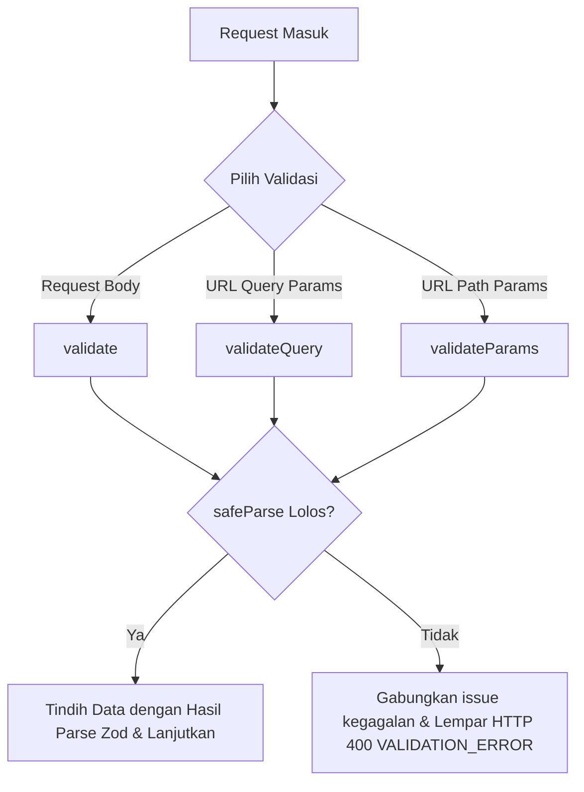

# 🎛️ Middleware Validasi Masukan Skema (Zod) — docs/features/01-utilities/08-validate-middleware.md

**Status**: ✅ Selesai | **Priority Order**: #1.8

---

## 📌 Deskripsi Fitur
Sebelum parameter masukan diolah oleh layer Service atau kueri database SQL dieksekusi, backend wajib menyaring integritas data kiriman client. Ini dilakukan untuk menghindari injeksi karakter berbahaya (*SQL Injection*), tipe data yang tidak cocok, maupun absennya kolom-kolom wajib.

Platform **EIS Engine** menyediakan tiga buah middleware validasi terpusat memanfaatkan pustaka skema **Zod** di dalam file `src/middleware/validate.middleware.js`:
1. **`validate`:** Untuk menyaring request body (`req.body`).
2. **`validateQuery`:** Untuk menyaring kueri URL parameter (`req.query`).
3. **`validateParams`:** Untuk menyaring variabel parameter path URL (`req.params`).

Setiap kegagalan validasi secara otomatis dihentikan di gerbang terluar Express dan dilemparkan ke Central Error Handler.

---

## ⚙️ Rincian Tiga Pilar Validasi Middleware



### 1. Validasi Body Request (`validate(schema)`)
Digunakan pada request `POST` / `PUT` / `PATCH` untuk memeriksa isi formulir data.

### 2. Validasi Query Parameter (`validateQuery(schema)`)
Digunakan pada request `GET` untuk menyaring filter pencarian pencarian URL (seperti rentang tanggal, pencarian nama zona, status keaktifan).

### 3. Validasi Parameter Path (`validateParams(schema)`)
Digunakan untuk menyaring kecocokan variabel dinamis path URL (seperti `:user_id`, `:session_id`, `:exhibit_id`) agar terhindar dari tipe data non-integer.

---

## 🛠️ Referensi Implementasi Kode

Komponen validasi skema diimplementasikan secara taktis pada [validate.middleware.js](file:///home/rafi/Documents/tugas-kuliah/semester4/software%20engginer%20prak/EIS-engine/src/middleware/validate.middleware.js):

```javascript
import { AppError } from '../utils/response.js'

export const validate = (schema) => (req, res, next) => {
  const result = schema.safeParse(req.body)
  if (!result.success) {
    const messages = result.error.issues
      .map((e) => `${e.path.join('.')}: ${e.message}`)
      .join(', ')
    return next(new AppError(400, 'VALIDATION_ERROR', messages))
  }
  req.body = result.data
  next()
}

export const validateQuery = (schema) => (req, res, next) => {
  const result = schema.safeParse(req.query)
  if (!result.success) {
    const messages = result.error.issues
      .map((e) => `${e.path.join('.')}: ${e.message}`)
      .join(', ')
    return next(new AppError(400, 'VALIDATION_ERROR', messages))
  }
  // Express 5 req.query adalah read-only getter — tidak bisa di-assign langsung
  // Gunakan Object.defineProperty untuk override hasil penyaringan Zod secara aman
  Object.defineProperty(req, 'query', {
    value: result.data,
    writable: true,
    configurable: true,
  })
  next()
}

export const validateParams = (schema) => (req, res, next) => {
  const result = schema.safeParse(req.params)
  if (!result.success) {
    const messages = result.error.issues
      .map((e) => `${e.path.join('.')}: ${e.message}`)
      .join(', ')
    return next(new AppError(400, 'VALIDATION_ERROR', messages))
  }
  req.params = result.data
  next()
}
```

---

## 🏆 Aturan Bisnis (Business Rules)

1. **Penyeragaman Detil Kegagalan (Aggregated Validation Errors):**
   Apabila terjadi kesalahan pengisian data pada beberapa kolom sekaligus (misalnya `name` kosong dan `email` tidak valid secara bersamaan), middleware mengagregasikan seluruh pesan kesalahan Zod menjadi satu string terpisah koma (misal: `"name: Nama wajib diisi, email: Format email tidak valid"`) sebelum melemparkan kegagalan HTTP 400 `VALIDATION_ERROR`.
2. **Standardisasi Tipe Data Bersih (Parse-and-Mutate Policy):**
   Middleware tidak sekadar memeriksa kebenaran data saja, melainkan juga menimpa data asli (`req.body`, `req.params`, `req.query`) dengan hasil parsing sukses Zod (`result.data`). Ini memastikan tipe data masukan yang sudah di-preprocess atau diubah tipenya oleh Zod (seperti string `"true"` menjadi boolean `true`, atau string ID `"3"` menjadi integer `3`) sudah dalam keadaan tipe data native yang bersih saat diterima di layer Controller.
3. **Penyelarasan Express 5 Read-Only Query Getter (Object Property Override):**
   Pada framework Express 5 ke atas, properti `req.query` disematkan sebagai properti *read-only getter* bawaan engine. Middleware `validateQuery` secara cerdas mensiasati batasan ini dengan mendefinisikan ulang properti menggunakan `Object.defineProperty` agar data query terfilter Zod tetap dapat diinjeksikan lancar tanpa memicu crash sistem *read-only violation*.
