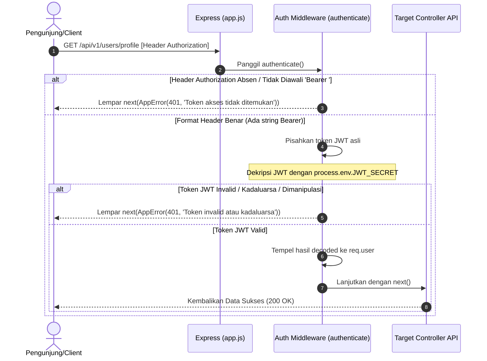

# 🔐 Autentikasi Pengunjung JWT Bearer — docs/features/02-auth-middleware/01-authenticate.md

**Status**: ✅ Selesai | **Priority Order**: #2.1

---

## 📌 Deskripsi Fitur
Mayoritas API fungsionalitas di **EIS Engine** bersifat pribadi bagi pengunjung (seperti melakukan check-in kandang satwa, merekam logs simulator sains, melihat riwayat sesi kunjungan, serta melihat data analitik EIS personal). Untuk mengamankan endpoint-endpoint ini dari akses ilegal tanpa melumpuhkan kecepatan performa server, sistem menerapkan arsitektur otentikasi token JWT.

Middleware `authenticate` di berkas `src/middleware/auth.middleware.js` bertugas memeriksa keabsahan **Bearer JWT Token** yang dikirimkan oleh client pada Header HTTP Request. Jika token lolos verifikasi, sistem mengizinkan client mengakses endpoint terkait.

---

## ⚙️ Rincian Protokol Token Keamanan

Pengunjung wajib menyertakan token otentikasi pada setiap HTTP request menuju endpoint yang dilindungi:

* **Header Key:** `Authorization`
* **Format Value:** `Bearer <JWT_TOKEN>`
* **Prosedur Validasi:**
  1. Memeriksa keberadaan header `Authorization`.
  2. Memeriksa kecocokan awalan format string `Bearer `.
  3. Melakukan pemisahan (*splitting*) string untuk mengambil kode token JWT asli.
  4. Mendekripsi token menggunakan algoritma verifikasi tanda tangan kunci rahasia `process.env.JWT_SECRET`.
  5. Menempelkan data terdekripsi pengunjung (`userId`, `ageCategory`, `role`) ke dalam objek request `req.user`.

---

## 🔄 Diagram Alur Proses (Sequence Diagram)

Berikut adalah visualisasi alur verifikasi Bearer JWT Token:



---

## 🛠️ Referensi Implementasi Kode

Komponen otentikasi JWT diimplementasikan secara taktis pada [auth.middleware.js](file:///home/rafi/Documents/tugas-kuliah/semester4/software%20engginer%20prak/EIS-engine/src/middleware/auth.middleware.js):

```javascript
import jwt from 'jsonwebtoken';
import { AppError } from '../utils/response.js';

export const authenticate = (req, res, next) => {
  const authHeader = req.headers.authorization;
  if (!authHeader || !authHeader.startsWith('Bearer ')) {
    return next(new AppError(401, 'UNAUTHORIZED', 'Token akses tidak ditemukan'));
  }
  
  const token = authHeader.split(' ')[1];
  try {
    const decoded = jwt.verify(token, process.env.JWT_SECRET);
    req.user = decoded; // tempel object decoded ke request object
    next();
  } catch (error) {
    next(new AppError(401, 'UNAUTHORIZED', 'Token invalid atau kadaluarsa'));
  }
};
```

---

## 🏆 Aturan Bisnis (Business Rules)

1. **Penempelan Identitas Pengunjung (User Request Context Injection):**
   Setelah token JWT didekripsi secara sukses oleh middleware, isi payload JWT kustom (seperti `userId` pengunjung, kategori usia pembelajaran `ageCategory`, dan tingkat wewenang `role`) disuntikkan secara dinamis ke dalam objek request internal server (`req.user = decoded`). Ini membebaskan layer Controller berikutnya dari beban melakukan kueri pencarian database ulang untuk sekadar mengetahui siapa pengunjung yang menembak API.
2. **Standardisasi Pesan Penolakan (Secure Unauthorized Messages):**
   Demi mengaburkan taktik pemindaian celah keamanan oleh peretas, pesan kegagalan otentikasi diatur seragam:
   * Jika token absen: *"Token akses tidak ditemukan"*.
   * Jika token dimanipulasi / kadaluarsa: *"Token invalid atau kadaluarsa"*.
   Semua ditolak menggunakan status kode HTTP 401 `UNAUTHORIZED`.
