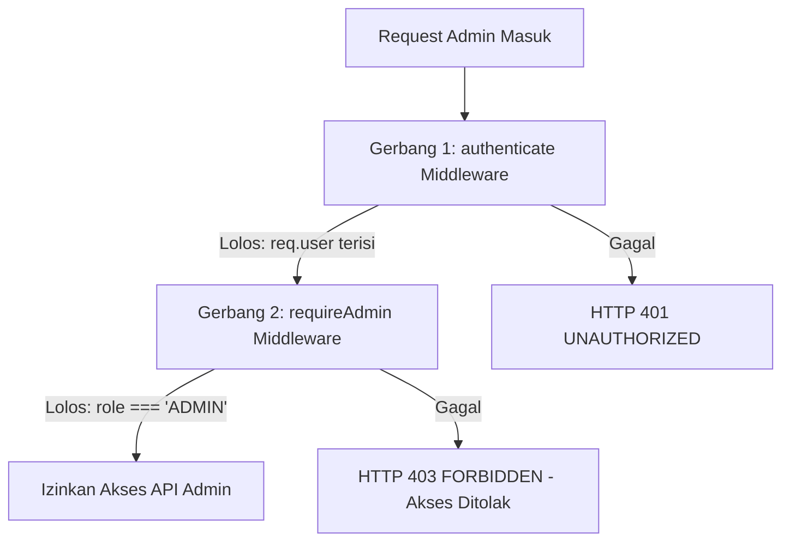

# 🛡️ Otorisasi Level Administrator — docs/features/02-auth-middleware/02-require-admin.md

**Status**: ✅ Selesai | **Priority Order**: #2.2

---

## 📌 Deskripsi Fitur
Beberapa endpoint di **EIS Engine** bersifat sangat sensitif karena menyangkut data kurikulum utama kebun binatang (seperti mendaftarkan kandang baru, menambah konten teks adaptif, merilis berkas video/audio pembelajaran satwa, mendaftarkan lembar kuis baru, hingga melihat panel visualisasi dashboard analitik bisnis massal).

Untuk memagari endpoint administrator ini dari penyalahgunaan wewenang oleh pengunjung biasa (`VISITOR`), backend menerapkan middleware pertahanan lapis kedua bernama `requireAdmin` di berkas `src/middleware/adminAuth.middleware.js`.

---

## ⚙️ Rincian Protokol Pengamanan Berlapis

Endpoint administratif diatur agar melewati gerbang otentikasi ganda secara berurutan:



1. **Lapis 1 (Token Pemeriksaan):** `authenticate` memastikan pengunjung adalah pengguna terdaftar yang membawa token JWT sah.
2. **Lapis 2 (Wewenang Pemeriksaan):** `requireAdmin` memindai kolom payload `req.user.role`.
   * Jika wewenang bernilai tepat **`ADMIN`**, request dilanjutkan ke Controller.
   * Jika wewenang bernilai selain itu (seperti `VISITOR`), request langsung dipotong dan dihadang menggunakan HTTP 403 `FORBIDDEN`.

---

## 🛠️ Referensi Implementasi Kode

Komponen otorisasi wewenang diimplementasikan secara ringkas pada [adminAuth.middleware.js](file:///home/rafi/Documents/tugas-kuliah/semester4/software%20engginer%20prak/EIS-engine/src/middleware/adminAuth.middleware.js):

```javascript
import { AppError } from '../utils/response.js';

export const requireAdmin = (req, res, next) => {
  if (!req.user || req.user.role !== 'ADMIN') {
    return next(new AppError(403, 'FORBIDDEN', 'Akses ditolak. Memerlukan otorisasi level admin.'));
  }
  next();
};
```

---

## 🏆 Aturan Bisnis (Business Rules)

1. **Ketergantungan Konteks Pengguna (User Context Dependency):**
   Middleware `requireAdmin` wajib diletakkan **di bawah** (setelah) pemanggilan middleware `authenticate` pada urutan router Express. Peletakan terbalik akan memicu crash server karena objek `req.user` belum didefinisikan oleh JWT verifier.
2. **Standardisasi Pesan Penghadangan (Secure Forbidden Message):**
   Apabila akun berwewenang rendah (`role = 'VISITOR'`) memaksa masuk ke panel admin, sistem secara aman menghentikan tindakan dengan HTTP 403 `FORBIDDEN` membawa pesan *"Akses ditolak. Memerlukan otorisasi level admin."* demi menjaga keamanan siber.
