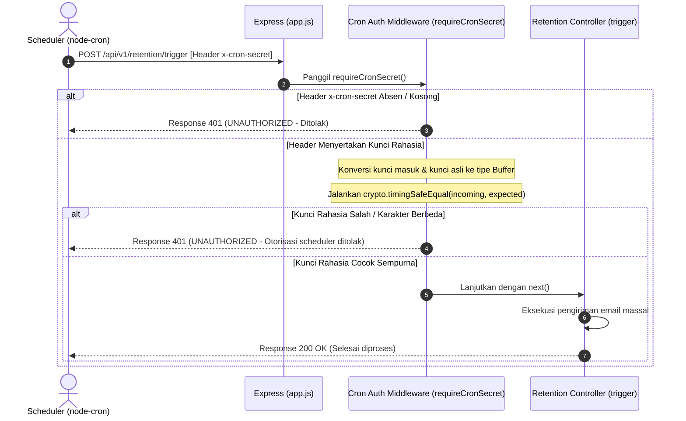

# 🕒 Proteksi Otomasi Cron (Header Secret) — docs/features/02-auth-middleware/03-require-cron-secret.md

**Status**: ✅ Selesai | **Priority Order**: #2.3

---

## 📌 Deskripsi Fitur
Sistem pengiriman email kuis retensi ingatan jangka panjang dipicu secara berkala setiap hari oleh trigger eksternal scheduler (`node-cron`). Agar endpoint pemicu email kuis massal (`POST /api/v1/retention/trigger`) tidak disalahgunakan atau ditembak berkali-kali secara jahat oleh pihak asing (yang dapat mengakibatkan pembengkakan kuota kirim email SMTP kebun binatang serta merusak kenyamanan email pengunjung), endpoint ini dipagari secara khusus.

Middleware `requireCronSecret` di berkas `src/middleware/cronAuth.middleware.js` bertugas memastikan request trigger otomatis membawa kunci rahasia token khusus pada header. Middleware ini menerapkan pencocokan kunci yang aman dari serangan analisis waktu pemrosesan CPU (*timing attacks*).

---

## ⚙️ Rincian Protokol Pengamanan Scheduler

Trigger scheduler wajib menyertakan kunci otorisasi pada header HTTP Request:

* **Header Key:** `x-cron-secret`
* **Format Value:** String Kunci Rahasia Khusus (yang disesuaikan dengan nilai `CRON_SECRET_KEY` pada variabel lingkungan `.env`).
* **Metode Komparasi Aman:** Memanfaatkan pustaka internal NodeJS **`crypto.timingSafeEqual`** untuk menghentikan serangan intelijen pengukuran latensi waktu respon CPU (*timing attacks*).

---

## 🔄 Diagram Alur Proses (Sequence Diagram)

Berikut adalah visualisasi alur verifikasi Header Cron Secret:



---

## 🛠️ Referensi Implementasi Kode

Komponen pengamanan scheduler diimplementasikan secara kokoh menggunakan enkripsi aman pada [cronAuth.middleware.js](file:///home/rafi/Documents/tugas-kuliah/semester4/software%20engginer%20prak/EIS-engine/src/middleware/cronAuth.middleware.js):

```javascript
import crypto from 'crypto';
import { AppError } from '../utils/response.js';

export const requireCronSecret = (req, res, next) => {
  const secret = req.headers['x-cron-secret'];
  const expected = process.env.CRON_SECRET_KEY || '';

  // Gunakan timingSafeEqual untuk mencegah timing attack
  const incoming = Buffer.from(secret || '');
  const expectedBuf = Buffer.from(expected);

  if (
    incoming.length !== expectedBuf.length ||
    !crypto.timingSafeEqual(incoming, expectedBuf)
  ) {
    return next(new AppError(401, 'UNAUTHORIZED', 'Otorisasi scheduler ditolak'));
  }
  next();
};
```

---

## 🏆 Aturan Bisnis (Business Rules)

1. **Pertahanan Serangan Waktu Komparasi (Timing Attack Prevention):**
   Membandingkan kunci rahasia menggunakan operator kesamaan standar JavaScript (seperti `secret === expected`) sangat berisiko. Operator tersebut langsung berhenti membandingkan pada karakter salah pertama (*early exit*), yang memungkinkan penetas (*hacker*) mengukur latensi milidetik CPU untuk menebak kunci rahasia karakter demi karakter. Penggunaan **`crypto.timingSafeEqual`** menjamin waktu pemrosesan komparasi CPU selalu konstan secara konstan berapa pun jumlah karakter yang cocok, menutup celah keamanan ini secara mutlak.
2. **Pengecualian Proteksi Autentikasi Pengunjung (Visitor Auth Bypass):**
   Endpoint trigger cron tidak membutuhkan dan tidak dipengaruhi oleh otentikasi pengunjung biasa (`authenticate` JWT). Ini diatur agar scheduler cron dapat menembak API secara independen kapan pun saat tengah malam tanpa membutuhkan token akun manusia yang aktif. Pelanggaran kunci langsung ditolak menggunakan HTTP 401 `UNAUTHORIZED` membawa pesan *"Otorisasi scheduler ditolak"*.
