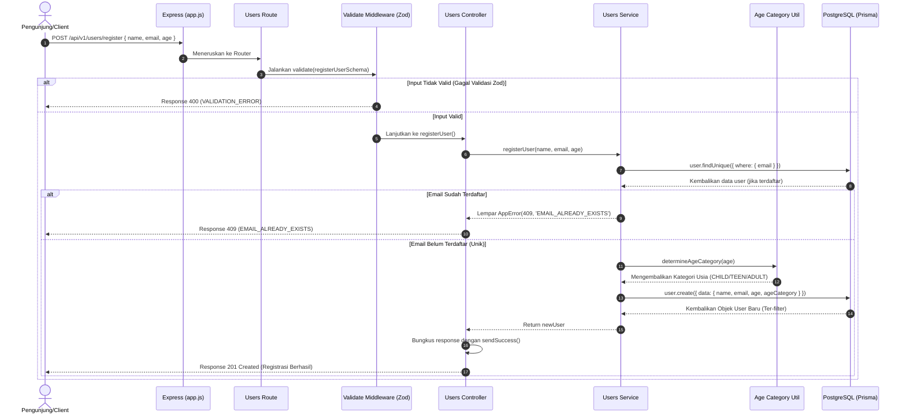

# 🔐 Registrasi User Baru — POST /api/v1/users/register

**Status**: ✅ Selesai | **Priority Order**: #3.1

---

## 📌 Deskripsi Fitur
Endpoint ini berfungsi sebagai gerbang masuk pertama (registrasi) bagi pengunjung baru aplikasi **Zoo Companion App (EIS Engine)**. Melalui endpoint ini, sistem akan mencatat identitas dasar pengunjung seperti nama, email, dan usia.

Sistem secara otomatis akan mengklasifikasikan kategori usia pengunjung (`AgeCategory`) untuk menyajikan konten edukasi yang sesuai dengan tingkat kognitif mereka selama kunjungan ke kebun binatang.

---

## ⚙️ Detail Endpoint

| Komponen | Spesifikasi |
| :--- | :--- |
| **HTTP Method** | `POST` |
| **URL Path** | `/api/v1/users/register` |
| **Autentikasi** | ☐ Public (Tidak memerlukan JWT Token) |
| **Headers** | `Content-Type: application/json` |

---

## 🗂️ Skema Validasi Request (Zod)

Sistem menggunakan pustaka **Zod** untuk menapis input sebelum diproses di layer logika bisnis. Skema validasi didefinisikan pada `src/validators/users.validator.js` dalam bentuk `registerUserSchema`:

```javascript
export const registerUserSchema = z.object({
  name: z.string().min(1, 'Nama wajib diisi').max(100, 'Nama maksimal 100 karakter'),
  email: z.string().email('Format email tidak valid'),
  age: z
    .number({ invalid_type_error: 'Usia harus berupa angka' })
    .int('Usia harus berupa bilangan bulat')
    .min(5, 'Usia minimal 5 tahun')
    .max(120, 'Usia maksimal 120 tahun'),
});
```

### Format Payload Request (JSON)
```json
{
  "name": "Budi Santoso",
  "email": "budisantoso@example.com",
  "age": 25
}
```

### Rincian Aturan Validasi Field
1. **`name`** (String, Required):
   - Tidak boleh kosong (minimal 1 karakter).
   - Maksimal 100 karakter untuk mencegah input spamming atau buffer overflow di tingkat visual.
2. **`email`** (String, Required):
   - Harus memiliki format email yang valid (contoh: mengandung karakter `@` dan domain yang absah).
3. **`age`** (Integer, Required):
   - Harus bertipe angka (number) bulat (int).
   - Batas usia minimal: **5 tahun** (usia kognitif paling rendah yang didukung untuk kuis edukasi).
   - Batas usia maksimal: **120 tahun**.

---

## 🔄 Diagram Alur Proses (Sequence Diagram)

Berikut adalah visualisasi alur pemrosesan request registrasi mulai dari Client hingga data tersimpan di PostgreSQL (Supabase) dan dikembalikan ke Client:



---

## 💾 Konteks Skema Database (Prisma)

Data pengunjung disimpan ke dalam tabel `users` (diwakili oleh model `User` pada berkas `prisma/schema.prisma`). Potongan skema yang relevan adalah sebagai berikut:

```prisma
enum AgeCategory {
  CHILD   // Usia 5–11 tahun
  TEEN    // Usia 12–17 tahun
  ADULT   // Usia 18 tahun ke atas
}

enum UserRole {
  VISITOR
  ADMIN
}

model User {
  id           Int          @id @default(autoincrement())
  name         String       @db.VarChar(100)
  email        String       @unique @db.VarChar(150)
  age          Int
  ageCategory  AgeCategory  @map("age_category") // Enum CHILD, TEEN, ADULT
  role         UserRole     @default(VISITOR)
  registeredAt DateTime     @default(now()) @map("registered_at")
  updatedAt    DateTime     @updatedAt @map("updated_at")

  // OTP fields (Nullable karena hanya terisi saat request masuk)
  otpCode      String?      @map("otp_code")
  otpExpiresAt DateTime?    @map("otp_expires_at")

  @@map("users")
}
```

---

## 🏆 Aturan Bisnis (Business Rules)

1. **Keunikan Email Global:** 
   Satu email hanya boleh digunakan oleh satu akun saja di seluruh sistem. Pendaftaran ulang menggunakan email yang sama akan memicu error konflik HTTP 409.
2. **Kalkulasi Kategori Usia Otomatis:**
   Sistem tidak mengandalkan client untuk menentukan kategori usia, melainkan dihitung langsung di backend menggunakan logika terpusat pada `src/utils/ageCategory.js`:
   * `CHILD` (Anak-anak) : **5 s.d. 11 tahun**
   * `TEEN` (Remaja)    : **12 s.d. 17 tahun**
   * `ADULT` (Dewasa)    : **18 tahun ke atas**
3. **Default Peran Pengguna (Default Role):**
   Setiap pendaftaran baru melalui endpoint publik ini akan selalu mendapatkan peran sebagai **`VISITOR`** secara otomatis (didefinisikan pada tingkat database).
4. **Penyaringan Data Sensitif (Data Sanitization):**
   Response yang dikirimkan ke client **wajib dibersihkan** dari field-field sensitif internal seperti `otpCode` dan `otpExpiresAt` menggunakan filter eksplisit `select` di tingkat ORM Prisma.

---

## 📥 Format Response Sukses (201 Created)

Bila registrasi sukses, sistem akan merespon dengan status **`201 Created`** dan mengembalikan payload JSON ter-sanitasi yang dibungkus oleh utilitas `sendSuccess()`:

```json
{
  "success": true,
  "message": "Registrasi berhasil",
  "data": {
    "id": 1,
    "name": "Budi Santoso",
    "email": "budisantoso@example.com",
    "age": 25,
    "ageCategory": "ADULT",
    "registeredAt": "2026-05-30T11:52:00.000Z"
  }
}
```

---

## ⚠️ Penanganan Error & Pengecualian

Format response error yang dibungkus oleh utilitas `sendError()` adalah sebagai berikut:

### 1. HTTP 400 Bad Request — `VALIDATION_ERROR`
Terjadi jika payload yang dikirimkan oleh client tidak lulus uji validasi Zod (misal usia kurang dari 5 tahun).
```json
{
  "success": false,
  "code": "VALIDATION_ERROR",
  "message": "Usia minimal 5 tahun"
}
```

### 2. HTTP 409 Conflict — `EMAIL_ALREADY_EXISTS`
Terjadi jika email yang didaftarkan sudah ada di dalam tabel `users`.
```json
{
  "success": false,
  "code": "EMAIL_ALREADY_EXISTS",
  "message": "Email ini telah terdaftar di sistem"
}
```

### 3. HTTP 500 Internal Server Error — `INTERNAL_ERROR`
Terjadi jika ada kesalahan sistem yang tidak tertangani secara spesifik (misal kegagalan koneksi database).
```json
{
  "success": false,
  "code": "INTERNAL_ERROR",
  "message": "Terjadi kesalahan internal pada server"
}
```

---

## 🛠️ Referensi Implementasi Kode

Dokumentasi ini bersumber langsung dari berkas-berkas berikut pada repositori backend:
- **Routing Layer:** [users.routes.js](file:///home/rafi/Documents/tugas-kuliah/semester4/software%20engginer%20prak/EIS-engine/src/routes/users.routes.js#L19)
- **Validation Schema:** [users.validator.js](file:///home/rafi/Documents/tugas-kuliah/semester4/software%20engginer%20prak/EIS-engine/src/validators/users.validator.js#L3-L11)
- **Controller Handler:** [users.controller.js](file:///home/rafi/Documents/tugas-kuliah/semester4/software%20engginer%20prak/EIS-engine/src/controllers/users.controller.js#L5-L13)
- **Service Layer Logic:** [users.service.js](file:///home/rafi/Documents/tugas-kuliah/semester4/software%20engginer%20prak/EIS-engine/src/services/users.service.js#L9-L41)
- **Age Category Util:** [ageCategory.js](file:///home/rafi/Documents/tugas-kuliah/semester4/software%20engginer%20prak/EIS-engine/src/utils/ageCategory.js)

---

## 🧪 Skenario Uji Coba (Test Cases)

Semua skenario pengujian untuk endpoint ini diimplementasikan di berkas [users.test.js](file:///home/rafi/Documents/tugas-kuliah/semester4/software%20engginer%20prak/EIS-engine/tests/users.test.js#L33-L91) menggunakan Jest + Supertest:

1. **Skenario Positif:**
   * **Deskripsi:** Registrasi menggunakan data yang benar dan email unik.
   * **Hasil Diharapkan:** HTTP Status `201 Created`, `success: true`, payload data berisi data lengkap user yang didaftarkan beserta kalkulasi `ageCategory` yang tepat.
2. **Skenario Negatif — Duplikasi Email:**
   * **Deskripsi:** Registrasi menggunakan email yang sudah terdaftar di database.
   * **Hasil Diharapkan:** HTTP Status `409 Conflict`, `success: false`, `code: "EMAIL_ALREADY_EXISTS"`.
3. **Skenario Negatif — Usia Kurang dari Minimum:**
   * **Deskripsi:** Registrasi dengan field `age` bernilai `< 5` (misal 3 tahun).
   * **Hasil Diharapkan:** HTTP Status `400 Bad Request`, `success: false`, `code: "VALIDATION_ERROR"`, `message: "Usia minimal 5 tahun"`.
4. **Skenario Negatif — Ketiadaan Field Wajib:**
   * **Deskripsi:** Registrasi tanpa menyertakan field `name` di body request.
   * **Hasil Diharapkan:** HTTP Status `400 Bad Request`, `success: false`, `code: "VALIDATION_ERROR"`.
