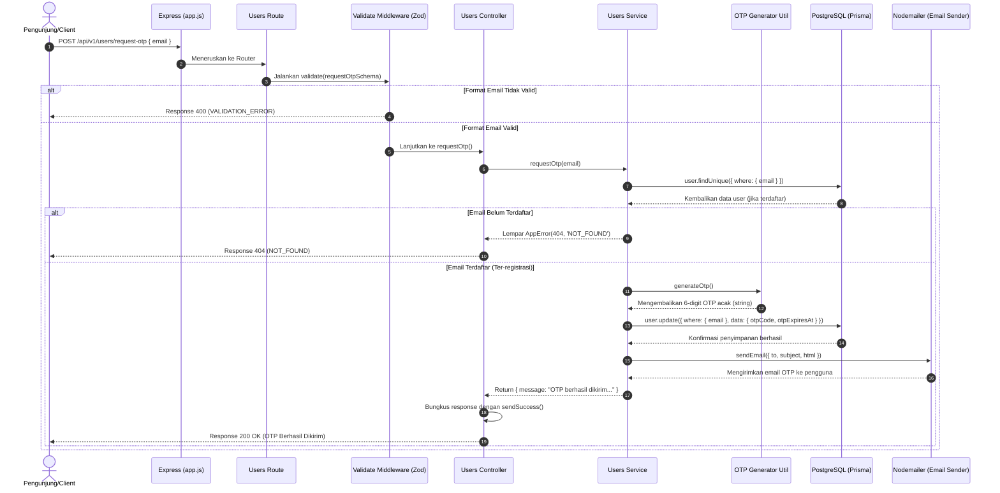

# 🔑 Request OTP Login — POST /api/v1/users/request-otp

**Status**: ✅ Selesai | **Priority Order**: #3.2

---

## 📌 Deskripsi Fitur
Untuk masuk (login) ke dalam aplikasi **Zoo Companion App (EIS Engine)**, sistem menggunakan mekanisme **Passwordless OTP (One-Time Password)**. Pengunjung tidak perlu mengingat kata sandi/password. 

Melalui endpoint ini, pengunjung yang telah terdaftar memasukkan email mereka. Sistem kemudian membuat kode OTP 6 digit acak yang berlaku jangka pendek (10 menit) dan mengirimkannya langsung ke alamat email terdaftar menggunakan Nodemailer.

---

## ⚙️ Detail Endpoint

| Komponen | Spesifikasi |
| :--- | :--- |
| **HTTP Method** | `POST` |
| **URL Path** | `/api/v1/users/request-otp` |
| **Autentikasi** | ☐ Public (Tidak memerlukan JWT Token) |
| **Headers** | `Content-Type: application/json` |

---

## 🗂️ Skema Validasi Request (Zod)

Sistem memastikan input email valid menggunakan pustaka **Zod** sebelum melakukan interaksi database. Skema didefinisikan pada `src/validators/users.validator.js` dalam bentuk `requestOtpSchema`:

```javascript
export const requestOtpSchema = z.object({
  email: z.string().email('Format email tidak valid'),
});
```

### Format Payload Request (JSON)
```json
{
  "email": "budisantoso@example.com"
}
```

### Rincian Aturan Validasi Field
1. **`email`** (String, Required):
   - Harus diisi dan memiliki format alamat email yang valid dan absah.

---

## 🔄 Diagram Alur Proses (Sequence Diagram)

Berikut adalah visualisasi alur pengajuan kode OTP dari Client hingga pengiriman email lewat SMTP Server:



---

## 💾 Konteks Skema Database (Prisma)

Data OTP disimpan secara temporer pada baris tabel pengguna yang bersangkutan di model `User` (`prisma/schema.prisma`):

```prisma
model User {
  id           Int          @id @default(autoincrement())
  email        String       @unique @db.VarChar(150)
  
  // OTP Fields (Short-lived)
  otpCode      String?      @map("otp_code")       // plain text OTP 6 digit
  otpExpiresAt DateTime?    @map("otp_expires_at") // waktu kedaluwarsa OTP
  
  @@map("users")
}
```

---

## 🏆 Aturan Bisnis (Business Rules)

1. **Prasyarat Akun Terdaftar:**
   Hanya email yang telah terdaftar melalui endpoint registrasi saja yang dapat meminta OTP. Jika email tidak ditemukan, sistem akan menolak dengan status HTTP 404 untuk menjaga integritas keamanan.
2. **Spesifikasi Kode OTP:**
   * Kode OTP terdiri dari **6 digit numerik** dalam format string acak (misal: `"481029"`).
   * Dihasilkan menggunakan fungsi acak matematis di `src/utils/otpGenerator.js`.
3. **Masa Berlaku Sangat Pendek (Short-lived):**
   OTP didefinisikan dengan masa kedaluwarsa **10 menit** sejak waktu dibuat (`Date.now() + 10 * 60 * 1000`). Masa berlaku ini disimpan di database pada field `otpExpiresAt`.
4. **Penyimpanan Plain Text Aman:**
   Karena masa aktif OTP sangat singkat (10 menit) dan langsung di-invalidate/dihapus setelah berhasil digunakan, maka kode OTP disimpan dalam bentuk *plain text* di database sesuai dengan konvensi SOP 05 demi efisiensi verifikasi operasional.
5. **Mekanisme Pengantaran Email:**
   Sistem mengintegrasikan **Nodemailer** melalui SMTP server yang diatur secara rahasia di environment variable (`EMAIL_HOST`, `EMAIL_PORT`, `EMAIL_USER`, `EMAIL_PASS`).

---

## 📥 Format Response Sukses (200 OK)

Jika email terdaftar dan OTP berhasil dikirimkan, sistem akan mengembalikan status **`200 OK`**:

```json
{
  "success": true,
  "message": "OTP berhasil dikirim ke email",
  "data": {
    "message": "OTP berhasil dikirim ke email"
  }
}
```

---

## ⚠️ Penanganan Error & Pengecualian

### 1. HTTP 400 Bad Request — `VALIDATION_ERROR`
Terjadi jika format email yang dimasukkan tidak memenuhi aturan (misalnya tanpa karakter `@`).
```json
{
  "success": false,
  "code": "VALIDATION_ERROR",
  "message": "Format email tidak valid"
}
```

### 2. HTTP 404 Not Found — `NOT_FOUND`
Terjadi jika email yang diajukan tidak ada di database pengguna.
```json
{
  "success": false,
  "code": "NOT_FOUND",
  "message": "Email tidak ditemukan di sistem"
}
```

---

## 🛠️ Referensi Implementasi Kode

- **Routing Layer:** [users.routes.js](file:///home/rafi/Documents/tugas-kuliah/semester4/software%20engginer%20prak/EIS-engine/src/routes/users.routes.js#L20)
- **Validation Schema:** [users.validator.js](file:///home/rafi/Documents/tugas-kuliah/semester4/software%20engginer%20prak/EIS-engine/src/validators/users.validator.js#L13-L15)
- **Controller Handler:** [users.controller.js](file:///home/rafi/Documents/tugas-kuliah/semester4/software%20engginer%20prak/EIS-engine/src/controllers/users.controller.js#L16-L24)
- **Service Layer Logic:** [users.service.js](file:///home/rafi/Documents/tugas-kuliah/semester4/software%20engginer%20prak/EIS-engine/src/services/users.service.js#L44-L78)
- **OTP Generator Utility:** [otpGenerator.js](file:///home/rafi/Documents/tugas-kuliah/semester4/software%20engginer%20prak/EIS-engine/src/utils/otpGenerator.js)
- **Email Sender Utility:** [emailSender.js](file:///home/rafi/Documents/tugas-kuliah/semester4/software%20engginer%20prak/EIS-engine/src/utils/emailSender.js)

---

## 🧪 Skenario Uji Coba (Test Cases)

Semua skenario pengujian diimplementasikan secara otomatis di berkas [users.test.js](file:///home/rafi/Documents/tugas-kuliah/semester4/software%20engginer%20prak/EIS-engine/tests/users.test.js#L94-L128):

1. **Skenario Positif:**
   * **Deskripsi:** Mengajukan OTP menggunakan email terdaftar yang valid.
   * **Hasil Diharapkan:** HTTP Status `200 OK`, `success: true`, pemanggilan update database OTP berjalan, dan fungsi `sendEmail` dipanggil.
2. **Skenario Negatif — Email Tidak Terdaftar:**
   * **Deskripsi:** Mengajukan OTP dengan email yang tidak ada di database.
   * **Hasil Diharapkan:** HTTP Status `404 Not Found`, `success: false`, `code: "NOT_FOUND"`.
3. **Skenario Negatif — Payload Request Kosong / Tidak Valid:**
   * **Deskripsi:** Request dengan payload kosong `{}` atau email kosong.
   * **Hasil Diharapkan:** HTTP Status `400 Bad Request`, `success: false`, `code: "VALIDATION_ERROR"`.
