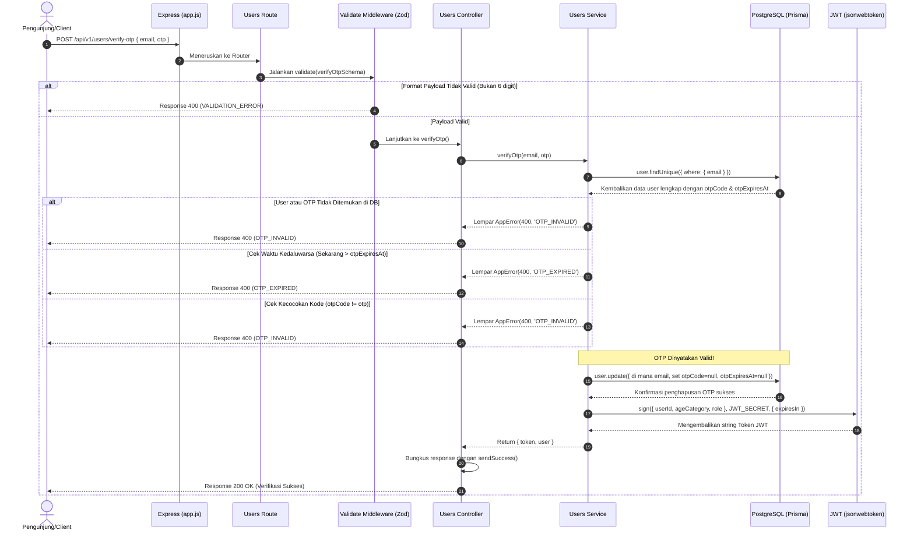

# 🔐 Verifikasi OTP & Terbitkan JWT — POST /api/v1/users/verify-otp

**Status**: ✅ Selesai | **Priority Order**: #3.3

---

## 📌 Deskripsi Fitur
Setelah pengunjung menerima kode OTP 6 digit melalui email, langkah selanjutnya adalah mengirimkannya kembali ke sistem bersama dengan alamat email mereka untuk diverifikasi.

Jika kode OTP **cocok** dan **belum melewati batas waktu kedaluwarsa (10 menit)**, sistem akan melakukan:
1. Menghapus (invalidasi) kode OTP di database agar tidak bisa digunakan kembali (*Replay Attack Prevention*).
2. Menghasilkan (*sign*) token **JWT (JSON Web Token)** berisi payload identitas dasar pengguna.
3. Mengembalikan token JWT tersebut beserta informasi dasar profil pengguna ke Client untuk digunakan sebagai autentikasi pada request berikutnya.

---

## ⚙️ Detail Endpoint

| Komponen | Spesifikasi |
| :--- | :--- |
| **HTTP Method** | `POST` |
| **URL Path** | `/api/v1/users/verify-otp` |
| **Autentikasi** | ☐ Public (Tidak memerlukan JWT Token) |
| **Headers** | `Content-Type: application/json` |

---

## 🗂️ Skema Validasi Request (Zod)

Sistem memvalidasi payload request sebelum mengecek kebenaran OTP di database. Skema didefinisikan pada `src/validators/users.validator.js` dalam bentuk `verifyOtpSchema`:

```javascript
export const verifyOtpSchema = z.object({
  email: z.string().email('Format email tidak valid'),
  otp: z.string().length(6, 'OTP harus terdiri dari 6 digit karakter string'),
});
```

### Format Payload Request (JSON)
```json
{
  "email": "budisantoso@example.com",
  "otp": "481029"
}
```

### Rincian Aturan Validasi Field
1. **`email`** (String, Required):
   - Harus berupa alamat email terdaftar dengan format yang valid.
2. **`otp`** (String, Required):
   - Harus berupa **string tepat 6 digit**. Mengirimkan OTP dengan panjang yang tidak sesuai akan langsung ditolak oleh middleware Zod sebelum membebani database.

---

## 🔄 Diagram Alur Proses (Sequence Diagram)

Berikut adalah visualisasi proses verifikasi OTP dan penandatanganan JWT Token:



---

## 💾 Konteks Skema Database (Prisma)

Model `User` (`prisma/schema.prisma`) berperan penting dalam proses verifikasi OTP dan penentuan klaim payload JWT:

```prisma
model User {
  id           Int          @id @default(autoincrement())
  name         String       @db.VarChar(100)
  email        String       @unique @db.VarChar(150)
  ageCategory  AgeCategory  @map("age_category")
  role         UserRole     @default(VISITOR)
  
  // OTP Fields
  otpCode      String?      @map("otp_code")
  otpExpiresAt DateTime?    @map("otp_expires_at")
  
  @@map("users")
}
```

---

## 🏆 Aturan Bisnis (Business Rules)

1. **Pencegahan Replay Attack (OTP Invalidation):**
   Setelah OTP berhasil divalidasi, sistem wajib **segera menghapus** kode OTP dan waktu kedaluwarsanya (diubah menjadi `null` di database) melalui pembaruan transaksi. Hal ini memastikan satu kode OTP hanya bisa digunakan sekali saja (*One-Time*).
2. **Validasi Waktu Kedaluwarsa:**
   Meskipun kode OTP yang dimasukkan benar, jika waktu server saat memproses request sudah melewati batas `otpExpiresAt`, maka OTP dianggap tidak berlaku dan melempar error `OTP_EXPIRED`.
3. **Masa Aktif Token JWT Adaptif:**
   Sistem mengatur waktu kedaluwarsa token JWT secara dinamis berdasarkan peran akun pengguna (`UserRole`):
   * Peran **`ADMIN`**     : Masa aktif token **1 hari** (`'1d'`) demi aspek keamanan yang lebih ketat untuk akses panel CMS admin.
   * Peran **`VISITOR`**   : Masa aktif token **7 hari** (`'7d'`) guna memberikan kenyamanan bagi pengunjung biasa agar tidak perlu berulang kali login selama masa kunjungannya.
4. **Struktur Klaim Payload JWT (SOP 05):**
   Token JWT ditandatangani menggunakan rahasia `process.env.JWT_SECRET` dengan payload berisi informasi dasar:
   ```json
   {
     "userId": 1,
     "ageCategory": "ADULT",
     "role": "VISITOR"
   }
   ```
   *Catatan: Informasi `ageCategory` disertakan pada token agar middleware lain dapat menyaring konten edukasi secara instan tanpa perlu melakukan query database tambahan.*

---

## 📥 Format Response Sukses (200 OK)

Jika verifikasi berhasil, sistem mengembalikan status **`200 OK`** yang melampirkan JWT Token dan profil pengguna:

```json
{
  "success": true,
  "message": "Verifikasi sukses. JWT Token diterbitkan.",
  "data": {
    "token": "eyJhbGciOiJIUzI1NiIsInR5cCI6IkpXVCJ9...",
    "user": {
      "id": 1,
      "name": "Budi Santoso",
      "email": "budisantoso@example.com",
      "role": "VISITOR",
      "ageCategory": "ADULT"
    }
  }
}
```

---

## ⚠️ Penanganan Error & Pengecualian

### 1. HTTP 400 Bad Request — `VALIDATION_ERROR`
Terjadi jika format payload salah (misal panjang OTP tidak sama dengan 6 karakter).
```json
{
  "success": false,
  "code": "VALIDATION_ERROR",
  "message": "OTP harus terdiri dari 6 digit karakter string"
}
```

### 2. HTTP 400 Bad Request — `OTP_INVALID`
Terjadi jika kode OTP yang dikirimkan salah, atau email tersebut tidak memiliki antrean kode OTP aktif di database.
```json
{
  "success": false,
  "code": "OTP_INVALID",
  "message": "Kode OTP yang dimasukkan salah"
}
```

### 3. HTTP 400 Bad Request — `OTP_EXPIRED`
Terjadi jika kode OTP benar tetapi sudah melewati masa berlaku 10 menit.
```json
{
  "success": false,
  "code": "OTP_EXPIRED",
  "message": "OTP telah kedaluwarsa. Silakan minta OTP baru"
}
```

---

## 🛠️ Referensi Implementasi Kode

- **Routing Layer:** [users.routes.js](file:///home/rafi/Documents/tugas-kuliah/semester4/software%20engginer%20prak/EIS-engine/src/routes/users.routes.js#L21)
- **Validation Schema:** [users.validator.js](file:///home/rafi/Documents/tugas-kuliah/semester4/software%20engginer%20prak/EIS-engine/src/validators/users.validator.js#L17-L20)
- **Controller Handler:** [users.controller.js](file:///home/rafi/Documents/tugas-kuliah/semester4/software%20engginer%20prak/EIS-engine/src/controllers/users.controller.js#L27-L35)
- **Service Layer Logic:** [users.service.js](file:///home/rafi/Documents/tugas-kuliah/semester4/software%20engginer%20prak/EIS-engine/src/services/users.service.js#L81-L129)

---

## 🧪 Skenario Uji Coba (Test Cases)

Skenario pengujian untuk verifikasi OTP diimplementasikan di berkas [users.test.js](file:///home/rafi/Documents/tugas-kuliah/semester4/software%20engginer%20prak/EIS-engine/tests/users.test.js#L131-L200):

1. **Skenario Positif:**
   * **Deskripsi:** Verifikasi OTP menggunakan kode yang benar dan email terdaftar yang belum kedaluwarsa.
   * **Hasil Diharapkan:** HTTP Status `200 OK`, `success: true`, payload data berisi token JWT dan data user pendukung, serta OTP di DB di-reset ke `null`.
2. **Skenario Negatif — Kode OTP Salah:**
   * **Deskripsi:** Mengirimkan kode OTP yang berbeda dengan yang tertera di database (misal mengirim `"123456"` sedangkan di database `"999999"`).
   * **Hasil Diharapkan:** HTTP Status `400 Bad Request`, `success: false`, `code: "OTP_INVALID"`.
3. **Skenario Negatif — OTP Kedaluwarsa:**
   * **Deskripsi:** Mengirimkan kode OTP yang benar, namun waktu server saat verifikasi sudah melewati `otpExpiresAt` (misal kedaluwarsa sejak 1 menit lalu).
   * **Hasil Diharapkan:** HTTP Status `400 Bad Request`, `success: false`, `code: "OTP_EXPIRED"`.
4. **Skenario Negatif — Format OTP Tidak Valid:**
   * **Deskripsi:** Mengirimkan OTP dengan panjang karakter kurang dari 6 (misal hanya `"12"`).
   * **Hasil Diharapkan:** HTTP Status `400 Bad Request`, `success: false`, `code: "VALIDATION_ERROR"`.
