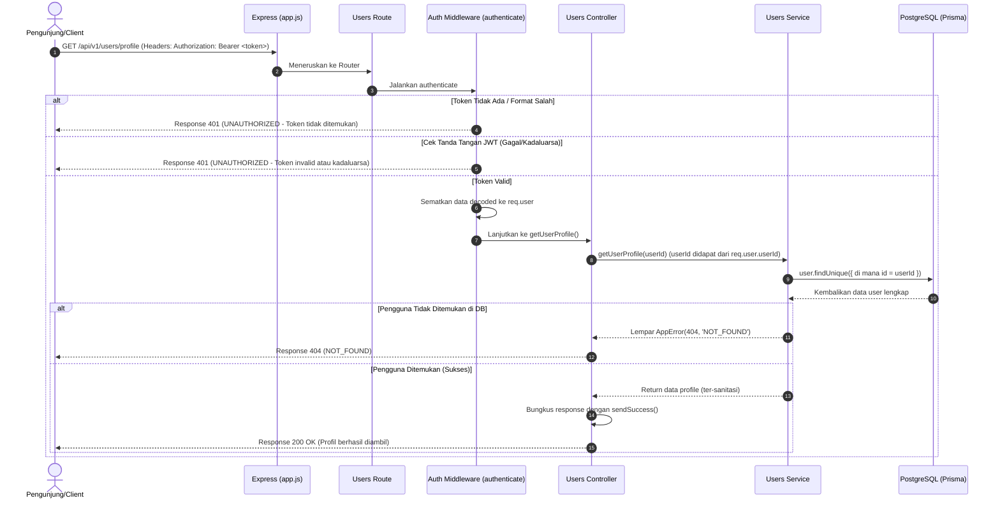

# 👤 Ambil Profil Pengguna — GET /api/v1/users/profile

**Status**: ✅ Selesai | **Priority Order**: #3.4

---

## 📌 Deskripsi Fitur
Setelah pengguna berhasil masuk (login) dan mendapatkan token JWT, Client dapat memanggil endpoint terproteksi ini untuk mengambil data profil lengkap pengguna yang sedang aktif saat ini.

Endpoint ini menggunakan middleware otorisasi untuk memvalidasi token JWT di setiap request. Informasi profil ini biasanya digunakan oleh aplikasi Client (Zoo Companion Mobile App atau Admin CMS Dashboard) untuk menampilkan nama, usia, kategori kognitif, peran (role), dan menyajikan data personalisasi pengunjung.

---

## ⚙️ Detail Endpoint

| Komponen | Spesifikasi |
| :--- | :--- |
| **HTTP Method** | `GET` |
| **URL Path** | `/api/v1/users/profile` |
| **Autentikasi** | ☑ Terproteksi (Memerlukan Bearer JWT Token) |
| **Headers** | `Authorization: Bearer <JWT_TOKEN>` |

---

## 🔐 Mekanisme Keamanan & Autentikasi (Middleware)

Endpoint ini dilindungi oleh middleware `authenticate` yang didefinisikan pada `src/middleware/auth.middleware.js`:

```javascript
export const authenticate = (req, res, next) => {
  const authHeader = req.headers.authorization;
  if (!authHeader || !authHeader.startsWith('Bearer ')) {
    return next(new AppError(401, 'UNAUTHORIZED', 'Token akses tidak ditemukan'));
  }
  
  const token = authHeader.split(' ')[1];
  try {
    const decoded = jwt.verify(token, process.env.JWT_SECRET);
    req.user = decoded; // Tempel object decoded ke request object
    next();
  } catch (error) {
    next(new AppError(401, 'UNAUTHORIZED', 'Token invalid atau kadaluarsa'));
  }
};
```

### Cara Kerja:
1. Client wajib mengirimkan token JWT pada Header request dengan format: `Authorization: Bearer <TOKEN>`.
2. Middleware memeriksa keberadaan dan format header.
3. Token JWT didekripsi menggunakan kunci rahasia server (`process.env.JWT_SECRET`).
4. Hasil dekripsi berupa payload (seperti `userId`, `role`, dan `ageCategory`) disematkan ke dalam objek **`req.user`**, sehingga dapat diakses oleh Controller dan Service selanjutnya.

---

## 🔄 Diagram Alur Proses (Sequence Diagram)

Berikut adalah visualisasi alur otorisasi token dan pengambilan data profil pengguna dari database:



---

## 💾 Konteks Skema Database (Prisma)

Data profil diambil dari tabel `users` (model `User` di `prisma/schema.prisma`). Selama kueri database, data sensitif internal akan disaring secara ketat:

```prisma
model User {
  id           Int          @id @default(autoincrement())
  name         String       @db.VarChar(100)
  email        String       @unique @db.VarChar(150)
  age          Int
  ageCategory  AgeCategory  @map("age_category")
  role         UserRole     @default(VISITOR)
  registeredAt DateTime     @default(now()) @map("registered_at")
  
  // OTP Fields (Sengaja DIABAIKAN/TIDAK DI-SELECT pada query profile)
  otpCode      String?      @map("otp_code")
  otpExpiresAt DateTime?    @map("otp_expires_at")

  @@map("users")
}
```

---

## 🏆 Aturan Bisnis (Business Rules)

1. **Akses Terbatas Terautentikasi:**
   Hanya request dengan token JWT yang sah dan belum kedaluwarsa yang diperbolehkan masuk. Jika tidak, request langsung dipotong di tingkat middleware dengan status HTTP 401.
2. **Penyaringan Data Sensitif Secara Eksplisit:**
   Demi menjaga standar keamanan tinggi (SOP 04 & SOP 05), data OTP (`otpCode`, `otpExpiresAt`) **sengaja tidak disertakan** dalam kueri database menggunakan proyeksi selektif Prisma (`select`). Ini mencegah kebocoran kredensial jangka pendek secara tidak sengaja ke log jaringan Client.
3. **Pencarian Berbasis ID Unik:**
   Pencarian data di database dilakukan menggunakan indeks kunci primer `id` (integer) yang diambil dari JWT, sehingga memastikan performa pencarian yang sangat cepat.

---

## 📥 Format Response Sukses (200 OK)

Jika token valid dan data pengguna ditemukan di database, sistem mengembalikan status **`200 OK`**:

```json
{
  "success": true,
  "message": "Profil pengguna berhasil diambil",
  "data": {
    "id": 1,
    "name": "Budi Santoso",
    "email": "budisantoso@example.com",
    "age": 25,
    "ageCategory": "ADULT",
    "role": "VISITOR",
    "registeredAt": "2026-05-30T11:52:00.000Z"
  }
}
```

---

## ⚠️ Penanganan Error & Pengecualian

### 1. HTTP 401 Unauthorized — `UNAUTHORIZED` (Token Absen)
Terjadi jika Client memanggil endpoint tanpa menyertakan Header `Authorization` Bearer.
```json
{
  "success": false,
  "code": "UNAUTHORIZED",
  "message": "Token akses tidak ditemukan"
}
```

### 2. HTTP 401 Unauthorized — `UNAUTHORIZED` (Token Kadaluarsa / Palsu)
Terjadi jika token JWT yang dikirimkan telah kedaluwarsa atau memiliki tanda tangan kriptografi yang salah.
```json
{
  "success": false,
  "code": "UNAUTHORIZED",
  "message": "Token invalid atau kadaluarsa"
}
```

### 3. HTTP 404 Not Found — `NOT_FOUND`
Terjadi jika token JWT valid, tetapi pengguna dengan ID tersebut telah dihapus dari database sistem.
```json
{
  "success": false,
  "code": "NOT_FOUND",
  "message": "Pengguna tidak ditemukan"
}
```

---

## 🛠️ Referensi Implementasi Kode

- **Routing Layer:** [users.routes.js](file:///home/rafi/Documents/tugas-kuliah/semester4/software%20engginer%20prak/EIS-engine/src/routes/users.routes.js#L24)
- **Security Middleware:** [auth.middleware.js](file:///home/rafi/Documents/tugas-kuliah/semester4/software%20engginer%20prak/EIS-engine/src/middleware/auth.middleware.js#L4-L18)
- **Controller Handler:** [users.controller.js](file:///home/rafi/Documents/tugas-kuliah/semester4/software%20engginer%20prak/EIS-engine/src/controllers/users.controller.js#L38-L47)
- **Service Layer Logic:** [users.service.js](file:///home/rafi/Documents/tugas-kuliah/semester4/software%20engginer%20prak/EIS-engine/src/services/users.service.js#L132-L152)

---

## 🧪 Skenario Uji Coba (Test Cases)

Skenario pengujian untuk profile diimplementasikan secara otomatis di berkas [users.test.js](file:///home/rafi/Documents/tugas-kuliah/semester4/software%20engginer%20prak/EIS-engine/tests/users.test.js#L203-L258):

1. **Skenario Positif:**
   * **Deskripsi:** Mengambil data profil dengan menyertakan token JWT Bearer yang sah di header.
   * **Hasil Diharapkan:** HTTP Status `200 OK`, `success: true`, data payload berisi detail profil user secara lengkap tanpa menyertakan `otpCode` atau `otpExpiresAt`.
2. **Skenario Negatif — Header Otorisasi Absen:**
   * **Deskripsi:** Request ke endpoint profile tanpa menyertakan header `Authorization`.
   * **Hasil Diharapkan:** HTTP Status `401 Unauthorized`, `success: false`, `code: "UNAUTHORIZED"`, `message: "Token akses tidak ditemukan"`.
3. **Skenario Negatif — Token JWT Tidak Valid / Kedaluwarsa:**
   * **Deskripsi:** Request dengan menyertakan token JWT palsu (misal `"Bearer token.palsu.invalid"`).
   * **Hasil Diharapkan:** HTTP Status `401 Unauthorized`, `success: false`, `code: "UNAUTHORIZED"`, `message: "Token invalid atau kadaluarsa"`.
4. **Skenario Negatif — ID Pengguna di JWT Tidak Ditemukan:**
   * **Deskripsi:** Request menggunakan JWT valid yang berisi ID pengguna yang tidak ada di database (misal ID `999`).
   * **Hasil Diharapkan:** HTTP Status `404 Not Found`, `success: false`, `code: "NOT_FOUND"`.
