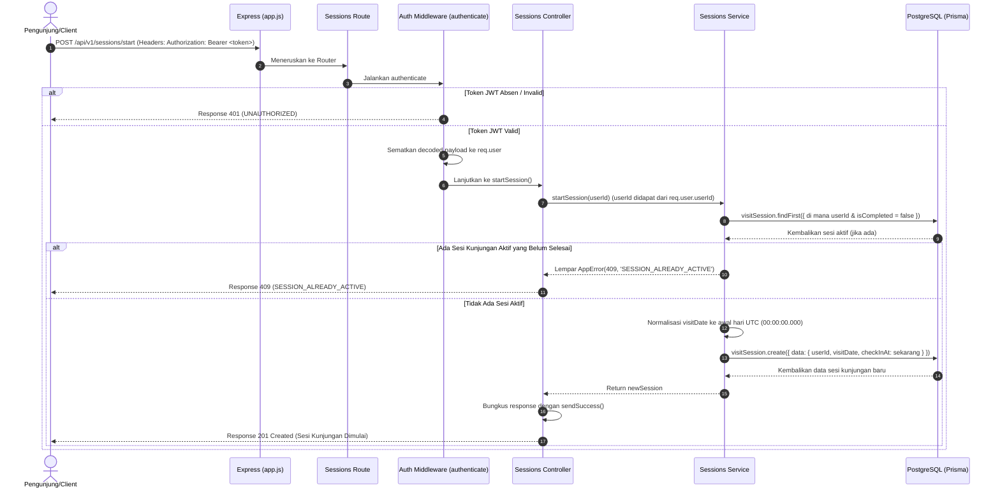

# 🏁 Mulai Sesi Kunjungan — POST /api/v1/sessions/start

**Status**: ✅ Selesai | **Priority Order**: #4.1

---

## 📌 Deskripsi Fitur
Endpoint terproteksi ini digunakan oleh pengunjung untuk menandai dimulainya satu siklus sesi kunjungan baru (*Visit Session*) ke kebun binatang. 

Ketika pengunjung melakukan pindai masuk (atau menekan tombol masuk aplikasi), endpoint ini dipanggil untuk mencatat tanggal kunjungan serta waktu tepat presisi pengunjung memasuki area kebun binatang (`checkInAt`). Pencatatan sesi ini sangat krusial karena seluruh interaksi exhibit, mini game lab, pengerjaan kuis kognitif (pre-zoo & post-zoo), dan penghitungan EIS Score final akan bertaut secara relasional ke ID sesi kunjungan ini.

---

## ⚙️ Detail Endpoint

| Komponen | Spesifikasi |
| :--- | :--- |
| **HTTP Method** | `POST` |
| **URL Path** | `/api/v1/sessions/start` |
| **Autentikasi** | ☑ Terproteksi (Memerlukan Bearer JWT Token) |
| **Headers** | `Authorization: Bearer <JWT_TOKEN>` |

---

## 🗂️ Skema Validasi Request

Endpoint ini **tidak memerlukan payload request (body)**. Identitas pengunjung (`userId`) diekstrak secara aman dari token JWT yang dikirimkan pada header otorisasi oleh middleware `authenticate`.

---

## 🔄 Diagram Alur Proses (Sequence Diagram)

Berikut adalah visualisasi alur validasi status sesi dan pembuatan sesi kunjungan baru di database:



---

## 💾 Konteks Skema Database (Prisma)

Data sesi kunjungan dikelola di dalam tabel `visit_sessions` (model `VisitSession` di `prisma/schema.prisma`):

```prisma
model VisitSession {
  id          Int       @id @default(autoincrement())
  userId      Int       @map("user_id")
  visitDate   DateTime  @map("visit_date") @db.Date // Tanggal kunjungan (di-normalisasi)
  checkInAt   DateTime  @default(now()) @map("check_in_at") // Presisi jam masuk
  checkOutAt  DateTime? @map("check_out_at") // Presisi jam keluar (null saat start)
  isCompleted Boolean   @default(false) @map("is_completed") // Status keaktifan sesi
  createdAt   DateTime  @default(now()) @map("created_at")

  // Relations
  user               User                @relation(fields: [userId], references: [id], onDelete: Cascade)
  quizAttempts       UserQuizAttempt[]
  interactions       Interaction[]
  retentionSchedules RetentionSchedule[]
  eisScore           EisScore?

  @@map("visit_sessions")
}
```

---

## 🏆 Aturan Bisnis (Business Rules)

1. **Aturan Sesi Aktif Tunggal (Single Active Session):**
   Setiap pengunjung hanya diperbolehkan memiliki **maksimal satu sesi aktif yang belum selesai** (`isCompleted: false`) dalam satu waktu. Hal ini penting untuk menjaga integritas data durasi kunjungan dan perhitungan skor adaptif kuis.
2. **Normalisasi Tanggal Kunjungan (`visitDate`):**
   Waktu pendaftaran sesi (`visitDate`) secara otomatis dinormalisasi oleh layer service ke awal hari UTC (`00:00:00.000`) untuk mempermudah rekapitulasi analitik statistik harian tanpa terpengaruh oleh zona waktu lokal perangkat client.
3. **Pencatatan Jam Masuk Real-Time (`checkInAt`):**
   Waktu masuk direkam secara presisi menggunakan `new Date()` server pada saat pemrosesan request untuk mengukur durasi total kunjungan pengunjung nantinya saat check-out.

---

## 📥 Format Response Sukses (210 Created)

Jika sesi berhasil dimulai, sistem mengembalikan status **`201 Created`** dengan payload detail sesi yang terdaftar:

```json
{
  "success": true,
  "message": "Sesi kunjungan berhasil dimulai",
  "data": {
    "id": 1,
    "userId": 1,
    "visitDate": "2026-05-30T00:00:00.000Z",
    "checkInAt": "2026-05-30T11:56:30.000Z",
    "isCompleted": false
  }
}
```

---

## ⚠️ Penanganan Error & Pengecualian

### 1. HTTP 401 Unauthorized — `UNAUTHORIZED`
Terjadi jika token JWT tidak valid, kedaluwarsa, atau header Authorization tidak disertakan.
```json
{
  "success": false,
  "code": "UNAUTHORIZED",
  "message": "Token akses tidak ditemukan"
}
```

### 2. HTTP 409 Conflict — `SESSION_ALREADY_ACTIVE`
Terjadi jika pengunjung bersangkutan masih memiliki sesi kunjungan aktif yang belum diakhiri/ditutup (`isCompleted: false`).
```json
{
  "success": false,
  "code": "SESSION_ALREADY_ACTIVE",
  "message": "Anda masih memiliki sesi kunjungan yang aktif. Selesaikan sesi sebelumnya terlebih dahulu."
}
```

### 3. HTTP 500 Internal Server Error — `INTERNAL_ERROR`
Terjadi jika ada kesalahan sistem yang tidak terduga saat memproses pembukaan sesi di tingkat database.
```json
{
  "success": false,
  "code": "INTERNAL_ERROR",
  "message": "Gagal memproses sesi kunjungan"
}
```

---

## 🛠️ Referensi Implementasi Kode

- **Routing Layer:** [sessions.routes.js](file:///home/rafi/Documents/tugas-kuliah/semester4/software%20engginer%20prak/EIS-engine/src/routes/sessions.routes.js#L11)
- **Controller Handler:** [sessions.controller.js](file:///home/rafi/Documents/tugas-kuliah/semester4/software%20engginer%20prak/EIS-engine/src/controllers/sessions.controller.js#L5-L13)
- **Service Layer Logic:** [sessions.service.js](file:///home/rafi/Documents/tugas-kuliah/semester4/software%20engginer%20prak/EIS-engine/src/services/sessions.service.js#L5-L47)

---

## 🧪 Skenario Uji Coba (Test Cases)

Semua pengujian diimplementasikan di [sessions.test.js](file:///home/rafi/Documents/tugas-kuliah/semester4/software%20engginer%20prak/EIS-engine/tests/sessions.test.js#L36-L93):

1. **Skenario Positif:**
   * **Deskripsi:** Memulai sesi kunjungan baru ketika tidak ada sesi aktif untuk pengguna tersebut.
   * **Hasil Diharapkan:** HTTP Status `201 Created`, `success: true`, payload data berisi properti detail sesi baru dengan status `isCompleted: false`.
2. **Skenario Negatif — Sesi Aktif Masih Ada:**
   * **Deskripsi:** Memulai sesi baru padahal pengguna tersebut masih memiliki sesi yang belum diselesaikan (`isCompleted: false`).
   * **Hasil Diharapkan:** HTTP Status `409 Conflict`, `success: false`, `code: "SESSION_ALREADY_ACTIVE"`.
3. **Skenario Negatif — Tanpa Header Otorisasi:**
   * **Deskripsi:** Memanggil endpoint tanpa mengirimkan token JWT Bearer.
   * **Hasil Diharapkan:** HTTP Status `401 Unauthorized`, `success: false`, `code: "UNAUTHORIZED"`.
