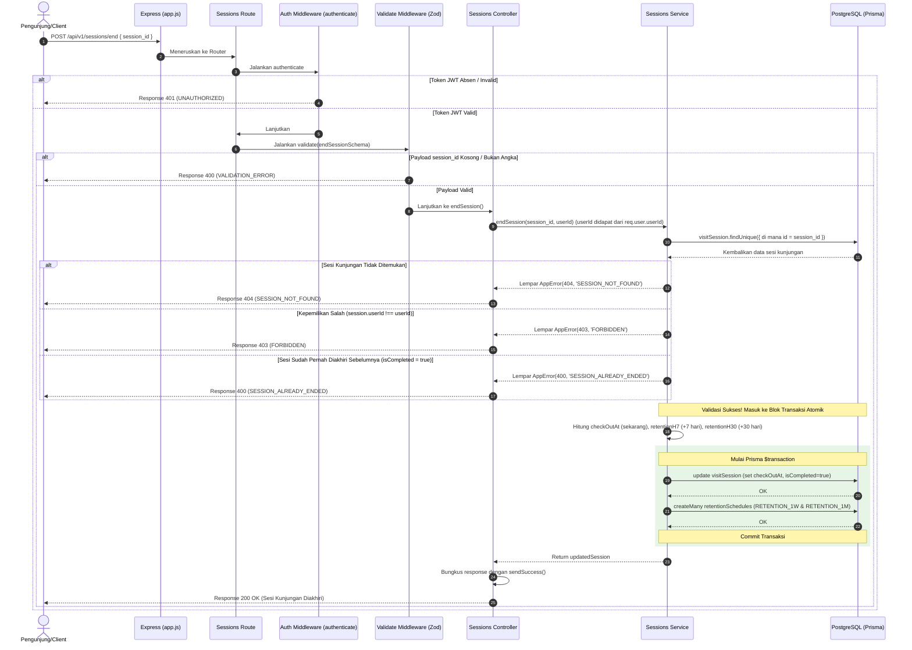

# 🏁 Akhiri Sesi Kunjungan — POST /api/v1/sessions/end

**Status**: ✅ Selesai | **Priority Order**: #4.2

---

## 📌 Deskripsi Fitur
Endpoint terproteksi ini digunakan oleh pengunjung untuk menandai akhir dari kunjungannya ke kebun binatang. 

Saat dipanggil, sistem akan mencatat waktu checkout pengunjung secara presisi (`checkOutAt`) dan menandai sesi kunjungan telah selesai (`isCompleted: true`). 

Hal yang paling krusial, endpoint ini juga secara otomatis menginjeksikan 2 antrean jadwal kuis retensi kognitif jangka panjang, yaitu kuis retensi H+7 (`RETENTION_1W`) dan H+30 (`RETENTION_1M`), ke dalam database untuk dikirimkan melalui email nantinya.

---

## ⚙️ Detail Endpoint

| Komponen | Spesifikasi |
| :--- | :--- |
| **HTTP Method** | `POST` |
| **URL Path** | `/api/v1/sessions/end` |
| **Autentikasi** | ☑ Terproteksi (Memerlukan Bearer JWT Token) |
| **Headers** | `Authorization: Bearer <JWT_TOKEN>`, `Content-Type: application/json` |

---

## 🗂️ Skema Validasi Request (Zod)

Sistem menggunakan **Zod** untuk memvalidasi keberadaan dan tipe data parameter pengakhiran sesi. Skema didefinisikan pada `src/validators/sessions.validator.js` dalam bentuk `endSessionSchema`:

```javascript
export const endSessionSchema = z.object({
  session_id: z
    .number({ invalid_type_error: 'session_id harus berupa angka' })
    .int('session_id harus bilangan bulat')
    .positive('session_id harus bernilai positif'),
});
```

### Format Payload Request (JSON)
```json
{
  "session_id": 1
}
```

### Rincian Aturan Validasi Field
1. **`session_id`** (Number, Required):
   - Harus bertipe angka (number) bilangan bulat (int) positif. ID ini merepresentasikan kunci utama dari sesi kunjungan aktif yang ingin ditutup.

---

## 🔄 Diagram Alur Proses (Sequence Diagram)

Berikut adalah visualisasi alur atomik pengakhiran sesi kunjungan dan injeksi otomatis jadwal kuis retensi:



---

## 💾 Konteks Skema Database (Prisma)

Proses pengakhiran sesi melibatkan modifikasi tabel `visit_sessions` dan penulisan baris baru secara massal pada tabel `retention_schedules` (diwakili model `RetentionSchedule` pada `prisma/schema.prisma`):

```prisma
enum QuizType {
  PRE_ZOO
  POST_ZOO
  RETENTION_1W   // Kuis retensi H+7
  RETENTION_1M   // Kuis retensi H+30
}

enum RetentionStatus {
  PENDING     // Menunggu jadwal dikirim oleh scheduler
  SENT
  COMPLETED
  EXPIRED
}

model RetentionSchedule {
  id          Int             @id @default(autoincrement())
  userId      Int             @map("user_id")
  sessionId   Int             @map("session_id")
  quizType    QuizType        @map("quiz_type")
  scheduledAt DateTime        @map("scheduled_at")
  sentAt      DateTime?       @map("sent_at")
  status      RetentionStatus @default(PENDING)
  createdAt   DateTime        @default(now()) @map("created_at")

  user    User         @relation(fields: [userId], references: [id], onDelete: Cascade)
  session VisitSession @relation(fields: [sessionId], references: [id], onDelete: Cascade)

  @@unique([userId, sessionId, quizType]) // Mencegah jadwal ganda untuk kuis yang sama
  @@map("retention_schedules")
}
```

---

## 🏆 Aturan Bisnis (Business Rules)

1. **Pemeriksaan Kepemilikan Sesi (Ownership Check):**
   Pengunjung hanya dapat mengakhiri sesi miliknya sendiri. Sistem melakukan verifikasi ketat membandingkan `userId` dari token JWT dengan `userId` pemilik sesi di database. Pelanggaran aturan ini menghasilkan error HTTP 403 `FORBIDDEN`.
2. **Pencegahan Redudansi Penutupan:**
   Sesi kunjungan yang sudah berstatus selesai (`isCompleted: true`) tidak boleh ditutup kembali demi menghindari duplikasi kueri database. Jika dicoba, sistem mengembalikan error HTTP 400 `SESSION_ALREADY_ENDED`.
3. **Mekanisme Transaksi Atomik Database (`$transaction`):**
   Aktivitas mengubah status sesi (`visitSession.update`) dan pembentukan 2 baris antrean jadwal kuis retensi (`retentionSchedule.createMany`) **wajib dibungkus di dalam transaksi atomik Prisma**. Hal ini menjamin keduanya harus berhasil atau gagal bersamaan, mencegah ketidaksinkronan data kuis retensi di masa depan.
4. **Perhitungan Tanggal Kuis Retensi Otomatis:**
   * **`RETENTION_1W` (H+7):** Dijadwalkan tepat **7 hari** setelah waktu checkout server (`checkOutAt + 7 hari`).
   * **`RETENTION_1M` (H+30):** Dijadwalkan tepat **30 hari** setelah waktu checkout server (`checkOutAt + 30 hari`).
   * Status awal antrean diatur sebagai **`PENDING`** yang nantinya diproses secara periodik harian oleh daemon Cron scheduler.
5. **Anti-Duplikasi Jadwal (`skipDuplicates`):**
   Saat menginjeksikan jadwal retensi, digunakan parameter `skipDuplicates: true` bertumpu pada indeks unik kombinasi `[userId, sessionId, quizType]` di tabel database untuk mencegah pembuatan jadwal ganda jika terjadi *double submission* request dari Client.

---

## 📥 Format Response Sukses (200 OK)

Bila sesi kunjungan berhasil ditutup, sistem mengembalikan status **`200 OK`**:

```json
{
  "success": true,
  "message": "Sesi kunjungan berhasil diakhiri",
  "data": {
    "id": 1,
    "userId": 1,
    "visitDate": "2026-05-30T00:00:00.000Z",
    "checkInAt": "2026-05-30T09:00:00.000Z",
    "checkOutAt": "2026-05-30T11:56:30.000Z",
    "isCompleted": true
  }
}
```

---

## ⚠️ Penanganan Error & Pengecualian

### 1. HTTP 400 Bad Request — `VALIDATION_ERROR`
Terjadi jika payload `session_id` kosong, bukan berupa angka, atau bernilai negatif.
```json
{
  "success": false,
  "code": "VALIDATION_ERROR",
  "message": "session_id harus berupa angka"
}
```

### 2. HTTP 400 Bad Request — `SESSION_ALREADY_ENDED`
Terjadi jika sesi dengan ID tersebut statusnya sudah diakhiri sebelumnya (`isCompleted: true`).
```json
{
  "success": false,
  "code": "SESSION_ALREADY_ENDED",
  "message": "Sesi kunjungan ini sudah diakhiri sebelumnya"
}
```

### 3. HTTP 403 Forbidden — `FORBIDDEN`
Terjadi jika pengguna mencoba mengakhiri sesi kunjungan milik pengunjung lain.
```json
{
  "success": false,
  "code": "FORBIDDEN",
  "message": "Anda tidak memiliki akses ke sesi kunjungan ini"
}
```

### 4. HTTP 404 Not Found — `SESSION_NOT_FOUND`
Terjadi jika `session_id` yang dimasukkan tidak ditemukan di dalam database.
```json
{
  "success": false,
  "code": "SESSION_NOT_FOUND",
  "message": "Sesi kunjungan tidak ditemukan"
}
```

---

## 🛠️ Referensi Implementasi Kode

- **Routing Layer:** [sessions.routes.js](file:///home/rafi/Documents/tugas-kuliah/semester4/software%20engginer%20prak/EIS-engine/src/routes/sessions.routes.js#L12)
- **Validation Schema:** [sessions.validator.js](file:///home/rafi/Documents/tugas-kuliah/semester4/software%20engginer%20prak/EIS-engine/src/validators/sessions.validator.js#L4-L9)
- **Controller Handler:** [sessions.controller.js](file:///home/rafi/Documents/tugas-kuliah/semester4/software%20engginer%20prak/EIS-engine/src/controllers/sessions.controller.js#L16-L25)
- **Service Layer Logic:** [sessions.service.js](file:///home/rafi/Documents/tugas-kuliah/semester4/software%20engginer%20prak/EIS-engine/src/services/sessions.service.js#L50-L126)

---

## 🧪 Skenario Uji Coba (Test Cases)

Semua pengujian untuk pengakhiran sesi diimplementasikan di [sessions.test.js](file:///home/rafi/Documents/tugas-kuliah/semester4/software%20engginer%20prak/EIS-engine/tests/sessions.test.js#L96-L201):

1. **Skenario Positif:**
   * **Deskripsi:** Mengakhiri sesi kunjungan yang aktif milik pengguna yang login saat ini.
   * **Hasil Diharapkan:** HTTP Status `200 OK`, `success: true`, status sesi diubah menjadi `isCompleted: true`, properti `checkOutAt` terisi, dan antrean `retentionSchedules` berhasil diinjeksi (2 baris: `RETENTION_1W` dan `RETENTION_1M`).
2. **Skenario Negatif — ID Sesi Tidak Ditemukan:**
   * **Deskripsi:** Mengirimkan request dengan `session_id` yang tidak eksis di database (misal `999`).
   * **Hasil Diharapkan:** HTTP Status `404 Not Found`, `success: false`, `code: "SESSION_NOT_FOUND"`.
3. **Skenario Negatif — Mencoba Mengakhiri Sesi Orang Lain:**
   * **Deskripsi:** Request pengakhiran sesi dengan JWT user A, tetapi mengisi payload `session_id` milik user B.
   * **Hasil Diharapkan:** HTTP Status `403 Forbidden`, `success: false`, `code: "FORBIDDEN"`.
4. **Skenario Negatif — Sesi Sudah Pernah Diselesaikan:**
   * **Deskripsi:** Mengirim request pengakhiran sesi yang statusnya sudah berstatus `isCompleted: true`.
   * **Hasil Diharapkan:** HTTP Status `400 Bad Request`, `success: false`, `code: "SESSION_ALREADY_ENDED"`.
5. **Skenario Negatif — Validasi Gagal (Payload Kosong):**
   * **Deskripsi:** Mengirim request pengakhiran sesi dengan payload body kosong `{}`.
   * **Hasil Diharapkan:** HTTP Status `400 Bad Request`, `success: false`, `code: "VALIDATION_ERROR"`.
