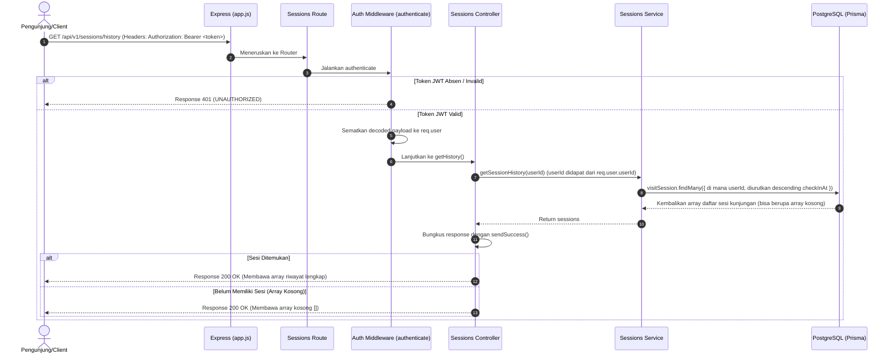

# 👤 Riwayat Sesi Kunjungan — GET /api/v1/sessions/history

**Status**: ✅ Selesai | **Priority Order**: #4.3

---

## 📌 Deskripsi Fitur
Endpoint terproteksi ini digunakan oleh pengunjung untuk mendapatkan seluruh riwayat sesi kunjungan (*Visit Sessions History*) yang pernah dilakukan di kebun binatang.

Data riwayat ini biasanya disajikan pada halaman profil atau menu riwayat kunjungan di dalam aplikasi Client (Zoo Companion Mobile App). Melalui informasi ini, pengunjung dapat melihat kembali kapan saja mereka mengunjungi kebun binatang, durasi kunjungan masa lalu, serta menjadi pintu masuk bagi Client untuk menampilkan detail kalkulasi EIS Score per sesi kunjungan di masa lalu.

---

## ⚙️ Detail Endpoint

| Komponen | Spesifikasi |
| :--- | :--- |
| **HTTP Method** | `GET` |
| **URL Path** | `/api/v1/sessions/history` |
| **Autentikasi** | ☑ Terproteksi (Memerlukan Bearer JWT Token) |
| **Headers** | `Authorization: Bearer <JWT_TOKEN>` |

---

## 🗂️ Skema Validasi Request

Endpoint ini **tidak memerlukan payload request (body atau query string)**. Daftar riwayat disaring secara dinamis di tingkat database berdasarkan `userId` yang diekstrak langsung dari token JWT yang sah oleh middleware keamanan.

---

## 🔄 Diagram Alur Proses (Sequence Diagram)

Berikut adalah visualisasi alur otorisasi dan pengambilan daftar riwayat kunjungan pengguna dari database:



---

## 💾 Konteks Skema Database (Prisma)

Data riwayat disaring secara langsung dari tabel `visit_sessions` (model `VisitSession` di `prisma/schema.prisma`):

```prisma
model VisitSession {
  id          Int       @id @default(autoincrement())
  userId      Int       @map("user_id")
  visitDate   DateTime  @map("visit_date") @db.Date
  checkInAt   DateTime  @default(now()) @map("check_in_at")
  checkOutAt  DateTime? @map("check_out_at")
  isCompleted Boolean   @default(false) @map("is_completed")

  user        User      @relation(fields: [userId], references: [id], onDelete: Cascade)

  @@map("visit_sessions")
}
```

---

## 🏆 Aturan Bisnis (Business Rules)

1. **Penyaringan Mandiri yang Aman (Secure Self-Filtering):**
   Pengguna hanya diizinkan untuk melihat riwayat kunjungannya sendiri. Sistem secara otomatis menyaring kueri database menggunakan parameter `where: { userId }` yang bersumber dari JWT terdekripsi. Hal ini mencegah celah kebocoran data antar pengguna (*Horizontal Privilege Escalation*).
2. **Urutan Kronologis Terbalik (Reverse Chronological Order):**
   Untuk memberikan kenyamanan navigasi bagi pengguna, sistem secara otomatis mengurutkan daftar sesi kunjungan dari yang paling baru hingga terlama menggunakan aturan kueri `orderBy: { checkInAt: 'desc' }`.
3. **Penanganan Kasus Tanpa Riwayat (Zero History Handling):**
   Jika pengguna yang bersangkutan baru saja mendaftar dan belum pernah memulai sesi kunjungan apa pun di kebun binatang, sistem **tidak melempar error**, melainkan tetap merespon dengan status HTTP **`200 OK`** yang melampirkan array kosong `[]` sebagai representasi aman data yang kosong.

---

## 📥 Format Response Sukses (200 OK)

### 1. Contoh Response dengan Riwayat Kunjungan
```json
{
  "success": true,
  "message": "Riwayat kunjungan berhasil diambil",
  "data": [
    {
      "id": 3,
      "visitDate": "2026-05-15T00:00:00.000Z",
      "checkInAt": "2026-05-15T08:00:00.000Z",
      "checkOutAt": "2026-05-15T12:00:00.000Z",
      "isCompleted": true
    },
    {
      "id": 1,
      "visitDate": "2026-05-10T00:00:00.000Z",
      "checkInAt": "2026-05-10T09:00:00.000Z",
      "checkOutAt": "2026-05-10T11:00:00.000Z",
      "isCompleted": true
    }
  ]
}
```

### 2. Contoh Response tanpa Riwayat Kunjungan (Pengunjung Baru)
```json
{
  "success": true,
  "message": "Riwayat kunjungan berhasil diambil",
  "data": []
}
```

---

## ⚠️ Penanganan Error & Pengecualian

### 1. HTTP 401 Unauthorized — `UNAUTHORIZED`
Terjadi jika token JWT kadaluarsa, salah, atau request dipanggil tanpa melampirkan header Authorization.
```json
{
  "success": false,
  "code": "UNAUTHORIZED",
  "message": "Token akses tidak ditemukan"
}
```

### 2. HTTP 500 Internal Server Error — `INTERNAL_ERROR`
Terjadi jika terjadi kegagalan sistem atau gangguan komunikasi dengan Supabase PostgreSQL.
```json
{
  "success": false,
  "code": "INTERNAL_ERROR",
  "message": "Gagal memproses sesi kunjungan"
}
```

---

## 🛠️ Referensi Implementasi Kode

- **Routing Layer:** [sessions.routes.js](file:///home/rafi/Documents/tugas-kuliah/semester4/software%20engginer%20prak/EIS-engine/src/routes/sessions.routes.js#L13)
- **Controller Handler:** [sessions.controller.js](file:///home/rafi/Documents/tugas-kuliah/semester4/software%20engginer%20prak/EIS-engine/src/controllers/sessions.controller.js#L28-L36)
- **Service Layer Logic:** [sessions.service.js](file:///home/rafi/Documents/tugas-kuliah/semester4/software%20engginer%20prak/EIS-engine/src/services/sessions.service.js#L129-L148)

---

## 🧪 Skenario Uji Coba (Test Cases)

Semua pengujian untuk riwayat sesi diimplementasikan di [sessions.test.js](file:///home/rafi/Documents/tugas-kuliah/semester4/software%20engginer%20prak/EIS-engine/tests/sessions.test.js#L204-L255):

1. **Skenario Positif:**
   * **Deskripsi:** Mengambil daftar riwayat sesi kunjungan pengguna yang valid dengan menyertakan token JWT Bearer yang sah.
   * **Hasil Diharapkan:** HTTP Status `200 OK`, `success: true`, data berupa array daftar sesi kunjungan terurut dari yang terbaru.
2. **Skenario Positif — Kasus Pengguna Baru (Tanpa Sesi):**
   * **Deskripsi:** Mengambil riwayat untuk pengguna terdaftar yang belum memiliki sesi kunjungan apa pun di database.
   * **Hasil Diharapkan:** HTTP Status `200 OK`, `success: true`, payload data berupa array kosong `[]`.
3. **Skenario Negatif — Tanpa Token Autentikasi:**
   * **Deskripsi:** Memanggil endpoint tanpa mengirimkan token JWT Bearer.
   * **Hasil Diharapkan:** HTTP Status `401 Unauthorized`, `success: false`, `code: "UNAUTHORIZED"`.
