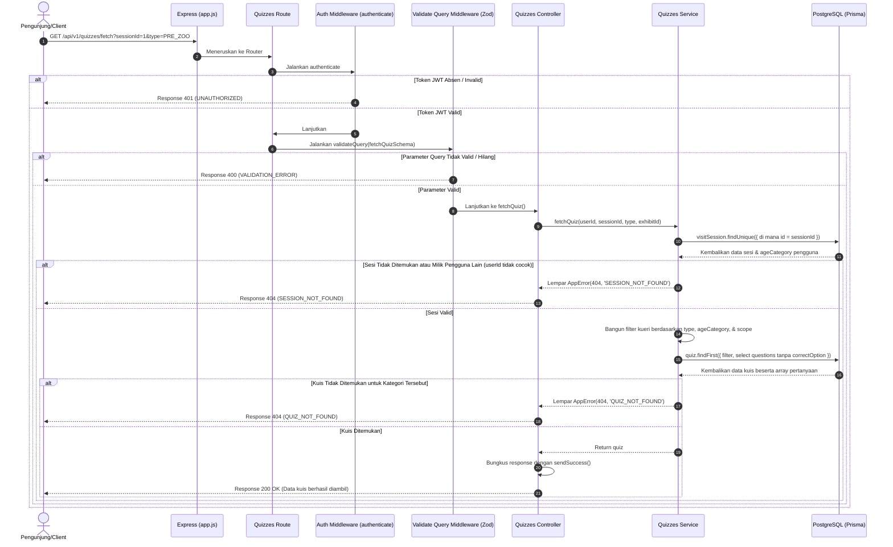

# 📝 Ambil Soal Kuis — GET /api/v1/quizzes/fetch

**Status**: ✅ Selesai | **Priority Order**: #5.1

---

## 📌 Deskripsi Fitur
Dalam ekosistem **Zoo Companion App (EIS Engine)**, kuis digunakan untuk mengukur tingkat kognitif dan pemahaman pengunjung. Terdapat empat kategori kuis berdasarkan alur kunjungan: kuis awal masuk (`PRE_ZOO`), kuis saat keluar (`POST_ZOO`), serta kuis retensi ingatan jangka panjang H+7 (`RETENTION_1W`) dan H+30 (`RETENTION_1M`).

Endpoint ini bertugas menyuguhkan daftar pertanyaan kuis pilihan ganda yang disesuaikan secara dinamis dengan kategori usia pengunjung (`CHILD`, `TEEN`, atau `ADULT`) dan cakupan kuis (global kebun binatang atau spesifik per kandang exhibit).

---

## ⚙️ Detail Endpoint

| Komponen | Spesifikasi |
| :--- | :--- |
| **HTTP Method** | `GET` |
| **URL Path** | `/api/v1/quizzes/fetch` |
| **Autentikasi** | ☑ Terproteksi (Memerlukan Bearer JWT Token) |
| **Headers** | `Authorization: Bearer <JWT_TOKEN>` |

---

## 🗂️ Skema Validasi Request (Zod)

Sistem memvalidasi query parameter sebelum memproses kueri database. Skema didefinisikan pada `src/validators/quizzes.validator.js` dalam bentuk `fetchQuizSchema`:

```javascript
export const fetchQuizSchema = z.object({
  sessionId: z.coerce.number().int().positive('sessionId harus berupa angka positif'),
  type: z.enum(['PRE_ZOO', 'POST_ZOO', 'RETENTION_1W', 'RETENTION_1M'], {
    message: 'type harus berupa nilai QuizType yang valid'
  }),
  exhibitId: z.coerce.number().int().positive('exhibitId harus berupa angka positif').optional()
});
```

### Contoh Pemanggilan Endpoint (URL Query String)
`GET /api/v1/quizzes/fetch?sessionId=1&type=PRE_ZOO`

### Rincian Aturan Validasi Field
1. **`sessionId`** (Integer, Required):
   - ID dari sesi kunjungan yang sedang aktif. Dilewatkan melalui query string dan dipaksa (*coerced*) menjadi angka bulat positif.
2. **`type`** (Enum, Required):
   - Harus bernilai salah satu dari enum `QuizType` yang valid: `PRE_ZOO`, `POST_ZOO`, `RETENTION_1W`, atau `RETENTION_1M`.
3. **`exhibitId`** (Integer, Optional):
   - ID exhibit (kandang) jika kuis ditujukan secara spesifik untuk kandang tersebut. Bersifat opsional.

---

## 🔄 Diagram Alur Proses (Sequence Diagram)

Berikut adalah visualisasi alur pemanggilan soal kuis yang adaptif berdasarkan usia pengguna:



---

## 💾 Konteks Skema Database (Prisma)

Data kuis dan daftar pertanyaan dikelola melalui tabel `quizzes` dan `questions` (`prisma/schema.prisma`):

```prisma
model Quiz {
  id          Int         @id @default(autoincrement())
  exhibitId   Int?        @map("exhibit_id")
  scope       QuizScope   @default(GLOBAL) // GLOBAL atau EXHIBIT
  title       String      @db.VarChar(150)
  quizType    QuizType    @map("quiz_type")
  ageCategory AgeCategory @map("age_category")
  createdAt   DateTime    @default(now()) @map("created_at")

  questions    Question[]

  @@map("quizzes")
}

model Question {
  id            Int      @id @default(autoincrement())
  quizId        Int      @map("quiz_id")
  questionText  String   @map("question_text") @db.Text
  optionA       String   @map("option_a") @db.Text
  optionB       String   @map("option_b") @db.Text
  optionC       String   @map("option_c") @db.Text
  optionD       String   @map("option_d") @db.Text
  correctOption String   @map("correct_option") @db.Char(1) // Kunci jawaban
  points        Int      @default(10)

  @@map("questions")
}
```

---

## 🏆 Aturan Bisnis (Business Rules)

1. **Keamanan Jawaban Kuis (Anti-Cheat):**
   Demi mencegah manipulasi atau pengerjaan kuis secara curang oleh Client yang pintar membaca data lalu lintas jaringan (network packet/JSON), field **`correctOption` (Kunci Jawaban) sengaja disaring keluar (tidak disertakan)** di tingkat kueri Prisma database. Client murni hanya menerima pilihan ganda (A, B, C, D) beserta bobot poinnya.
2. **Kuis Adaptif Kognitif (Age-based Filtering):**
   Soal kuis disaring secara otomatis berdasarkan kategori usia pengunjung yang tersimpan di dalam sesi (`CHILD`, `TEEN`, `ADULT`), sehingga tingkat kesulitan kuis selalu relevan dengan kognisi umur pengunjung.
3. **Penyaringan Cakupan (Scope Filtering):**
   * Jika parameter `exhibitId` disertakan, sistem secara otomatis mencari kuis dengan cakupan `EXHIBIT` yang bertaut khusus ke kandang hewan tersebut.
   * Jika tidak ada `exhibitId`, sistem mencari kuis dengan cakupan umum `GLOBAL` untuk kebun binatang secara menyeluruh.

---

## 📥 Format Response Sukses (200 OK)

Jika kuis berhasil ditemukan dan diambil, sistem mengembalikan status **`200 OK`** yang memuat daftar soal ter-sanitasi:

```json
{
  "success": true,
  "message": "Data kuis berhasil diambil",
  "data": {
    "id": 1,
    "title": "Kuis Awal Kunjungan Kebun Binatang",
    "quizType": "PRE_ZOO",
    "scope": "GLOBAL",
    "ageCategory": "ADULT",
    "exhibitId": null,
    "questions": [
      {
        "id": 1,
        "questionText": "Hewan mamalia darat terbesar di dunia saat ini adalah?",
        "optionA": "Jerapah",
        "optionB": "Gajah Afrika",
        "optionC": "Badak Sumatra",
        "optionD": "Kudanil",
        "points": 10
      }
    ]
  }
}
```

---

## ⚠️ Penanganan Error & Pengecualian

### 1. HTTP 400 Bad Request — `VALIDATION_ERROR`
Terjadi jika query parameter wajib tidak lengkap, bertipe salah, atau nilai enum `type` tidak valid.
```json
{
  "success": false,
  "code": "VALIDATION_ERROR",
  "message": "type harus berupa nilai QuizType yang valid"
}
```

### 2. HTTP 404 Not Found — `SESSION_NOT_FOUND`
Terjadi jika ID sesi kunjungan tidak ada di database, atau sesi tersebut milik pengguna lain.
```json
{
  "success": false,
  "code": "SESSION_NOT_FOUND",
  "message": "Sesi tidak ditemukan atau bukan milik Anda"
}
```

### 3. HTTP 404 Not Found — `QUIZ_NOT_FOUND`
Terjadi jika tidak ada kuis di database yang cocok dengan kriteria `quizType`, `ageCategory` pengguna, dan `scope` yang diajukan.
```json
{
  "success": false,
  "code": "QUIZ_NOT_FOUND",
  "message": "Kuis tidak ditemukan untuk kriteria yang diberikan"
}
```

---

## 🛠️ Referensi Implementasi Kode

- **Routing Layer:** [quizzes.routes.js](file:///home/rafi/Documents/tugas-kuliah/semester4/software%20engginer%20prak/EIS-engine/src/routes/quizzes.routes.js#L11)
- **Validation Schema:** [quizzes.validator.js](file:///home/rafi/Documents/tugas-kuliah/semester4/software%20engginer%20prak/EIS-engine/src/validators/quizzes.validator.js#L3-L9)
- **Controller Handler:** [quizzes.controller.js](file:///home/rafi/Documents/tugas-kuliah/semester4/software%20engginer%20prak/EIS-engine/src/controllers/quizzes.controller.js#L4-L19)
- **Service Layer Logic:** [quizzes.service.js](file:///home/rafi/Documents/tugas-kuliah/semester4/software%20engginer%20prak/EIS-engine/src/services/quizzes.service.js#L14-L80)

---

## 🧪 Skenario Uji Coba (Test Cases)

Semua pengujian untuk fetch kuis diimplementasikan di [quizzes.test.js](file:///home/rafi/Documents/tugas-kuliah/semester4/software%20engginer%20prak/EIS-engine/tests/quizzes.test.js#L39-L108):

1. **Skenario Positif:**
   * **Deskripsi:** Mengambil soal kuis dengan menyertakan token JWT, ID sesi aktif milik sendiri, dan tipe kuis yang terdaftar.
   * **Hasil Diharapkan:** HTTP Status `200 OK`, `success: true`, mengembalikan objek kuis dan daftar pertanyaan.
2. **Skenario Positif — Verifikasi Keamanan Jawaban:**
   * **Deskripsi:** Memeriksa seluruh array pertanyaan yang dikembalikan dari API.
   * **Hasil Diharapkan:** Properti `correctOption` **wajib bernilai undefined** di semua soal untuk meminimalkan cheat.
3. **Skenario Negatif — Kuis Tidak Eksis:**
   * **Deskripsi:** Mencoba mengambil kuis dengan kategori kriteria yang datanya belum dimasukkan admin ke database.
   * **Hasil Diharapkan:** HTTP Status `404 Not Found`, `success: false`, `code: "QUIZ_NOT_FOUND"`.
4. **Skenario Negatif — Query Parameter Hilang / Salah:**
   * **Deskripsi:** Memanggil endpoint kuis tanpa menyertakan `sessionId` atau dengan type kuis palsu.
   * **Hasil Diharapkan:** HTTP Status `400 Bad Request`, `success: false`, `code: "VALIDATION_ERROR"`.
