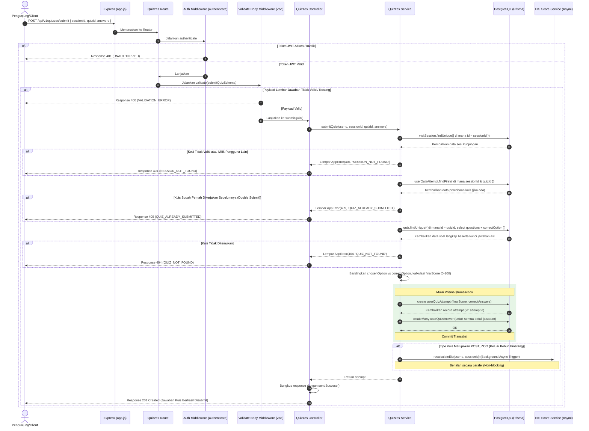

# 🔐 Submit Jawaban Kuis — POST /api/v1/quizzes/submit

**Status**: ✅ Selesai | **Priority Order**: #5.2

---

## 📌 Deskripsi Fitur
Setelah pengunjung menyelesaikan pengerjaan kuis pada aplikasi Client, Client akan mengirimkan lembar jawaban lengkap yang berisi daftar pilihan opsi (A, B, C, atau D) untuk setiap butir pertanyaan yang dijawab.

Sistem di backend memproses lembar jawaban tersebut dengan aman melalui langkah-langkah berikut:
1. Mengoreksi dan mencocokkan setiap pilihan jawaban pengunjung secara otomatis dengan kunci jawaban asli yang tersimpan di database.
2. Menghitung jumlah jawaban yang benar dan mengonversinya menjadi persentase skor akhir kuis skala 0-100.
3. Menyimpan data percobaan pengerjaan (`UserQuizAttempt`) dan rincian pilihan jawaban per soal (`UserQuizAnswer`) dalam satu transaksi atomik.
4. Memicu kalkulasi ulang EIS Score secara non-blocking (*background operation*) apabila kuis yang diselesaikan adalah kuis akhir kunjungan (`POST_ZOO`).

---

## ⚙️ Detail Endpoint

| Komponen | Spesifikasi |
| :--- | :--- |
| **HTTP Method** | `POST` |
| **URL Path** | `/api/v1/quizzes/submit` |
| **Autentikasi** | ☑ Terproteksi (Memerlukan Bearer JWT Token) |
| **Headers** | `Authorization: Bearer <JWT_TOKEN>`, `Content-Type: application/json` |

---

## 🗂️ Skema Validasi Request (Zod)

Sistem menggunakan **Zod** untuk memastikan integritas lembar jawaban sebelum melakukan pencocokan kunci. Skema didefinisikan pada `src/validators/quizzes.validator.js` dalam bentuk `submitQuizSchema`:

```javascript
export const submitQuizSchema = z.object({
  sessionId: z.number().int().positive('sessionId harus berupa angka positif'),
  quizId: z.number().int().positive('quizId harus berupa angka positif'),
  answers: z.array(z.object({
    questionId: z.number().int().positive('questionId harus berupa angka positif'),
    chosenOption: z.enum(['A', 'B', 'C', 'D'])
  })).min(1, 'Dibutuhkan setidaknya satu jawaban')
});
```

### Format Payload Request (JSON)
```json
{
  "sessionId": 1,
  "quizId": 1,
  "answers": [
    { "questionId": 1, "chosenOption": "B" },
    { "questionId": 2, "chosenOption": "C" }
  ]
}
```

### Rincian Aturan Validasi Field
1. **`sessionId`** (Integer, Required):
   - ID dari sesi kunjungan aktif yang terikat. Harus bertipe angka bulat positif.
2. **`quizId`** (Integer, Required):
   - ID dari kuis yang dikerjakan. Harus bertipe angka bulat positif.
3. **`answers`** (Array, Required):
   - Array dari objek jawaban. Wajib menyertakan minimal 1 jawaban (`.min(1)`).
   - Setiap elemen objek jawaban wajib memiliki `questionId` (angka bulat positif) dan `chosenOption` (karakter enum `A`, `B`, `C`, atau `D`).

---

## 🔄 Diagram Alur Proses (Sequence Diagram)

Berikut adalah alur pengerjaan koreksi otomatis, penyimpanan data, serta pemecahan trigger background EIS Score:



---

## 💾 Konteks Skema Database (Prisma)

Data hasil evaluasi kuis direkam secara permanen ke dalam tabel `user_quiz_attempts` dan detail jawabannya disimpan ke tabel `user_quiz_answers` (`prisma/schema.prisma`):

```prisma
model UserQuizAttempt {
  id             Int       @id @default(autoincrement())
  userId         Int       @map("user_id")
  sessionId      Int       @map("session_id")
  quizId         Int       @map("quiz_id")
  totalQuestions Int       @map("total_questions")
  correctAnswers Int       @default(0) @map("correct_answers")
  finalScore     Int       @default(0) @map("final_score") // Skor persentase (0–100)
  startedAt      DateTime  @default(now()) @map("started_at")
  completedAt    DateTime? @map("completed_at")

  user    User         @relation(fields: [userId], references: [id], onDelete: Cascade)
  session VisitSession @relation(fields: [sessionId], references: [id], onDelete: Cascade)
  quiz    Quiz         @relation(fields: [quizId], references: [id], onDelete: Cascade)
  answers UserQuizAnswer[]

  @@map("user_quiz_attempts")
}

model UserQuizAnswer {
  id            Int      @id @default(autoincrement())
  attemptId     Int      @map("attempt_id")
  questionId    Int      @map("question_id")
  chosenOption  String   @map("chosen_option") @db.Char(1)
  isCorrect     Boolean  @map("is_correct")
  answeredAt    DateTime @default(now()) @map("answered_at")

  attempt  UserQuizAttempt @relation(fields: [attemptId], references: [id], onDelete: Cascade)
  question Question        @relation(fields: [questionId], references: [id], onDelete: Cascade)

  @@map("user_quiz_answers")
}
```

---

## 🏆 Aturan Bisnis (Business Rules)

1. **Pemeriksaan Kepemilikan Sesi:**
   Jawaban kuis hanya dapat disubmit ke dalam sesi kunjungan aktif yang sah milik pengunjung yang bersangkutan. Request dari pengunjung yang mencoba mensubmit kuis ke sesi orang lain akan langsung ditolak (HTTP 404 `SESSION_NOT_FOUND`).
2. **Pencegahan Double Submission:**
   Demi menjaga keabsahan penilaian edukasi, pengunjung **dilarang keras mengambil kuis yang sama lebih dari sekali** dalam satu sesi kunjungan. Sistem memverifikasi duplikasi kueri di database, dan mengembalikan error HTTP 409 `QUIZ_ALREADY_SUBMITTED` bila terdeteksi pelanggaran.
3. **Kalkulasi Skor Persentase Terpusat:**
   Skor dihitung langsung di backend menggunakan rumus persentase dengan pembulatan bulat terdekat:
   $$\text{Final Score} = \text{Math.round}\left(\frac{\text{Jumlah Benar}}{\text{Total Pertanyaan}} \times 100\right)$$
   Ini menghindari manipulasi skor mentah dari sisi Client.
4. **Mekanisme Transaksi Atomik Database:**
   Pencatatan ringkasan pengerjaan kuis (`UserQuizAttempt`) dan penyimpanan baris detail jawaban per soal kuis (`UserQuizAnswer`) dilakukan di dalam satu blok transaksi database Prisma (`$transaction`). Hal ini memastikan integritas data, agar detail lembar jawaban tidak pernah menjadi *orphan* (menggantung tanpa induk attempt).
5. **Trigger Non-Blocking EIS Score (POST_ZOO):**
   Jika kuis yang disubmit bertipe kuis keluar (`POST_ZOO`), server secara otomatis langsung memicu proses kalkulasi ulang EIS Score (`recalculateEis`). Operasi ini dijalankan secara **asynchronous (background process)** dengan menggunakan `.catch()` untuk penanganan error. Ini bertujuan agar Client segera mendapatkan response konfirmasi pengerjaan kuis yang cepat tanpa perlu menunggu kalkulasi agregasi EIS yang memakan waktu di backend selesai.

---

## 📥 Format Response Sukses (201 Created)

Jika pengerjaan kuis berhasil dikoreksi dan disimpan, sistem mengembalikan status **`201 Created`**:

```json
{
  "success": true,
  "message": "Jawaban kuis berhasil disubmit",
  "data": {
    "id": 5,
    "userId": 1,
    "sessionId": 1,
    "quizId": 1,
    "totalQuestions": 2,
    "correctAnswers": 2,
    "finalScore": 100,
    "startedAt": "2026-05-30T11:59:10.000Z",
    "completedAt": "2026-05-30T11:59:15.000Z"
  }
}
```

---

## ⚠️ Penanganan Error & Pengecualian

### 1. HTTP 400 Bad Request — `VALIDATION_ERROR`
Terjadi jika array `answers` kosong, field tidak lengkap, atau pilihan opsi berada di luar enum `['A', 'B', 'C', 'D']`.
```json
{
  "success": false,
  "code": "VALIDATION_ERROR",
  "message": "Dibutuhkan setidaknya satu jawaban"
}
```

### 2. HTTP 404 Not Found — `SESSION_NOT_FOUND`
Terjadi jika `sessionId` tidak terdaftar atau merupakan milik pengunjung lain.
```json
{
  "success": false,
  "code": "SESSION_NOT_FOUND",
  "message": "Sesi tidak valid atau tidak ditemukan"
}
```

### 3. HTTP 404 Not Found — `QUIZ_NOT_FOUND`
Terjadi jika `quizId` yang diajukan tidak dapat ditemukan di database.
```json
{
  "success": false,
  "code": "QUIZ_NOT_FOUND",
  "message": "Kuis tidak ditemukan"
}
```

### 4. HTTP 409 Conflict — `QUIZ_ALREADY_SUBMITTED`
Terjadi jika pengunjung mencoba mensubmit kembali lembar jawaban untuk kuis yang sudah pernah dikerjakan pada sesi kunjungan tersebut.
```json
{
  "success": false,
  "code": "QUIZ_ALREADY_SUBMITTED",
  "message": "Anda sudah mengambil kuis ini"
}
```

---

## 🛠️ Referensi Implementasi Kode

- **Routing Layer:** [quizzes.routes.js](file:///home/rafi/Documents/tugas-kuliah/semester4/software%20engginer%20prak/EIS-engine/src/routes/quizzes.routes.js#L15)
- **Validation Schema:** [quizzes.validator.js](file:///home/rafi/Documents/tugas-kuliah/semester4/software%20engginer%20prak/EIS-engine/src/validators/quizzes.validator.js#L11-L18)
- **Controller Handler:** [quizzes.controller.js](file:///home/rafi/Documents/tugas-kuliah/semester4/software%20engginer%20prak/EIS-engine/src/controllers/quizzes.controller.js#L21-L32)
- **Service Layer Logic:** [quizzes.service.js](file:///home/rafi/Documents/tugas-kuliah/semester4/software%20engginer%20prak/EIS-engine/src/services/quizzes.service.js#L90-L184)
- **EIS Agregasi Trigger:** [eis.service.js](file:///home/rafi/Documents/tugas-kuliah/semester4/software%20engginer%20prak/EIS-engine/src/services/eis.service.js)

---

## 🧪 Skenario Uji Coba (Test Cases)

Semua pengujian untuk submit kuis diimplementasikan di [quizzes.test.js](file:///home/rafi/Documents/tugas-kuliah/semester4/software%20engginer%20prak/EIS-engine/tests/quizzes.test.js#L110-L201):

1. **Skenario Positif:**
   * **Deskripsi:** Mensubmit jawaban kuis yang sah dengan kunci jawaban yang tepat pada sesi aktif milik sendiri.
   * **Hasil Diharapkan:** HTTP Status `201 Created`, `success: true`, payload data mengembalikan ringkasan attempt dengan `finalScore` berupa persentase nilai (skala 0-100).
2. **Skenario Negatif — Double Submission:**
   * **Deskripsi:** Mencoba mensubmit lembar jawaban untuk kuis yang sudah pernah direkam pengerjaannya di database pada sesi bersangkutan.
   * **Hasil Diharapkan:** HTTP Status `409 Conflict`, `success: false`, `code: "QUIZ_ALREADY_SUBMITTED"`.
3. **Skenario Negatif — Kuis Tidak Ditemukan:**
   * **Deskripsi:** Mensubmit kuis menggunakan ID kuis palsu.
   * **Hasil Diharapkan:** HTTP Status `404 Not Found`, `success: false`, `code: "QUIZ_NOT_FOUND"`.
4. **Skenario Negatif — Array Jawaban Kosong:**
   * **Deskripsi:** Mengirim request dengan parameter `answers: []`.
   * **Hasil Diharapkan:** HTTP Status `400 Bad Request`, `success: false`, `code: "VALIDATION_ERROR"`.
