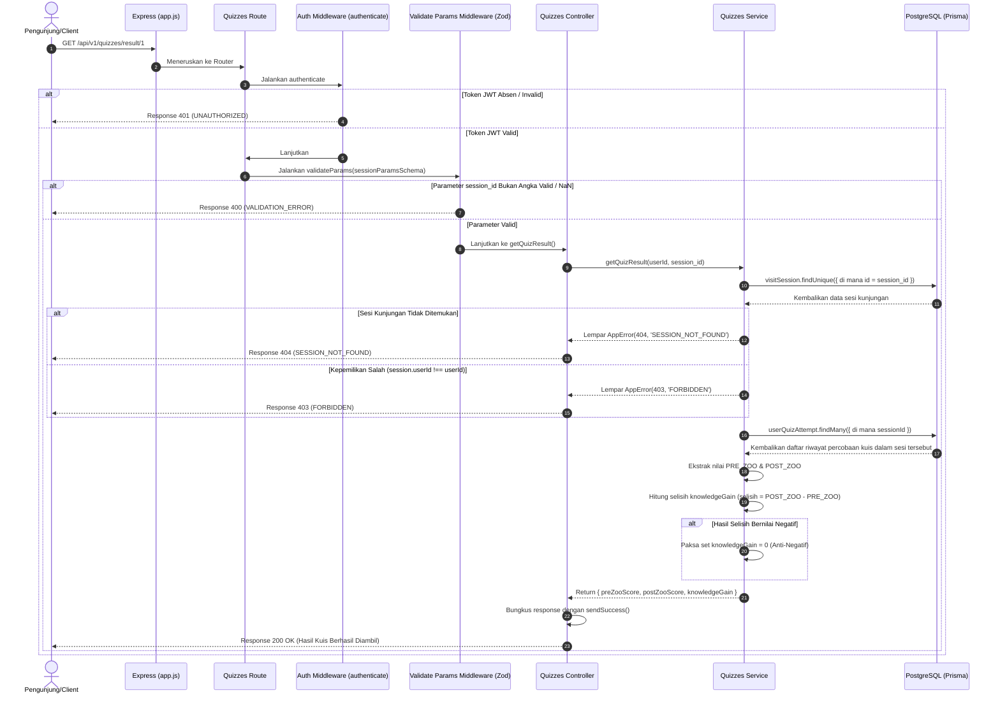

# 📊 Hasil Perbandingan Kuis & Pertumbuhan Pengetahuan — GET /api/v1/quizzes/result/:session_id

**Status**: ✅ Selesai | **Priority Order**: #5.3

---

## 📌 Deskripsi Fitur
Tujuan utama dari sistem **EIS Engine** adalah mengukur dampak edukasi dari kunjungan ke kebun binatang. Poin penilaian yang sangat krusial dalam pilar ini adalah pertumbuhan pengetahuan pengunjung (*Knowledge Gain*).

Endpoint terproteksi ini digunakan oleh aplikasi Client untuk memanggil ringkasan evaluasi perbandingan nilai kuis sebelum kunjungan (`PRE_ZOO`) dan setelah kunjungan (`POST_ZOO`) untuk satu sesi kunjungan tertentu. Sistem secara otomatis menghitung selisih peningkatan skor kognitif pengunjung sebagai indikator keberhasilan edukatif.

---

## ⚙️ Detail Endpoint

| Komponen | Spesifikasi |
| :--- | :--- |
| **HTTP Method** | `GET` |
| **URL Path** | `/api/v1/quizzes/result/:session_id` |
| **Autentikasi** | ☑ Terproteksi (Memerlukan Bearer JWT Token) |
| **Headers** | `Authorization: Bearer <JWT_TOKEN>` |

---

## 🗂️ Skema Validasi Request (Zod)

Sistem memvalidasi parameter URL menggunakan pustaka **Zod** untuk menangani kesalahan input. Skema didefinisikan pada `src/validators/quizzes.validator.js` dalam bentuk `sessionParamsSchema`:

```javascript
export const sessionParamsSchema = z.object({
  session_id: z.coerce.number().finite('session_id harus berupa angka valid').int().positive()
});
```

### Contoh Pemanggilan Endpoint (URL Path Parameter)
`GET /api/v1/quizzes/result/1`

### Rincian Aturan Validasi Field
1. **`session_id`** (Integer, Required):
   - Parameter dilewatkan melalui URL path. Dipaksa (*coerced*) bertipe angka, wajib berupa bilangan bulat positif yang valid/finite (mencegah nilai `NaN`).

---

## 🔄 Diagram Alur Proses (Sequence Diagram)

Berikut adalah visualisasi alur validasi hak akses dan kalkulasi pertumbuhan pengetahuan pengunjung:



---

## 💾 Konteks Skema Database (Prisma)

Kalkulasi pertumbuhan pengetahuan bertumpu pada pencarian silang tabel `visit_sessions` dan tabel `user_quiz_attempts` (`prisma/schema.prisma`):

```prisma
model VisitSession {
  id          Int       @id @default(autoincrement())
  userId      Int       @map("user_id")
  
  quizAttempts       UserQuizAttempt[]

  @@map("visit_sessions")
}

model UserQuizAttempt {
  id             Int       @id @default(autoincrement())
  sessionId      Int       @map("session_id")
  quizId         Int       @map("quiz_id")
  finalScore     Int       @default(0) @map("final_score") // Nilai akhir kuis

  quiz    Quiz         @relation(fields: [quizId], references: [id], onDelete: Cascade)
  session VisitSession @relation(fields: [sessionId], references: [id], onDelete: Cascade)

  @@map("user_quiz_attempts")
}
```

---

## 🏆 Aturan Bisnis (Business Rules)

1. **Pemeriksaan Otorisasi Kepemilikan Sesi (Privacy Protection):**
   Pengunjung hanya diperbolehkan mengakses laporan hasil kuis miliknya sendiri. Jika pengguna yang terenkripsi di dalam token JWT mencoba membuka hasil kuis milik orang lain, sistem akan melarang keras akses tersebut dengan status HTTP 403 `FORBIDDEN`.
2. **Formula Peningkatan Pengetahuan (*Knowledge Gain*):**
   * Peningkatan dihitung dari selisih antara nilai kuis pasca-kunjungan (`POST_ZOO`) dengan nilai kuis pra-kunjungan (`PRE_ZOO`):
     $$\text{Knowledge Gain} = \text{Score}_{\text{POST\_ZOO}} - \text{Score}_{\text{PRE\_ZOO}}$$
   * **Batas Minimum Peningkatan (Anti-Negative Rule):** Jika dalam beberapa kasus pengunjung mendapatkan nilai kuis keluar lebih kecil daripada kuis awal masuk (sehingga selisih bernilai negatif), **sistem akan memaksa nilai Knowledge Gain menjadi `0`**. Aturan ini dirancang untuk mencegah terjadinya nilai dampak edukasi yang negatif dalam agregasi EIS Score.

---

## 📥 Format Response Sukses (200 OK)

Jika data sesi valid, sistem mengembalikan status **`200 OK`**:

```json
{
  "success": true,
  "message": "Hasil kuis berhasil diambil",
  "data": {
    "preZooScore": 60,
    "postZooScore": 80,
    "knowledgeGain": 20
  }
}
```

---

## ⚠️ Penanganan Error & Pengecualian

### 1. HTTP 400 Bad Request — `VALIDATION_ERROR`
Terjadi jika parameter URL `session_id` bukan merupakan angka valid atau bertipe `NaN`.
```json
{
  "success": false,
  "code": "VALIDATION_ERROR",
  "message": "session_id harus berupa angka valid"
}
```

### 2. HTTP 403 Forbidden — `FORBIDDEN`
Terjadi jika pengunjung mencoba memanggil data hasil kuis dari sesi kunjungan milik orang lain.
```json
{
  "success": false,
  "code": "FORBIDDEN",
  "message": "Akses ditolak: Sesi bukan milik Anda"
}
```

### 3. HTTP 404 Not Found — `SESSION_NOT_FOUND`
Terjadi jika `session_id` yang dimasukkan tidak ditemukan di dalam database.
```json
{
  "success": false,
  "code": "SESSION_NOT_FOUND",
  "message": "Sesi tidak ditemukan"
}
```

---

## 🛠️ Referensi Implementasi Kode

- **Routing Layer:** [quizzes.routes.js](file:///home/rafi/Documents/tugas-kuliah/semester4/software%20engginer%20prak/EIS-engine/src/routes/quizzes.routes.js#L19)
- **Validation Schema:** [quizzes.validator.js](file:///home/rafi/Documents/tugas-kuliah/semester4/software%20engginer%20prak/EIS-engine/src/validators/quizzes.validator.js#L20-L23)
- **Controller Handler:** [quizzes.controller.js](file:///home/rafi/Documents/tugas-kuliah/semester4/software%20engginer%20prak/EIS-engine/src/controllers/quizzes.controller.js#L34-L45)
- **Service Layer Logic:** [quizzes.service.js](file:///home/rafi/Documents/tugas-kuliah/semester4/software%20engginer%20prak/EIS-engine/src/services/quizzes.service.js#L192-L242)

---

## 🧪 Skenario Uji Coba (Test Cases)

Semua pengujian untuk perbandingan hasil kuis diimplementasikan di [quizzes.test.js](file:///home/rafi/Documents/tugas-kuliah/semester4/software%20engginer%20prak/EIS-engine/tests/quizzes.test.js#L203-L268):

1. **Skenario Positif:**
   * **Deskripsi:** Mengambil data hasil perbandingan dalam satu sesi yang sah, di mana kuis `PRE_ZOO` bernilai `60` dan `POST_ZOO` bernilai `80`.
   * **Hasil Diharapkan:** HTTP Status `200 OK`, `success: true`, data `knowledgeGain` dihitung dengan benar bernilai `20`.
2. **Skenario Positif — Kasus Nilai Menurun (Anti-Negatif):**
   * **Deskripsi:** Mengambil data hasil kuis di mana nilai `PRE_ZOO` bernilai `80` tetapi `POST_ZOO` bernilai `50`.
   * **Hasil Diharapkan:** HTTP Status `200 OK`, `success: true`, data `knowledgeGain` dipaksa bernilai `0` (bukan `-30`).
3. **Skenario Negatif — Mencoba Membuka Sesi Orang Lain:**
   * **Deskripsi:** Request data kuis sesi ID 1 menggunakan token JWT milik user lain.
   * **Hasil Diharapkan:** HTTP Status `403 Forbidden`, `success: false`, `code: "FORBIDDEN"`.
4. **Skenario Negatif — Sesi Tidak Ditemukan:**
   * **Deskripsi:** Memanggil hasil kuis menggunakan parameter `session_id` yang tidak eksis.
   * **Hasil Diharapkan:** HTTP Status `404 Not Found`, `success: false`, `code: "SESSION_NOT_FOUND"`.
5. **Skenario Negatif — Parameter Salah Tipe:**
   * **Deskripsi:** Mengisi parameter path dengan tipe data string bukan angka bulat (misal `/result/abc`).
   * **Hasil Diharapkan:** HTTP Status `400 Bad Request`, `success: false`, `code: "VALIDATION_ERROR"`.
