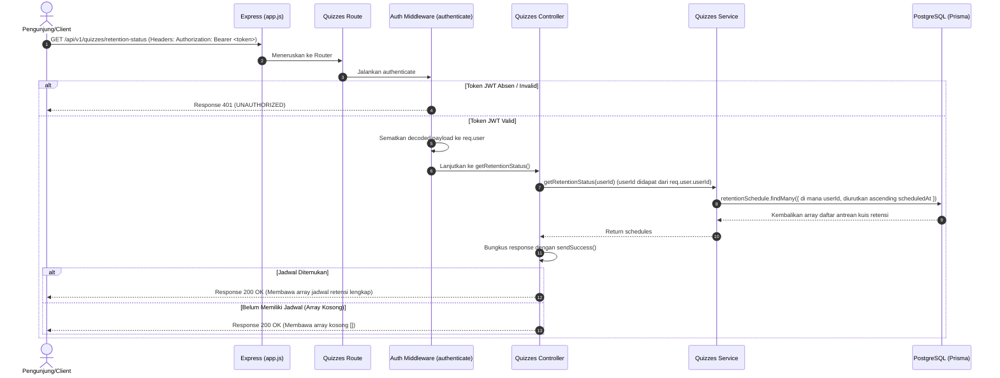

# 📅 Ambil Status Jadwal Kuis Retensi — GET /api/v1/quizzes/retention-status

**Status**: ✅ Selesai | **Priority Order**: #5.4

---

## 📌 Deskripsi Fitur
Sebagai bagian dari pemantauan ingatan jangka panjang, sistem **EIS Engine** menjadwalkan kuis retensi kognitif yang akan dikirim melalui email pada H+7 (`RETENTION_1W`) dan H+30 (`RETENTION_1M`) setelah pengunjung pulang (check-out) dari kebun binatang.

Endpoint terproteksi ini digunakan oleh Client untuk memantau status antrean jadwal pengiriman kuis retensi bagi pengunjung yang sedang masuk saat ini. Melalui endpoint ini, pengunjung dapat melihat daftar jadwal pengiriman kuis retensi mereka, kapan email tersebut direncanakan dikirim, serta apakah kuis tersebut sudah dikirim (`SENT`), sudah dijawab (`COMPLETED`), atau sudah kedaluwarsa (`EXPIRED`).

---

## ⚙️ Detail Endpoint

| Komponen | Spesifikasi |
| :--- | :--- |
| **HTTP Method** | `GET` |
| **URL Path** | `/api/v1/quizzes/retention-status` |
| **Autentikasi** | ☑ Terproteksi (Memerlukan Bearer JWT Token) |
| **Headers** | `Authorization: Bearer <JWT_TOKEN>` |

---

## 🗂️ Skema Validasi Request

Endpoint ini **tidak memerlukan payload request (body atau query string)**. Daftar antrean jadwal retensi disaring secara otomatis di tingkat database berdasarkan `userId` yang diperoleh secara aman dari JWT terdekripsi.

---

## 🔄 Diagram Alur Proses (Sequence Diagram)

Berikut adalah visualisasi alur otorisasi dan pengambilan daftar antrean jadwal kuis retensi dari database:



---

## 💾 Konteks Skema Database (Prisma)

Data status antrean kuis retensi diambil secara langsung dari tabel `retention_schedules` (model `RetentionSchedule` di `prisma/schema.prisma`):

```prisma
enum RetentionStatus {
  PENDING     // Belum dikirim
  SENT        // Sudah dikirim ke email
  COMPLETED   // Sudah dijawab pengunjung
  EXPIRED     // Melewati batas waktu tanpa dijawab
}

model RetentionSchedule {
  id          Int             @id @default(autoincrement())
  userId      Int             @map("user_id")
  sessionId   Int             @map("session_id")
  quizType    QuizType        @map("quiz_type")
  scheduledAt DateTime        @map("scheduled_at")
  sentAt      DateTime?       @map("sent_at")
  status      RetentionStatus @default(PENDING)
  createdAt   DateTime        @default(now()) @map("created_at")

  @@unique([userId, sessionId, quizType])
  @@map("retention_schedules")
}
```

---

## 🏆 Aturan Bisnis (Business Rules)

1. **Akses Terbatas Mandiri (Data Privacy):**
   Pengunjung hanya diizinkan untuk melihat status antrean jadwal retensi milik mereka sendiri. Sistem melakukan pemfilteran kueri database secara otomatis menggunakan parameter `where: { userId }` yang bersumber dari JWT terdekripsi, mencegah kebocoran informasi antar pengunjung.
2. **Urutan Kronologis Maju (Chronological Order):**
   Untuk memberikan kemudahan pemantauan secara urut dari tanggal terdekat hingga terjauh, sistem mengembalikan daftar jadwal dengan kueri pengurutan menaik: `orderBy: { scheduledAt: 'asc' }`.
3. **Penyajian Data Kosong yang Aman (Safe Zero Case Handling):**
   Bagi pengunjung baru yang baru saja mendaftar atau pengunjung aktif yang belum pernah mengakhiri sesi kunjungan pertama mereka (sehingga belum ada jadwal kuis retensi terbuat di database), sistem tetap merespon dengan status HTTP **`200 OK`** yang melampirkan array kosong `[]` (bukan melempar error).

---

## 📥 Format Response Sukses (200 OK)

### 1. Contoh Response dengan Jadwal Retensi Aktif
```json
{
  "success": true,
  "message": "Status jadwal retensi berhasil diambil",
  "data": [
    {
      "id": 1,
      "sessionId": 1,
      "quizType": "RETENTION_1W",
      "scheduledAt": "2026-06-06T11:56:30.000Z",
      "sentAt": null,
      "status": "PENDING",
      "createdAt": "2026-05-30T11:56:52.000Z"
    },
    {
      "id": 2,
      "sessionId": 1,
      "quizType": "RETENTION_1M",
      "scheduledAt": "2026-06-29T11:56:30.000Z",
      "sentAt": null,
      "status": "PENDING",
      "createdAt": "2026-05-30T11:56:52.000Z"
    }
  ]
}
```

### 2. Contoh Response Tanpa Jadwal Retensi (Pengunjung Baru / Belum Checkout Sesi)
```json
{
  "success": true,
  "message": "Status jadwal retensi berhasil diambil",
  "data": []
}
```

---

## ⚠️ Penanganan Error & Pengecualian

### 1. HTTP 401 Unauthorized — `UNAUTHORIZED`
Terjadi jika token JWT tidak disertakan atau tanda tangan token tersebut tidak valid/kadaluarsa.
```json
{
  "success": false,
  "code": "UNAUTHORIZED",
  "message": "Token akses tidak ditemukan"
}
```

### 2. HTTP 500 Internal Server Error — `INTERNAL_ERROR`
Terjadi jika ada kegagalan komunikasi sistem dengan database PostgreSQL (Supabase) saat menarik data jadwal retensi.
```json
{
  "success": false,
  "code": "INTERNAL_ERROR",
  "message": "Terjadi kesalahan internal pada server"
}
```

---

## 🛠️ Referensi Implementasi Kode

- **Routing Layer:** [quizzes.routes.js](file:///home/rafi/Documents/tugas-kuliah/semester4/software%20engginer%20prak/EIS-engine/src/routes/quizzes.routes.js#L23)
- **Controller Handler:** [quizzes.controller.js](file:///home/rafi/Documents/tugas-kuliah/semester4/software%20engginer%20prak/EIS-engine/src/controllers/quizzes.controller.js#L47-L56)
- **Service Layer Logic:** [quizzes.service.js](file:///home/rafi/Documents/tugas-kuliah/semester4/software%20engginer%20prak/EIS-engine/src/services/quizzes.service.js#L245-L272)

---

## 🧪 Skenario Uji Coba (Test Cases)

Semua pengujian untuk status jadwal retensi diimplementasikan di [quizzes.test.js](file:///home/rafi/Documents/tugas-kuliah/semester4/software%20engginer%20prak/EIS-engine/tests/quizzes.test.js#L270-L301):

1. **Skenario Positif:**
   * **Deskripsi:** Mengambil daftar antrean kuis retensi dengan token JWT yang sah dari pengguna terdaftar yang sudah checkout.
   * **Hasil Diharapkan:** HTTP Status `200 OK`, `success: true`, mengembalikan array berisi jadwal retensi dengan urutan menaik berdasarkan `scheduledAt`.
2. **Skenario Positif — Kasus Tanpa Jadwal:**
   * **Deskripsi:** Mengambil daftar kuis retensi untuk pengguna yang belum memiliki record jadwal retensi apa pun di database.
   * **Hasil Diharapkan:** HTTP Status `200 OK`, `success: true`, payload data berupa array kosong `[]`.
3. **Skenario Negatif — Tanpa Token Autentikasi:**
   * **Deskripsi:** Memanggil endpoint status retensi tanpa menyertakan token JWT Bearer di header.
   * **Hasil Diharapkan:** HTTP Status `401 Unauthorized`, `success: false`, `code: "UNAUTHORIZED"`.
