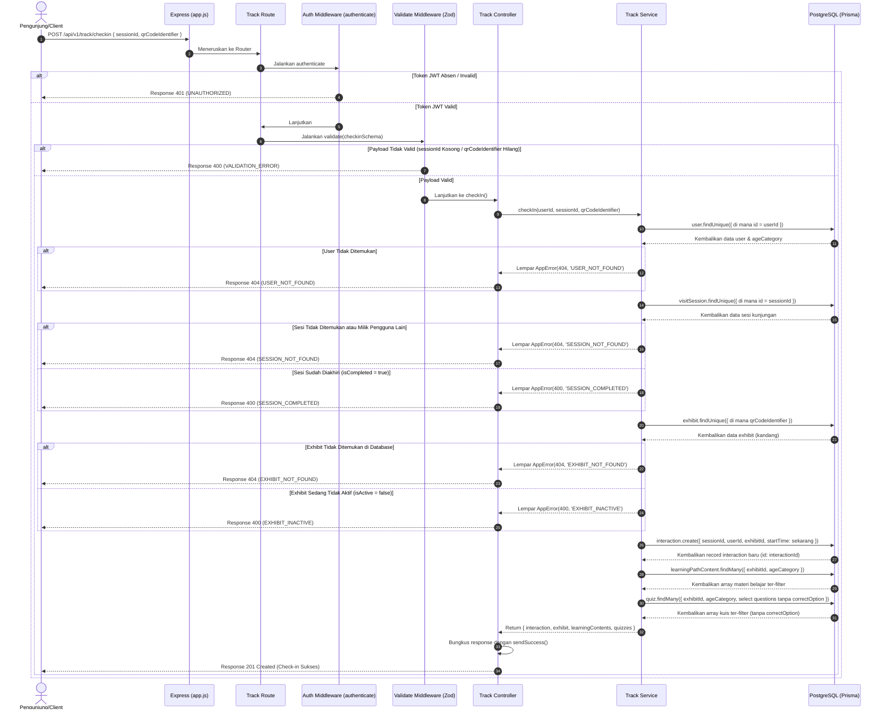

# 📍 Check-in Exhibit (Scan QR Code) — POST /api/v1/track/checkin

**Status**: ✅ Selesai | **Priority Order**: #6.1

---

## 📌 Deskripsi Fitur
Sebagai jantung dari fitur penjelajahan interaktif di kebun binatang, setiap area kandang (*Exhibit*) dilengkapi dengan papan penanda fisik yang memuat kode QR unik. 

Saat pengunjung melakukan pindai masuk (check-in) menggunakan kamera aplikasi Client, endpoint ini dipanggil untuk:
1. Memvalidasi keabsahan kode QR dan status keaktifan exhibit bersangkutan.
2. Membuka record pelacakan baru pada tabel `interactions` dengan mencatat waktu awal masuk (`startTime`).
3. Menyuguhkan **jalur konten pembelajaran adaptif kognitif** (`LearningPathContent`) dan daftar kuis exhibit terkait yang disesuaikan secara real-time dengan kategori usia pengunjung (`CHILD`, `TEEN`, `ADULT`).

---

## ⚙️ Detail Endpoint

| Komponen | Spesifikasi |
| :--- | :--- |
| **HTTP Method** | `POST` |
| **URL Path** | `/api/v1/track/checkin` |
| **Autentikasi** | ☑ Terproteksi (Memerlukan Bearer JWT Token) |
| **Headers** | `Authorization: Bearer <JWT_TOKEN>`, `Content-Type: application/json` |

---

## 🗂️ Skema Validasi Request (Zod)

Sistem menggunakan **Zod** untuk memastikan integritas data identitas sesi dan kode QR exhibit sebelum kueri database dieksekusi. Skema didefinisikan pada `src/validators/track.validator.js` dalam bentuk `checkinSchema`:

```javascript
export const checkinSchema = z.object({
  sessionId: z.number().int().positive('sessionId harus berupa angka positif'),
  qrCodeIdentifier: z.string().min(1, 'qrCodeIdentifier wajib diisi')
});
```

### Format Payload Request (JSON)
```json
{
  "sessionId": 1,
  "qrCodeIdentifier": "EXHIBIT-HARIMAU-001"
}
```

### Rincian Aturan Validasi Field
1. **`sessionId`** (Integer, Required):
   - ID kunci utama dari sesi kunjungan aktif pengguna. Harus bertipe angka bulat positif.
2. **`qrCodeIdentifier`** (String, Required):
   - String kode identitas unik exhibit yang dibaca dari pindaian QR Code (misalnya `EXHIBIT-HARIMAU-001`). Tidak boleh kosong.

---

## 🔄 Diagram Alur Proses (Sequence Diagram)

Berikut adalah visualisasi alur validasi status sesi dan exhibit serta penyusunan konten adaptif:



---

## 💾 Konteks Skema Database (Prisma)

Proses check-in merekam baris data baru ke tabel `interactions` yang bertaut secara relasional ke tabel `exhibits` (`prisma/schema.prisma`):

```prisma
model Exhibit {
  id               Int       @id @default(autoincrement())
  name             String    @db.VarChar(100)
  zoneName         String    @map("zone_name") @db.VarChar(100)
  description      String    @db.Text
  qrCodeIdentifier String    @unique @map("qr_code_identifier") @db.VarChar(100)
  isActive         Boolean   @default(true) @map("is_active")
  createdAt        DateTime  @default(now()) @map("created_at")

  interactions         Interaction[]
  learningPathContents LearningPathContent[]
  quizzes              Quiz[]

  @@map("exhibits")
}

model Interaction {
  id                 Int       @id @default(autoincrement())
  sessionId          Int       @map("session_id")
  userId             Int       @map("user_id")
  exhibitId          Int       @map("exhibit_id")
  startTime          DateTime  @map("start_time")
  endTime            DateTime? @map("end_time")
  durationSeconds    Int?      @map("duration_seconds")
  
  // Media consumption logs
  clickedAudio       Boolean   @default(false) @map("clicked_audio")
  clickedVideo       Boolean   @default(false) @map("clicked_video")
  clickedVisual      Boolean   @default(false) @map("clicked_visual")
  clickedInteractive Boolean   @default(false) @map("clicked_interactive")
  createdAt          DateTime  @default(now()) @map("created_at")

  session            VisitSession         @relation(fields: [sessionId], references: [id], onDelete: Cascade)
  user               User                 @relation(fields: [userId], references: [id], onDelete: Cascade)
  exhibit            Exhibit              @relation(fields: [exhibitId], references: [id], onDelete: Cascade)
  labLogs            InteractiveLabLog[]

  @@map("interactions")
}
```

---

## 🏆 Aturan Bisnis (Business Rules)

1. **Kepemilikan & Status Sesi Aktif:**
   Pengunjung hanya dapat melakukan check-in kandang menggunakan ID sesi kunjungan miliknya sendiri yang berstatus aktif (`isCompleted: false`). Check-in ke sesi yang telah ditutup (checkout dari kebun binatang) akan ditolak demi konsistensi analitik dengan error HTTP 400 `SESSION_COMPLETED`.
2. **Aturan Keaktifan Exhibit (Exhibit Maintenance Rule):**
   Jika admin kebun binatang menonaktifkan exhibit tertentu (misalnya kandang gajah ditutup sementara karena perawatan kesehatan hewan), field `isActive` di database diatur ke `false`. Pemindaian QR Code pada kandang yang nonaktif akan memicu error HTTP 400 `EXHIBIT_INACTIVE`.
3. **Penyaringan Jalur Pembelajaran Adaptif (Adaptive Learning Path):**
   * Konten edukasi (`learningContents`) dan kuis exhibit (`quizzes`) difilter secara real-time di database berdasarkan kategori usia pengunjung (`ageCategory`). Pengunjung anak-anak akan menerima narasi edukatif bergambar yang ringan, sedangkan pengunjung dewasa akan menerima data konservasi dan sains yang lebih mendalam.
4. **Keamanan Kunci Soal Kuis Exhibit (Anti-Cheat):**
   Daftar pertanyaan kuis yang dikirimkan pada payload check-in **sengaja disaring tanpa menyertakan field `correctOption` (kunci jawaban)** demi meminimalkan kecurangan penilaian di tingkat Client.
5. **Kemudahan Alur Tanpa Hambatan (Anti-Blocking Check-in):**
   Untuk menjaga kenyamanan pengalaman pengguna (*User Experience*) di lapangan (karena pengunjung seringkali lupa menekan tombol "Keluar Kandang" atau terjadi gangguan konektivitas GPS/seluler), sistem **tidak memblokir** pendaftaran check-in baru di exhibit B meskipun pengunjung bersangkutan belum secara formal melakukan checkout dari exhibit A sebelumnya.

---

## 📥 Format Response Sukses (201 Created)

Bila check-in berhasil dicatat, sistem mengembalikan status **`201 Created`** membawa metadata konten edukasi:

```json
{
  "success": true,
  "message": "Check-in berhasil",
  "data": {
    "interaction": {
      "id": 89,
      "sessionId": 1,
      "userId": 1,
      "exhibitId": 3,
      "startTime": "2026-05-30T12:02:14.000Z",
      "endTime": null,
      "durationSeconds": null,
      "clickedAudio": false,
      "clickedVideo": false,
      "clickedVisual": false,
      "clickedInteractive": false
    },
    "exhibit": {
      "id": 3,
      "name": "Harimau Sumatera",
      "zoneName": "Zona Mamalia",
      "description": "Harimau Sumatera adalah subspesies harimau yang dilindungi..."
    },
    "learningContents": [
      {
        "id": 1,
        "contentTitle": "Harimau Sumatera & Konservasi",
        "contentBody": "Harimau Sumatera adalah subspesies harimau yang masih bertahan hidup...",
        "createdAt": "2026-05-30T12:02:14.000Z"
      }
    ],
    "quizzes": []
  }
}
```

---

## ⚠️ Penanganan Error & Pengecualian

### 1. HTTP 400 Bad Request — `SESSION_COMPLETED`
Terjadi jika ID sesi kunjungan kebun binatang tersebut statusnya sudah diakhiri.
```json
{
  "success": false,
  "code": "SESSION_COMPLETED",
  "message": "Sesi sudah selesai, tidak bisa check-in"
}
```

### 2. HTTP 400 Bad Request — `EXHIBIT_INACTIVE`
Terjadi jika kandang hewan bersangkutan sedang dinonaktifkan sementara oleh petugas admin.
```json
{
  "success": false,
  "code": "EXHIBIT_INACTIVE",
  "message": "Exhibit sedang tidak aktif"
}
```

### 3. HTTP 404 Not Found — `SESSION_NOT_FOUND`
Terjadi jika `sessionId` tidak ditemukan di database atau merupakan milik pengunjung lain.
```json
{
  "success": false,
  "code": "SESSION_NOT_FOUND",
  "message": "Sesi tidak ditemukan atau bukan milik Anda"
}
```

### 4. HTTP 404 Not Found — `EXHIBIT_NOT_FOUND`
Terjadi jika string `qrCodeIdentifier` dari pindaian kamera salah dan tidak terdaftar di database.
```json
{
  "success": false,
  "code": "EXHIBIT_NOT_FOUND",
  "message": "Exhibit tidak ditemukan"
}
```

---

## 🛠️ Referensi Implementasi Kode

- **Routing Layer:** [track.routes.js](file:///home/rafi/Documents/tugas-kuliah/semester4/software%20engginer%20prak/EIS-engine/src/routes/track.routes.js#L9)
- **Validation Schema:** [track.validator.js](file:///home/rafi/Documents/tugas-kuliah/semester4/software%20engginer%20prak/EIS-engine/src/validators/track.validator.js#L4-L7)
- **Controller Handler:** [track.controller.js](file:///home/rafi/Documents/tugas-kuliah/semester4/software%20engginer%20prak/EIS-engine/src/controllers/track.controller.js#L4-L15)
- **Service Layer Logic:** [track.service.js](file:///home/rafi/Documents/tugas-kuliah/semester4/software%20engginer%20prak/EIS-engine/src/services/track.service.js#L4-L94)

---

## 🧪 Skenario Uji Coba (Test Cases)

Semua pengujian untuk check-in diimplementasikan di [track.test.js](file:///home/rafi/Documents/tugas-kuliah/semester4/software%20engginer%20prak/EIS-engine/tests/track.test.js#L102-L204):

1. **Skenario Positif:**
   * **Deskripsi:** Memanggil endpoint check-in dengan parameter `sessionId` yang aktif milik sendiri dan `qrCodeIdentifier` yang terdaftar.
   * **Hasil Diharapkan:** HTTP Status `201 Created`, `success: true`, mengembalikan record interaksi baru dan data konten edukasi adaptif usia.
2. **Skenario Positif — Kasus Check-in Ganda (Idempotent Check):**
   * **Deskripsi:** Melakukan request check-in ke kandang yang sama di bawah sesi yang sama berulang kali.
   * **Hasil Diharapkan:** Sistem mengenali interaksi aktif yang sudah ada, mengembalikan status `201 Created` dengan interaction ID lama tanpa menggandakan record di database.
3. **Skenario Negatif — QR Code Salah:**
   * **Deskripsi:** Memindai kode QR yang datanya tidak terdaftar di database (misalnya `EXHIBIT-HARIMAU-UNKNOWN`).
   * **Hasil Diharapkan:** HTTP Status `404 Not Found`, `success: false`, `code: "EXHIBIT_NOT_FOUND"`.
4. **Skenario Negatif — Sesi Milik Orang Lain:**
   * **Deskripsi:** Menggunakan token JWT milik user A untuk check-in, tetapi menyertakan `sessionId` milik user B.
   * **Hasil Diharapkan:** HTTP Status `404 Not Found`, `success: false`, `code: "SESSION_NOT_FOUND"`.
