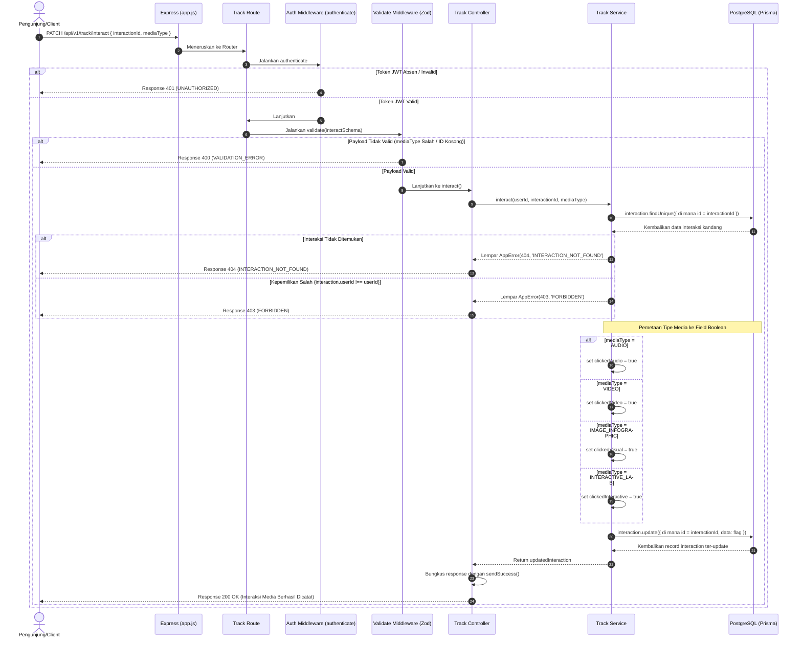

# 🎧 Catat Interaksi Media Pembelajaran — PATCH /api/v1/track/interact

**Status**: ✅ Selesai | **Priority Order**: #6.2

---

## 📌 Deskripsi Fitur
Untuk mendukung penyajian materi edukasi yang komprehensif, papan informasi digital kebun binatang menyajikan beberapa jenis media pembelajaran: pemutar rekaman suara satwa (`AUDIO`), dokumentasi video konservasi (`VIDEO`), bagan visual diagram/infografis (`IMAGE_INFOGRAPHIC`), dan simulasi mini game lab sains (`INTERACTIVE_LAB`).

Endpoint terproteksi ini dipanggil setiap kali pengunjung mengeklik salah satu dari tipe media pembelajaran tersebut pada aplikasi Client. Sistem akan mencatat riwayat aktivitas konsumsi media tersebut dengan memperbarui flag boolean yang sesuai pada baris pelacakan interaksi kandidat. Data ini sangat krusial dalam menganalisis kecenderungan gaya belajar pengunjung (Audio, Visual, atau Lab Kinestetik) yang nantinya memengaruhi kalkulasi pilar ketertarikan di EIS Score.

---

## ⚙️ Detail Endpoint

| Komponen | Spesifikasi |
| :--- | :--- |
| **HTTP Method** | `PATCH` |
| **URL Path** | `/api/v1/track/interact` |
| **Autentikasi** | ☑ Terproteksi (Memerlukan Bearer JWT Token) |
| **Headers** | `Authorization: Bearer <JWT_TOKEN>`, `Content-Type: application/json` |

---

## 🗂️ Skema Validasi Request (Zod)

Sistem memvalidasi tipe media menggunakan pustaka **Zod** untuk memastikan hanya enum yang sah yang diterima database. Skema didefinisikan pada `src/validators/track.validator.js` dalam bentuk `interactSchema`:

```javascript
export const interactSchema = z.object({
  interactionId: z.number().int().positive('interactionId harus berupa angka positif'),
  mediaType: z.nativeEnum(MediaType, { errorMap: () => ({ message: 'mediaType tidak valid' }) })
});
```

### Format Payload Request (JSON)
```json
{
  "interactionId": 89,
  "mediaType": "AUDIO"
}
```

### Rincian Aturan Validasi Field
1. **`interactionId`** (Integer, Required):
   - ID kunci utama dari pelacakan interaksi kandang yang sedang berjalan. Harus bertipe angka bulat positif.
2. **`mediaType`** (Enum, Required):
   - Harus berupa salah satu dari tipe data enum **`MediaType`** yang didukung oleh database:
     - `AUDIO` (Materi suara/narator pendengaran)
     - `VIDEO` (Materi tontonan bergerak)
     - `IMAGE_INFOGRAPHIC` (Materi gambar/bagan diagram)
     - `INTERACTIVE_LAB` (Materi game lab kinestetik)

---

## 🔄 Diagram Alur Proses (Sequence Diagram)

Berikut adalah visualisasi alur verifikasi kepemilikan interaksi dan pemetaan flag boolean media:



---

## 💾 Konteks Skema Database (Prisma)

Data interaksi media dicatat dengan meng-update baris tabel `interactions` yang memuat empat buah flag boolean konsumsi media:

```prisma
enum MediaType {
  AUDIO
  VIDEO
  IMAGE_INFOGRAPHIC
  INTERACTIVE_LAB
}

model Interaction {
  id                 Int       @id @default(autoincrement())
  sessionId          Int       @map("session_id")
  userId             Int       @map("user_id")
  exhibitId          Int       @map("exhibit_id")
  startTime          DateTime  @map("start_time")
  endTime            DateTime? @map("end_time")
  durationSeconds    Int?      @map("duration_seconds")
  
  // Media Flags
  clickedAudio       Boolean   @default(false) @map("clicked_audio")
  clickedVideo       Boolean   @default(false) @map("clicked_video")
  clickedVisual      Boolean   @default(false) @map("clicked_visual")
  clickedInteractive Boolean   @default(false) @map("clicked_interactive")
  createdAt          DateTime  @default(now()) @map("created_at")

  @@map("interactions")
}
```

---

## 🏆 Aturan Bisnis (Business Rules)

1. **Pemeriksaan Kepemilikan Ketat (Ownership Check):**
   Pengunjung hanya diizinkan mencatatkan interaksi media pada record pelacakan kandang miliknya sendiri. Jika pengguna dengan sengaja (atau terjadi serangan keamanan) mencoba mengirimkan pembaruan media ke `interactionId` milik pengunjung lain, sistem akan melarang keras dengan melemparkan error HTTP 403 `FORBIDDEN`.
2. **Pemetaan Boolean Pintar (Deterministic Mapping):**
   Sistem mengalihkan input enum dari Client ke kolom boolean database secara deterministik:
   * Input `AUDIO` secara otomatis meng-update kolom `clickedAudio` menjadi `true`.
   * Input `VIDEO` secara otomatis meng-update kolom `clickedVideo` menjadi `true`.
   * Input `IMAGE_INFOGRAPHIC` secara otomatis meng-update kolom `clickedVisual` (visual) menjadi `true`.
   * Input `INTERACTIVE_LAB` secara otomatis meng-update kolom `clickedInteractive` (interactive) menjadi `true`.
   Flag boolean yang sudah bernilai `true` akan tetap dipertahankan `true` jika terjadi pengulangan klik klik media yang sama.

---

## 📥 Format Response Sukses (200 OK)

Jika pencatatan interaksi media sukses dilakukan, sistem mengembalikan status **`200 OK`** yang memuat data terbaru:

```json
{
  "success": true,
  "message": "Interaksi berhasil dicatat",
  "data": {
    "id": 89,
    "sessionId": 1,
    "userId": 1,
    "exhibitId": 3,
    "startTime": "2026-05-30T12:02:14.000Z",
    "endTime": null,
    "durationSeconds": null,
    "clickedAudio": true,
    "clickedVideo": false,
    "clickedVisual": false,
    "clickedInteractive": false
  }
}
```

---

## ⚠️ Penanganan Error & Pengecualian

### 1. HTTP 400 Bad Request — `VALIDATION_ERROR`
Terjadi jika parameter `mediaType` tidak sesuai dengan enum yang terdaftar, atau parameter `interactionId` bernilai negatif.
```json
{
  "success": false,
  "code": "VALIDATION_ERROR",
  "message": "mediaType tidak valid"
}
```

### 2. HTTP 403 Forbidden — `FORBIDDEN`
Terjadi jika pengunjung mencoba memicu pembaruan media untuk data interaksi milik orang lain.
```json
{
  "success": false,
  "code": "FORBIDDEN",
  "message": "Anda tidak memiliki akses ke interaksi ini"
}
```

### 3. HTTP 404 Not Found — `INTERACTION_NOT_FOUND`
Terjadi jika ID interaksi kandang (`interactionId`) tidak ditemukan dalam database.
```json
{
  "success": false,
  "code": "INTERACTION_NOT_FOUND",
  "message": "Interaksi tidak ditemukan"
}
```

---

## 🛠️ Referensi Implementasi Kode

- **Routing Layer:** [track.routes.js](file:///home/rafi/Documents/tugas-kuliah/semester4/software%20engginer%20prak/EIS-engine/src/routes/track.routes.js#L10)
- **Validation Schema:** [track.validator.js](file:///home/rafi/Documents/tugas-kuliah/semester4/software%20engginer%20prak/EIS-engine/src/validators/track.validator.js#L9-L12)
- **Controller Handler:** [track.controller.js](file:///home/rafi/Documents/tugas-kuliah/semester4/software%20engginer%20prak/EIS-engine/src/controllers/track.controller.js#L17-L28)
- **Service Layer Logic:** [track.service.js](file:///home/rafi/Documents/tugas-kuliah/semester4/software%20engginer%20prak/EIS-engine/src/services/track.service.js#L96-L127)

---

## 🧪 Skenario Uji Coba (Test Cases)

Semua pengujian untuk interaksi media diimplementasikan di [track.test.js](file:///home/rafi/Documents/tugas-kuliah/semester4/software%20engginer%20prak/EIS-engine/tests/track.test.js#L207-L326):

1. **Skenario Positif — Klik Audio:**
   * **Deskripsi:** Mengirim request dengan tipe `AUDIO` untuk interaksi aktif milik sendiri.
   * **Hasil Diharapkan:** HTTP Status `200 OK`, `success: true`, properti `clickedAudio` berubah menjadi `true`.
2. **Skenario Positif — Klik Gambar Infografis:**
   * **Deskripsi:** Mengirim request dengan tipe `IMAGE_INFOGRAPHIC` untuk interaksi aktif milik sendiri.
   * **Hasil Diharapkan:** HTTP Status `200 OK`, `success: true`, properti `clickedVisual` berubah menjadi `true`.
3. **Skenario Negatif — Mengakses Interaksi Milik Pengunjung Lain:**
   * **Deskripsi:** Mengirim request menggunakan token JWT milik user A untuk meng-update interaksi yang dibuat oleh user B.
   * **Hasil Diharapkan:** HTTP Status `403 Forbidden`, `success: false`, `code: "FORBIDDEN"`.
4. **Skenario Negatif — Tipe Media Tidak Valid:**
   * **Deskripsi:** Mengirim request dengan tipe media buatan (misal `INVALID_TYPE`).
   * **Hasil Diharapkan:** HTTP Status `400 Bad Request`, `success: false`, `code: "VALIDATION_ERROR"`.
