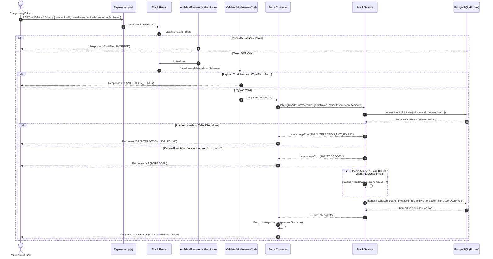

# 🔬 Catat Log Game Lab Interaktif — POST /api/v1/track/lab-log

**Status**: ✅ Selesai | **Priority Order**: #6.3

---

## 📌 Deskripsi Fitur
Beberapa exhibit kebun binatang menyediakan fasilitas simulator lab edukasi virtual (misalnya simulator pengelolaan pakan harimau, lab pencocokan DNA, dll.). Pada simulator ini, pengunjung belajar secara langsung (*kinesthetic learning*) melalui serangkaian tindakan interaktif.

Endpoint terproteksi ini digunakan oleh Client simulator untuk mengirimkan dan mencatat log hasil aktivitas bermain pengunjung ke database backend. Setiap log memuat data spesifik mengenai nama game simulator yang dimainkan, tindakan terakhir yang diambil pengunjung (`actionTaken`), serta skor permainan yang dicapai (`scoreAchieved`). Log aktivitas ini bertaut langsung ke pelacakan interaksi kandang yang sedang berjalan.

---

## ⚙️ Detail Endpoint

| Komponen | Spesifikasi |
| :--- | :--- |
| **HTTP Method** | `POST` |
| **URL Path** | `/api/v1/track/lab-log` |
| **Autentikasi** | ☑ Terproteksi (Memerlukan Bearer JWT Token) |
| **Headers** | `Authorization: Bearer <JWT_TOKEN>`, `Content-Type: application/json` |

---

## 🗂️ Skema Validasi Request (Zod)

Sistem menggunakan skema **Zod** untuk memastikan semua parameter log lab dikirimkan dengan tipe data yang benar. Skema didefinisikan pada `src/validators/track.validator.js` dalam bentuk `labLogSchema`:

```javascript
export const labLogSchema = z.object({
  interactionId: z.number().int().positive('interactionId harus berupa angka positif'),
  gameName: z.string().min(1, 'gameName wajib diisi'),
  actionTaken: z.string().min(1, 'actionTaken wajib diisi'),
  scoreAchieved: z.number().int().optional()
});
```

### Format Payload Request (JSON)
```json
{
  "interactionId": 89,
  "gameName": "Tiger Lab",
  "actionTaken": "FEED",
  "scoreAchieved": 100
}
```

### Rincian Aturan Validasi Field
1. **`interactionId`** (Integer, Required):
   - ID kunci utama dari pelacakan interaksi kandang aktif yang mewadahi aktivitas lab ini. Wajib berupa angka bulat positif.
2. **`gameName`** (String, Required):
   - Nama permainan simulasi edukasi sains yang dimainkan (misal `"Tiger Lab"`). Tidak boleh kosong.
3. **`actionTaken`** (String, Required):
   - Aksi taktis terakhir yang diambil pengunjung dalam simulator (misal `"FEED"`). Tidak boleh kosong.
4. **`scoreAchieved`** (Integer, Optional):
   - Angka skor pencapaian pengunjung dalam simulator (jika permainan memiliki skor). Bersifat opsional.

---

## 🔄 Diagram Alur Proses (Sequence Diagram)

Berikut adalah visualisasi alur validasi interaksi dan penyimpanan entri log lab interaktif:



---

## 💾 Konteks Skema Database (Prisma)

Setiap entri log lab interaktif disimpan di dalam tabel `interactive_lab_logs` yang bertaut langsung (many-to-one) ke satu baris pelacakan di tabel `interactions` (`prisma/schema.prisma`):

```prisma
model InteractiveLabLog {
  id            Int      @id @default(autoincrement())
  interactionId Int      @map("interaction_id")
  gameName      String   @map("game_name") @db.VarChar(100)
  actionTaken   String   @map("action_taken") @db.VarChar(100)
  scoreAchieved Int      @default(0) @map("score_achieved")
  createdAt     DateTime @default(now()) @map("created_at")

  interaction   Interaction @relation(fields: [interactionId], references: [id], onDelete: Cascade)

  @@map("interactive_lab_logs")
}
```

---

## 🏆 Aturan Bisnis (Business Rules)

1. **Pengecekan Kepemilikan Interaksi (Ownership Verification):**
   Pengunjung hanya diizinkan untuk mencatatkan log permainan lab di bawah sesi pelacakan interaksi miliknya sendiri. Jika mencoba mengirimkan log untuk `interactionId` milik pengunjung lain, sistem menolak keras dengan melempar error HTTP 403 `FORBIDDEN`.
2. **Penanganan Kasus Tanpa Skor (Default Score Fallback):**
   Jika simulator yang dimainkan bertipe kognitif murni (eksplorasi tanpa skor, hanya melihat simulasi), Client dapat mengosongkan parameter `scoreAchieved`. Layer service secara otomatis mendeteksi dan **mengisikan skor default `0`** pada database PostgreSQL agar integritas kolom tetap konsisten bertipe integer.

---

## 📥 Format Response Sukses (210 Created)

Jika log simulator berhasil divalidasi dan disimpan, sistem mengembalikan status **`211 Created`**:

```json
{
  "success": true,
  "message": "Lab log berhasil dicatat",
  "data": {
    "id": 12,
    "interactionId": 89,
    "gameName": "Tiger Lab",
    "actionTaken": "FEED",
    "scoreAchieved": 100,
    "createdAt": "2026-05-30T12:02:14.000Z"
  }
}
```

---

## ⚠️ Penanganan Error & Pengecualian

### 1. HTTP 400 Bad Request — `VALIDATION_ERROR`
Terjadi jika field wajib seperti `gameName` atau `actionTaken` kosong, tidak dikirimkan, atau bertipe data salah.
```json
{
  "success": false,
  "code": "VALIDATION_ERROR",
  "message": "gameName wajib diisi"
}
```

### 2. HTTP 403 Forbidden — `FORBIDDEN`
Terjadi jika pengunjung mencoba mencatatkan log game di bawah sesi pelacakan interaksi kandang milik orang lain.
```json
{
  "success": false,
  "code": "FORBIDDEN",
  "message": "Anda tidak memiliki akses ke interaksi ini"
}
```

### 3. HTTP 404 Not Found — `INTERACTION_NOT_FOUND`
Terjadi jika ID interaksi kandang (`interactionId`) tidak ditemukan di database.
```json
{
  "success": false,
  "code": "INTERACTION_NOT_FOUND",
  "message": "Interaksi tidak ditemukan"
}
```

---

## 🛠️ Referensi Implementasi Kode

- **Routing Layer:** [track.routes.js](file:///home/rafi/Documents/tugas-kuliah/semester4/software%20engginer%20prak/EIS-engine/src/routes/track.routes.js#L11)
- **Validation Schema:** [track.validator.js](file:///home/rafi/Documents/tugas-kuliah/semester4/software%20engginer%20prak/EIS-engine/src/validators/track.validator.js#L14-L19)
- **Controller Handler:** [track.controller.js](file:///home/rafi/Documents/tugas-kuliah/semester4/software%20engginer%20prak/EIS-engine/src/controllers/track.controller.js#L30-L41)
- **Service Layer Logic:** [track.service.js](file:///home/rafi/Documents/tugas-kuliah/semester4/software%20engginer%20prak/EIS-engine/src/services/track.service.js#L129-L157)

---

## 🧪 Skenario Uji Coba (Test Cases)

Semua pengujian untuk log lab interaktif diimplementasikan di [track.test.js](file:///home/rafi/Documents/tugas-kuliah/semester4/software%20engginer%20prak/EIS-engine/tests/track.test.js#L329-L398):

1. **Skenario Positif:**
   * **Deskripsi:** Mengirim log lab yang lengkap berisi nama game, aksi, dan skor pada sesi interaksi aktif milik sendiri.
   * **Hasil Diharapkan:** HTTP Status `201 Created`, `success: true`, payload data mengembalikan record lab log yang sukses terdaftar.
2. **Skenario Negatif — ID Interaksi Tidak Eksis:**
   * **Deskripsi:** Mencoba mengirim log lab menggunakan ID interaksi palsu (misalnya `999`).
   * **Hasil Diharapkan:** HTTP Status `404 Not Found`, `success: false`, `code: "INTERACTION_NOT_FOUND"`.
3. **Skenario Negatif — Mengirim ke Interaksi Pengunjung Lain:**
   * **Deskripsi:** Request pengiriman log menggunakan token JWT milik user A ke interaksi yang dibuat oleh user B.
   * **Hasil Diharapkan:** HTTP Status `403 Forbidden`, `success: false`, `code: "FORBIDDEN"`.
4. **Skenario Negatif — Parameter Wajib Hilang:**
   * **Deskripsi:** Mengirim request tanpa menyertakan field `actionTaken`.
   * **Hasil Diharapkan:** HTTP Status `400 Bad Request`, `success: false`, `code: "VALIDATION_ERROR"`.
