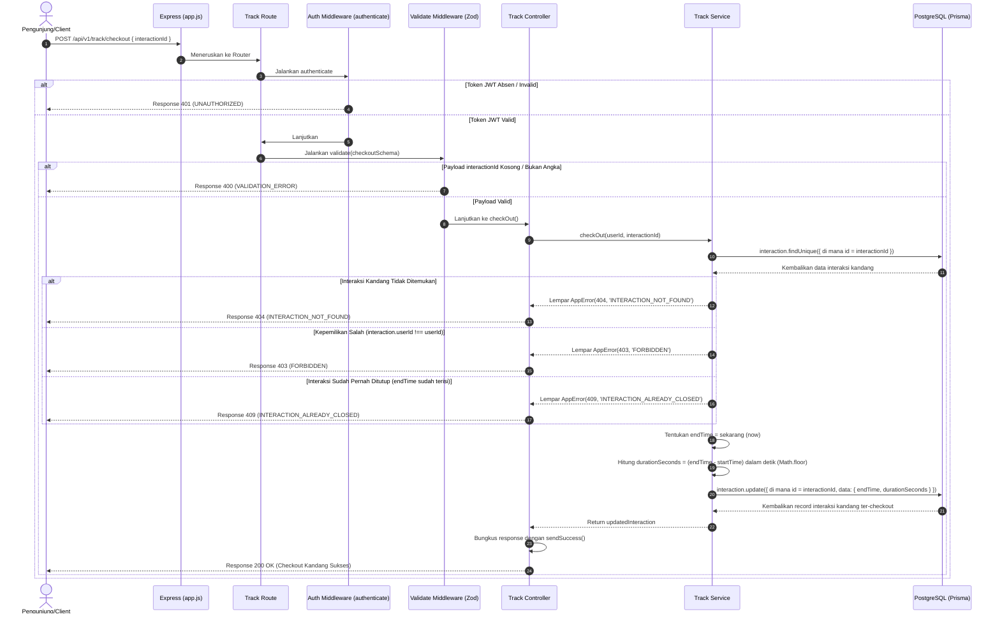

# 🏁 Checkout Exhibit (Keluar Area Kandang) — POST /api/v1/track/checkout

**Status**: ✅ Selesai | **Priority Order**: #6.4

---

## 📌 Deskripsi Fitur
Saat pengunjung selesai menjelajahi suatu area kandang satwa (*Exhibit*) dan berniat untuk berpindah ke area kandang lainnya, pengunjung memencet tombol keluar pada aplikasi Client.

Endpoint terproteksi ini bertugas untuk:
1. Memvalidasi status keaktifan pelacakan interaksi kandidat.
2. Mencatat waktu keluar secara presisi (`endTime`) menggunakan waktu server saat request diterima.
3. Menghitung durasi total waktu kunjungan pengunjung di kandang tersebut dalam satuan detik (`durationSeconds`). Data durasi ini menjadi indikator penting dalam mengevaluasi pilar minat dan keaktifan pengunjung terhadap satwa bersangkutan.

---

## ⚙️ Detail Endpoint

| Komponen | Spesifikasi |
| :--- | :--- |
| **HTTP Method** | `POST` |
| **URL Path** | `/api/v1/track/checkout` |
| **Autentikasi** | ☑ Terproteksi (Memerlukan Bearer JWT Token) |
| **Headers** | `Authorization: Bearer <JWT_TOKEN>`, `Content-Type: application/json` |

---

## 🗂️ Skema Validasi Request (Zod)

Sistem menggunakan **Zod** untuk memastikan keberadaan parameter pengakhiran interaksi. Skema didefinisikan pada `src/validators/track.validator.js` dalam bentuk `checkoutSchema`:

```javascript
export const checkoutSchema = z.object({
  interactionId: z.number().int().positive('interactionId harus berupa angka positif')
});
```

### Format Payload Request (JSON)
```json
{
  "interactionId": 89
}
```

### Rincian Aturan Validasi Field
1. **`interactionId`** (Integer, Required):
   - ID kunci utama dari pelacakan interaksi kandang aktif yang ingin diakhiri. Harus bertipe angka bulat positif.

---

## 🔄 Diagram Alur Proses (Sequence Diagram)

Berikut adalah visualisasi alur penutupan pelacakan interaksi kandang dan perhitungan durasi waktu kunjungan:



---

## 💾 Konteks Skema Database (Prisma)

Proses checkout memperbarui kolom `end_time` dan `duration_seconds` pada tabel `interactions` (`prisma/schema.prisma`):

```prisma
model Interaction {
  id                 Int       @id @default(autoincrement())
  sessionId          Int       @map("session_id")
  userId             Int       @map("user_id")
  exhibitId          Int       @map("exhibit_id")
  startTime          DateTime  @map("start_time")
  endTime            DateTime? @map("end_time") // Diisi presisi waktu keluar
  durationSeconds    Int?      @map("duration_seconds") // Durasi dalam detik
  
  clickedAudio       Boolean   @default(false) @map("clicked_audio")
  clickedVideo       Boolean   @default(false) @map("clicked_video")
  clickedVisual      Boolean   @default(false) @map("clicked_visual")
  clickedInteractive Boolean   @default(false) @map("clicked_interactive")
  createdAt          DateTime  @default(now()) @map("created_at")

  @@map("interactions")
}
```

---

## 🏆 Aturan Bisnis (Business Rules)

1. **Pemeriksaan Otorisasi Kepemilikan Sesi:**
   Pengunjung hanya diizinkan untuk mengakhiri sesi interaksi kandang miliknya sendiri. Request dari pengunjung yang mencoba menutup interaksi milik orang lain akan langsung ditolak dengan status HTTP 403 `FORBIDDEN`.
2. **Pencegahan Checkout Ganda:**
   Interaksi yang statusnya sudah ditutup sebelumnya (`endTime` sudah tidak bernilai `null`) tidak boleh ditutup kembali demi menghindari kerusakan data analitik durasi. Jika dicoba, sistem mengembalikan error HTTP 409 `INTERACTION_ALREADY_CLOSED`.
3. **Kalkulasi Presisi Durasi Waktu Kunjungan:**
   Waktu keluar ditentukan berdasarkan jam sistem server (`endTime = now`). Selisih durasi dihitung secara presisi dalam satuan detik dengan pembulatan matematis ke bawah:
   $$\text{durationSeconds} = \text{Math.floor}\left(\frac{\text{endTime} - \text{startTime}}{1000}\right)$$
   Skor durasi ini nantinya diagregasikan di tingkat global untuk mengevaluasi pilar antusiasme belajar pengunjung.

---

## 📥 Format Response Sukses (200 OK)

Bila checkout kandang berhasil dicatat, sistem mengembalikan status **`200 OK`**:

```json
{
  "success": true,
  "message": "Checkout berhasil",
  "data": {
    "id": 89,
    "sessionId": 1,
    "userId": 1,
    "exhibitId": 3,
    "startTime": "2026-05-30T12:02:14.000Z",
    "endTime": "2026-05-30T12:17:14.000Z",
    "durationSeconds": 900,
    "clickedAudio": false,
    "clickedVideo": false,
    "clickedVisual": false,
    "clickedInteractive": false
  }
}
```

---

## ⚠️ Penanganan Error & Pengecualian

### 1. HTTP 400 Bad Request — `VALIDATION_ERROR`
Terjadi jika parameter `interactionId` kosong, bernilai negatif, atau bertipe data selain angka integer.
```json
{
  "success": false,
  "code": "VALIDATION_ERROR",
  "message": "interactionId harus berupa angka positif"
}
```

### 2. HTTP 403 Forbidden — `FORBIDDEN`
Terjadi jika pengunjung mencoba checkout dari interaksi kandang milik orang lain.
```json
{
  "success": false,
  "code": "FORBIDDEN",
  "message": "Anda tidak memiliki akses ke interaksi ini"
}
```

### 3. HTTP 404 Not Found — `INTERACTION_NOT_FOUND`
Terjadi jika ID interaksi kandang (`interactionId`) tidak ditemukan di database.
```json
{
  "success": false,
  "code": "INTERACTION_NOT_FOUND",
  "message": "Interaksi tidak ditemukan"
}
```

### 4. HTTP 409 Conflict — `INTERACTION_ALREADY_CLOSED`
Terjadi jika pengunjung mencoba memicu checkout untuk interaksi kandang yang statusnya sudah ditutup (`endTime` sudah bernilai tidak null).
```json
{
  "success": false,
  "code": "INTERACTION_ALREADY_CLOSED",
  "message": "Interaksi sudah ditutup sebelumnya"
}
```

---

## 🛠️ Referensi Implementasi Kode

- **Routing Layer:** [track.routes.js](file:///home/rafi/Documents/tugas-kuliah/semester4/software%20engginer%20prak/EIS-engine/src/routes/track.routes.js#L12)
- **Validation Schema:** [track.validator.js](file:///home/rafi/Documents/tugas-kuliah/semester4/software%20engginer%20prak/EIS-engine/src/validators/track.validator.js#L21-L23)
- **Controller Handler:** [track.controller.js](file:///home/rafi/Documents/tugas-kuliah/semester4/software%20engginer%20prak/EIS-engine/src/controllers/track.controller.js#L43-L54)
- **Service Layer Logic:** [track.service.js](file:///home/rafi/Documents/tugas-kuliah/semester4/software%20engginer%20prak/EIS-engine/src/services/track.service.js#L159-L197)

---

## 🧪 Skenario Uji Coba (Test Cases)

Semua pengujian untuk checkout exhibit diimplementasikan di [track.test.js](file:///home/rafi/Documents/tugas-kuliah/semester4/software%20engginer%20prak/EIS-engine/tests/track.test.js#L401-L477):

1. **Skenario Positif:**
   * **Deskripsi:** Melakukan checkout untuk interaksi kandang aktif milik sendiri.
   * **Hasil Diharapkan:** HTTP Status `200 OK`, `success: true`, status interaksi di database berhasil diperbarui dengan terisinya kolom `endTime` serta nilai `durationSeconds` yang terhitung presisi.
2. **Skenario Negatif — Interaksi Sudah Ditutup:**
   * **Deskripsi:** Mencoba melakukan checkout ulang pada interaksi yang statusnya sudah pernah di-checkout (sudah memiliki `endTime`).
   * **Hasil Diharapkan:** HTTP Status `409 Conflict`, `success: false`, `code: "INTERACTION_ALREADY_CLOSED"`.
3. **Skenario Negatif — ID Interaksi Palsu:**
   * **Deskripsi:** Melakukan request checkout dengan menyertakan `interactionId` yang tidak eksis di database (misalnya `999`).
   * **Hasil Diharapkan:** HTTP Status `404 Not Found`, `success: false`, `code: "INTERACTION_NOT_FOUND"`.
4. **Skenario Negatif — Menutup Interaksi Pengunjung Lain:**
   * **Deskripsi:** Request pengakhiran interaksi menggunakan token JWT milik user A untuk menutup interaksi milik user B.
   * **Hasil Diharapkan:** HTTP Status `403 Forbidden`, `success: false`, `code: "FORBIDDEN"`.
