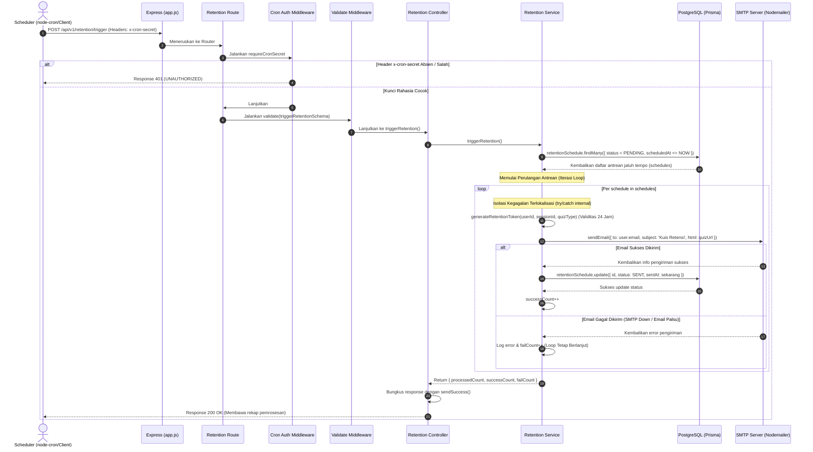

# 📧 Pemicu Pengiriman Email Retensi — POST /api/v1/retention/trigger

**Status**: ✅ Selesai | **Priority Order**: #7.1

---

## 📌 Deskripsi Fitur
Untuk mengukur daya ingat (*cognitive retention*) pengunjung, sistem harus mengirimkan tautan kuis retensi melalui email pada H+7 (`RETENTION_1W`) dan H+30 (`RETENTION_1M`) setelah pengunjung checkout.

Endpoint terproteksi khusus ini bertugas untuk memindai antrean jadwal retensi di database yang telah jatuh tempo, men-generate token akses kuis retensi sekali pakai berdurasi 24 jam, mengirimkan email interaktif via **Nodemailer SMTP**, serta memperbarui status antrean di database dari `PENDING` menjadi `SENT` beserta waktu kirimnya (`sentAt`).

---

## ⚙️ Detail Endpoint

| Komponen | Spesifikasi |
| :--- | :--- |
| **HTTP Method** | `POST` |
| **URL Path** | `/api/v1/retention/trigger` |
| **Autentikasi** | ☑ Terproteksi (Memerlukan Kunci Rahasia Cron) |
| **Headers** | `x-cron-secret: <CRON_SECRET_KEY>`, `Content-Type: application/json` |

---

## 🗂️ Skema Validasi Request (Zod)

Endpoint ini diakses secara terjadwal oleh scheduler. Untuk mencegah kegagalan validasi, sistem menerima body kosong `{}`. Skema didefinisikan pada `src/validators/retention.validator.js` dalam bentuk `triggerRetentionSchema`:

```javascript
export const triggerRetentionSchema = z.object({});
```

### Format Payload Request (JSON)
```json
{}
```

---

## 🔄 Diagram Alur Proses (Sequence Diagram)

Berikut adalah alur otorisasi rahasia cron, pencarian antrean jatuh tempo, isolasi error loop, dan pengiriman email SMTP:



---

## 💾 Konteks Skema Database (Prisma)

Proses trigger memindai dan memperbarui data status pengiriman pada tabel `retention_schedules` (`prisma/schema.prisma`):

```prisma
enum RetentionStatus {
  PENDING
  SENT
  COMPLETED
  EXPIRED
}

model RetentionSchedule {
  id          Int             @id @default(autoincrement())
  userId      Int             @map("user_id")
  sessionId   Int             @map("session_id")
  quizType    QuizType        @map("quiz_type")
  scheduledAt DateTime        @map("scheduled_at")
  sentAt      DateTime?       @map("sent_at")
  status      RetentionStatus @default(PENDING)
  createdAt   DateTime        @default(now()) @map("created_at")

  user        User            @relation(fields: [userId], references: [id], onDelete: Cascade)
  session     VisitSession    @relation(fields: [sessionId], references: [id], onDelete: Cascade)

  @@unique([userId, sessionId, quizType])
  @@map("retention_schedules")
}
```

---

## 🏆 Aturan Bisnis (Business Rules)

1. **Otorisasi Khusus Rahasia Cron (Cron Token Authorization):**
   Mengingat pemanggilan kueri massal dan pengiriman email Nodemailer SMTP membutuhkan konsumsi sumber daya komputasi dan kuota SMTP, endpoint ini dipagari secara eksklusif menggunakan pencocokan header `x-cron-secret` (bukan JWT token pengguna). Panggilan ilegal dari pihak luar akan langsung ditolak dengan status HTTP 401 `UNAUTHORIZED`.
2. **Aturan Isolasi Kegagalan Iterasi (Failure Isolation Rule):**
   Pemrosesan antrean di layer Service dieksekusi di dalam perulangan yang dilindungi oleh blok `try/catch` terlokalisasi. Apabila terjadi kegagalan sistem pada satu pengguna (misal karena kotak surat email penuh atau format email salah), **sistem tidak akan menghentikan seluruh proses**. Iterasi berikutnya akan tetap berjalan normal sehingga pengiriman kuis pengguna lainnya terjamin.
3. **Masa Berlaku Tautan Kuis (Retention Token Lifespan):**
   Token retensi ditandatangani menggunakan `jwt.sign` dengan kunci khusus `RETENTION_TOKEN_SECRET` dan **dibatasi masa kedaluwarsanya tepat 24 jam (`expiresIn: '24h'`)**. Jika pengunjung mengklik tautan email setelah lewat waktu 24 jam, sistem akan menolak kuis tersebut demi menjaga validitas waktu pengujian ingatan.

---

## 📥 Format Response Sukses (200 OK)

Jika eksekusi trigger retensi berhasil dijalankan, sistem mengembalikan status **`200 OK`** beserta ringkasan statistik pemrosesan:

```json
{
  "success": true,
  "message": "Proses trigger retensi selesai",
  "data": {
    "processedCount": 2,
    "successCount": 2,
    "failCount": 0
  }
}
```

---

## ⚠️ Penanganan Error & Pengecualian

### 1. HTTP 401 Unauthorized — `UNAUTHORIZED` (Header Hilang / Kunci Salah)
Terjadi jika request dikirimkan tanpa menyertakan header otorisasi custom `x-cron-secret` atau nilai kunci yang dikirimkan keliru.
```json
{
  "success": false,
  "code": "UNAUTHORIZED",
  "message": "Otorisasi scheduler ditolak"
}
```

---

## 🛠️ Referensi Implementasi Kode

- **Routing Layer:** [retention.routes.js](file:///home/rafi/Documents/tugas-kuliah/semester4/software%20engginer%20prak/EIS-engine/src/routes/retention.routes.js#L16)
- **Validation Schema:** [retention.validator.js](file:///home/rafi/Documents/tugas-kuliah/semester4/software%20engginer%20prak/EIS-engine/src/validators/retention.validator.js#L3)
- **Otorisasi Middleware:** [cronAuth.middleware.js](file:///home/rafi/Documents/tugas-kuliah/semester4/software%20engginer%20prak/EIS-engine/src/middleware/cronAuth.middleware.js#L1-L15)
- **Controller Handler:** [retention.controller.js](file:///home/rafi/Documents/tugas-kuliah/semester4/software%20engginer%20prak/EIS-engine/src/controllers/retention.controller.js#L8-L15)
- **Service Layer Logic:** [retention.service.js](file:///home/rafi/Documents/tugas-kuliah/semester4/software%20engginer%20prak/EIS-engine/src/services/retention.service.js#L12-L90)

---

## 🧪 Skenario Uji Coba (Test Cases)

Semua pengujian untuk pemicu retensi diimplementasikan di [retention.test.js](file:///home/rafi/Documents/tugas-kuliah/semester4/software%20engginer%20prak/EIS-engine/tests/retention.test.js#L112-L183):

1. **Skenario Positif:**
   * **Deskripsi:** Memanggil trigger kuis retensi menggunakan header `x-cron-secret` yang benar saat database memiliki antrean `PENDING` yang jatuh tempo.
   * **Hasil Diharapkan:** HTTP Status `200 OK`, `success: true`, data terkirim via email, antrean di-update menjadi `SENT` di DB.
2. **Skenario Positif — Kasus Antrean Kosong:**
   * **Deskripsi:** Memicu trigger kuis retensi saat database tidak memiliki antrean jatuh tempo sama sekali.
   * **Hasil Diharapkan:** HTTP Status `200 OK`, `success: true`, `processedCount` bernilai `0`, tidak ada email dikirim.
3. **Skenario Negatif — Header Otorisasi Kunci Cron Salah:**
   * **Deskripsi:** Mengirim request trigger dengan header `x-cron-secret` yang salah (misal `"wrong_secret"`).
   * **Hasil Diharapkan:** HTTP Status `401 Unauthorized`, `success: false`, `code: "UNAUTHORIZED"`.
4. **Skenario Positif — Toleransi Kegagalan Individual (Failure Resilience):**
   * **Deskripsi:** Menguji antrean dengan 2 record, di mana pengiriman email pertama berhasil, namun pengiriman email kedua sengaja digagalkan (misal akibat error SMTP).
   * **Hasil Diharapkan:** Sistem tetap sukses mengembalikan `200 OK`, merekam `successCount: 1` dan `failCount: 1` tanpa melempar crash server global.
