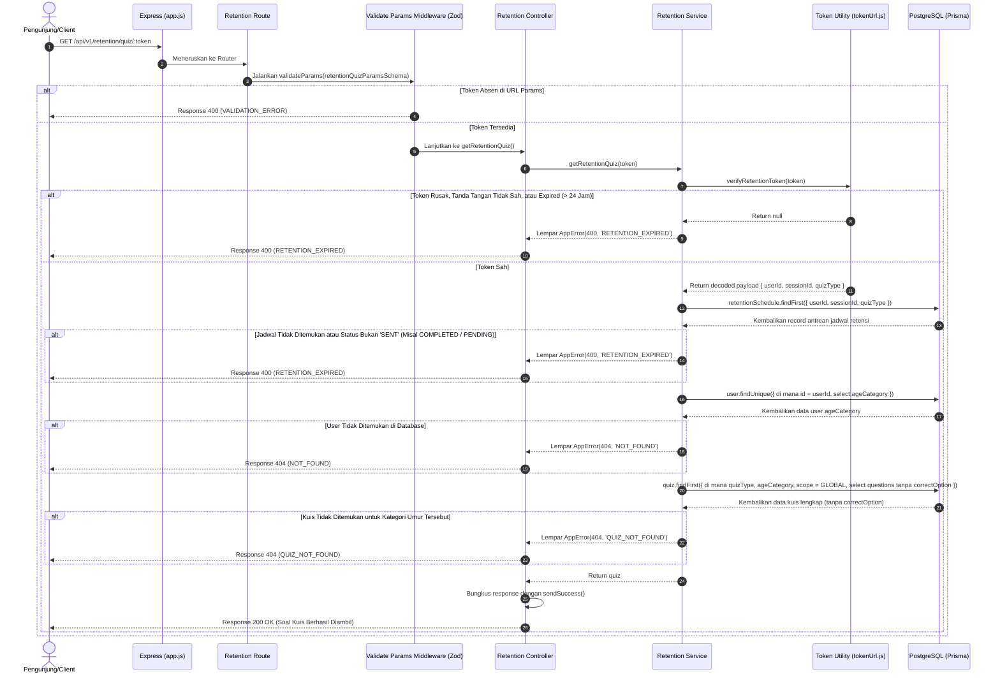

# 🔑 Ambil Kuis Retensi Lewat Token URL — GET /api/v1/retention/quiz/:token

**Status**: ✅ Selesai | **Priority Order**: #7.2

---

## 📌 Deskripsi Fitur
Setelah email kuis retensi berhasil dikirimkan, pengunjung dapat mengklik tautan interaktif yang tertera pada isi email. Tautan tersebut mengarahkan pengunjung secara langsung ke halaman pengerjaan kuis retensi pada aplikasi Client.

Endpoint publik khusus ini dipanggil oleh Client untuk mengambil daftar pertanyaan kuis retensi global (`GLOBAL`) beserta pilihan jawabannya. Endpoint ini **tidak membutuhkan otentikasi Bearer JWT di header**, melainkan mengandalkan token tanda tangan kriptografis khusus retensi yang disematkan langsung pada parameter URL `:token`. Token tersebut memverifikasi identitas pengunjung, sesi kunjungan asal, serta jenis kuis retensi (`RETENTION_1W` atau `RETENTION_1M`) yang harus dikerjakan.

---

## ⚙️ Detail Endpoint

| Komponen | Spesifikasi |
| :--- | :--- |
| **HTTP Method** | `GET` |
| **URL Path** | `/api/v1/retention/quiz/:token` |
| **Autentikasi** | ☑ Terproteksi (Otorisasi via Kriptografi Token URL) |
| **Headers** | `Content-Type: application/json` |

---

## 🗂️ Skema Validasi Request (Zod)

Sistem menggunakan middleware **Zod** khusus untuk memvalidasi keberadaan string parameter di URL params. Skema didefinisikan pada `src/validators/retention.validator.js` dalam bentuk `retentionQuizParamsSchema`:

```javascript
export const retentionQuizParamsSchema = z.object({
  token: z.string().min(1, 'Token retensi wajib disertakan'),
});
```

### Format Parameter URL
```bash
GET /api/v1/retention/quiz/eyJhbGciOiJIUzI1NiIsInR5cCI6IkpXVCJ9.eyJ1c2VySWQiOjEsInNlc3Npb25JZCI6MSwicXVpelR5cGUiOiJSRVRFTlRJT05fMVcifQ...
```

---

## 🔄 Diagram Alur Proses (Sequence Diagram)

Berikut adalah visualisasi alur verifikasi tanda tangan token URL, pencocokan status kirim di database, dan pengembalian soal tanpa kunci jawaban:



---

## 💾 Konteks Skema Database (Prisma)

Data kuis diambil berdasarkan kategori usia pengunjung yang diverifikasi dari token, serta mencocokkan status antrean di tabel `retention_schedules` (`prisma/schema.prisma`):

```prisma
model Quiz {
  id          Int         @id @default(autoincrement())
  exhibitId   Int?        @map("exhibit_id")
  scope       QuizScope   @default(GLOBAL)
  title       String      @db.VarChar(150)
  quizType    QuizType    @map("quiz_type")
  ageCategory AgeCategory @map("age_category")
  createdAt   DateTime    @default(now()) @map("created_at")

  exhibit      Exhibit?          @relation(fields: [exhibitId], references: [id], onDelete: SetNull)
  questions    Question[]
  quizAttempts UserQuizAttempt[]

  @@map("quizzes")
}

model Question {
  id            Int      @id @default(autoincrement())
  quizId        Int      @map("quiz_id")
  questionText  String   @map("question_text") @db.Text
  optionA       String   @map("option_a") @db.Text
  optionB       String   @map("option_b") @db.Text
  optionC       String   @map("option_c") @db.Text
  optionD       String   @map("option_d") @db.Text
  correctOption String   @map("correct_option") @db.Char(1)
  points        Int      @default(10)
  createdAt     DateTime @default(now()) @map("created_at")

  quiz    Quiz              @relation(fields: [quizId], references: [id], onDelete: Cascade)
  answers UserQuizAnswer[]

  @@map("questions")
}
```

---

## 🏆 Aturan Bisnis (Business Rules)

1. **Akses Bebas Otorisasi Login Aplikasi (Passwordless URL Access):**
   Mengingat email kuis retensi dikirimkan H+7 atau H+30 ketika pengunjung sudah berada di rumah dan kemungkinan besar sesi JWT login aplikasi utama mereka sudah kedaluwarsa, **pengunjung dibebaskan dari kewajiban login ulang**. Otorisasi akses sepenuhnya dialihkan secara aman menggunakan pembuktian keabsahan tanda tangan kriptografi token pada URL parameter `:token`.
2. **Aturan Hak Akses Sekali Pakai (Strict One-Time Take Rule):**
   Kuis retensi dirancang untuk dievaluasi tepat satu kali. Tautan kuis retensi dinyatakan valid hanya apabila antrean status kuis di database bernilai **`SENT`** (artinya email telah sukses dikirimkan dan pengunjung belum pernah mengumpulkan jawaban). 
   - Jika status di database bernilai `COMPLETED` (kuis sudah dijawab), sistem menolak memuat soal dengan status HTTP 400 `RETENTION_EXPIRED` untuk menghindari pengerjaan ulang kuis demi menjaga kemurnian data retensi kognitif.
3. **Keamanan Ekstra Saringan Anti-Cheat (No CorrectOption Exposure):**
   Demi menjamin keadilan evaluasi, kueri database pada layer Service secara ketat **hanya memilih (select) opsi jawaban A, B, C, D, dan membuang kolom `correctOption` (kunci jawaban)**. Hal ini meniadakan celah bagi pengguna cerdik untuk mengintip jawaban melalui menu inspect element jaringan peramban (*developer tools*).

---

## 📥 Format Response Sukses (200 OK)

Bila token valid dan antrean lolos verifikasi, sistem mengembalikan status **`200 OK`**:

```json
{
  "success": true,
  "message": "Soal kuis retensi berhasil diambil",
  "data": {
    "id": 1,
    "title": "Kuis Mengingat Fauna Mingguan",
    "quizType": "RETENTION_1W",
    "scope": "GLOBAL",
    "ageCategory": "ADULT",
    "exhibitId": null,
    "questions": [
      {
        "id": 1,
        "questionText": "Berapakah rata-rata waktu tidur koala sehari?",
        "optionA": "18-22 Jam",
        "optionB": "5-8 Jam",
        "optionC": "10-12 Jam",
        "optionD": "1-3 Jam",
        "points": 10
      }
    ]
  }
}
```

---

## ⚠️ Penanganan Error & Pengecualian

### 1. HTTP 400 Bad Request — `RETENTION_EXPIRED` (Token Tidak Valid / Kedaluwarsa)
Terjadi jika tanda tangan token retensi rusak, masa aktif token di atas 24 jam telah terlampaui, atau status antrean di database bernilai `COMPLETED` / `PENDING`.
```json
{
  "success": false,
  "code": "RETENTION_EXPIRED",
  "message": "Token retensi tidak valid atau sudah kadaluarsa"
}
```

### 2. HTTP 404 Not Found — `QUIZ_NOT_FOUND`
Terjadi jika kuis bertipe retensi global untuk kategori usia pengunjung tersebut tidak ditemukan di database.
```json
{
  "success": false,
  "code": "QUIZ_NOT_FOUND",
  "message": "Kuis retensi tidak ditemukan untuk kategori Anda"
}
```

---

## 🛠️ Referensi Implementasi Kode

- **Routing Layer:** [retention.routes.js](file:///home/rafi/Documents/tugas-kuliah/semester4/software%20engginer%20prak/EIS-engine/src/routes/retention.routes.js#L25-L29)
- **Validation Schema:** [retention.validator.js](file:///home/rafi/Documents/tugas-kuliah/semester4/software%20engginer%20prak/EIS-engine/src/validators/retention.validator.js#L5-L7)
- **Controller Handler:** [retention.controller.js](file:///home/rafi/Documents/tugas-kuliah/semester4/software%20engginer%20prak/EIS-engine/src/controllers/retention.controller.js#L21-L29)
- **Service Layer Logic:** [retention.service.js](file:///home/rafi/Documents/tugas-kuliah/semester4/software%20engginer%20prak/EIS-engine/src/services/retention.service.js#L97-L168)
- **Token Utility:** [tokenUrl.js](file:///home/rafi/Documents/tugas-kuliah/semester4/software%20engginer%20prak/EIS-engine/src/utils/tokenUrl.js#L11-L17)

---

## 🧪 Skenario Uji Coba (Test Cases)

Semua pengujian untuk penarikan soal kuis retensi diimplementasikan di [retention.test.js](file:///home/rafi/Documents/tugas-kuliah/semester4/software%20engginer%20prak/EIS-engine/tests/retention.test.js#L186-L247):

1. **Skenario Positif:**
   * **Deskripsi:** Melakukan request GET dengan token retensi yang valid dan status antrean di database bernilai `SENT`.
   * **Hasil Diharapkan:** HTTP Status `200 OK`, `success: true`, mengembalikan daftar soal lengkap tanpa menyertakan kolom `correctOption`.
2. **Skenario Negatif — Token Kriptografi Kedaluwarsa:**
   * **Deskripsi:** Mengirim request dengan token yang masa berlakunya di atas 24 jam (token kedaluwarsa).
   * **Hasil Diharapkan:** HTTP Status `400 Bad Request`, `success: false`, `code: "RETENTION_EXPIRED"`.
3. **Skenario Negatif — Kuis Sudah Pernah Dikerjakan (COMPLETED):**
   * **Deskripsi:** Mengirim request dengan token valid milik kuis yang status antreannya di database sudah bernilai `COMPLETED`.
   * **Hasil Diharapkan:** HTTP Status `400 Bad Request`, `success: false`, `code: "RETENTION_EXPIRED"`.
4. **Skenario Negatif — Saringan Keamanan Kunci Jawaban:**
   * **Deskripsi:** Memeriksa muatan data (`data.questions[0]`) kuis retensi yang berhasil diambil pada skenario positif.
   * **Hasil Diharapkan:** Properti kunci jawaban `correctOption` harus bernilai `undefined` (tidak ada di data objek).
