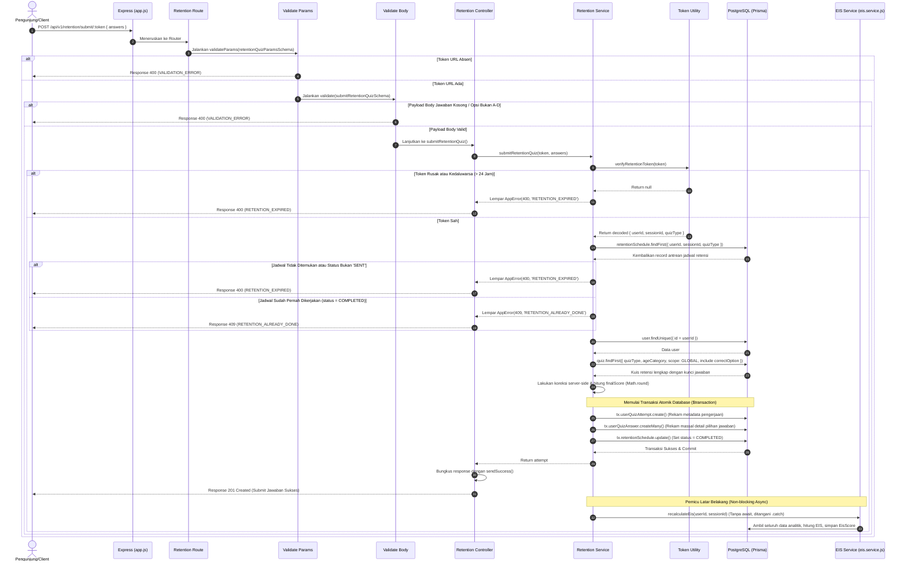

# 📝 Kirim Jawaban Kuis Retensi — POST /api/v1/retention/submit/:token

**Status**: ✅ Selesai | **Priority Order**: #7.3

---

## 📌 Deskripsi Fitur
Setelah pengunjung menyelesaikan lembar jawaban kuis retensi pada antarmuka aplikasi Client, Client akan mengirimkan kumpulan pilihan jawaban tersebut ke server.

Endpoint publik khusus ini digunakan untuk:
1. Memvalidasi kembali masa berlaku token URL dan status pengiriman antrean retensi di database.
2. Melakukan pencocokan jawaban dan penilaian otomatis di sisi server (*server-side grading*).
3. Merekam hasil pengerjaan kuis (`UserQuizAttempt`) dan detail jawaban soal (`UserQuizAnswer`) ke database secara atomik.
4. Menandai antrean jadwal retensi tersebut telah selesai dikerjakan (`COMPLETED`).
5. Memicu kalkulasi ulang profil kognitif dan EIS Score pengunjung secara asinkron di latar belakang.

---

## ⚙️ Detail Endpoint

| Komponen | Spesifikasi |
| :--- | :--- |
| **HTTP Method** | `POST` |
| **URL Path** | `/api/v1/retention/submit/:token` |
| **Autentikasi** | ☑ Terproteksi (Otorisasi via Kriptografi Token URL) |
| **Headers** | `Content-Type: application/json` |

---

## 🗂️ Skema Validasi Request (Zod)

Sistem menggunakan middleware **Zod** ganda untuk memvalidasi token pada parameter URL serta keabsahan payload jawaban pada request body. Skema didefinisikan pada `src/validators/retention.validator.js`:

### 1. Validasi URL Parameter
```javascript
export const retentionQuizParamsSchema = z.object({
  token: z.string().min(1, 'Token retensi wajib disertakan'),
});
```

### 2. Validasi Request Body (`submitRetentionQuizSchema`)
```javascript
export const submitRetentionQuizSchema = z.object({
  answers: z.array(
    z.object({
      questionId: z.number(),
      chosenOption: z.enum(['A', 'B', 'C', 'D']),
    })
  ).min(1, 'Dibutuhkan setidaknya satu jawaban'),
});
```

### Format Payload Request Body (JSON)
```json
{
  "answers": [
    {
      "questionId": 1,
      "chosenOption": "A"
    }
  ]
}
```

---

## 🔄 Diagram Alur Proses (Sequence Diagram)

Berikut adalah visualisasi alur penilaian server-side, transaksi atomik tiga arah, dan pemicu asinkron latar belakang:



---

## 💾 Konteks Skema Database (Prisma)

Proses submit kuis retensi merekam data upaya pada tabel `user_quiz_attempts` dan jawaban detail pada tabel `user_quiz_answers` (`prisma/schema.prisma`):

```prisma
model UserQuizAttempt {
  id             Int       @id @default(autoincrement())
  userId         Int       @map("user_id")
  sessionId      Int       @map("session_id")
  quizId         Int       @map("quiz_id")
  totalQuestions Int       @map("total_questions")
  correctAnswers Int       @default(0) @map("correct_answers")
  finalScore     Int       @default(0) @map("final_score")
  startedAt      DateTime  @default(now()) @map("started_at")
  completedAt    DateTime? @map("completed_at")

  user    User         @relation(fields: [userId], references: [id], onDelete: Cascade)
  session VisitSession @relation(fields: [sessionId], references: [id], onDelete: Cascade)
  quiz    Quiz         @relation(fields: [quizId], references: [id], onDelete: Cascade)
  answers UserQuizAnswer[]

  @@map("user_quiz_attempts")
}

model UserQuizAnswer {
  id            Int      @id @default(autoincrement())
  attemptId     Int      @map("attempt_id")
  questionId    Int      @map("question_id")
  chosenOption  String   @map("chosen_option") @db.Char(1)
  isCorrect     Boolean  @map("is_correct")
  answeredAt    DateTime @default(now()) @map("answered_at")

  attempt  UserQuizAttempt @relation(fields: [attemptId], references: [id], onDelete: Cascade)
  question Question        @relation(fields: [questionId], references: [id], onDelete: Cascade)

  @@map("user_quiz_answers")
}
```

---

## 🏆 Aturan Bisnis (Business Rules)

1. **Aturan Satu Kali Submit (Strict Anti-Double Submit Rule):**
   Pengunjung hanya diizinkan mengumpulkan jawaban kuis retensi tepat satu kali. Jika sistem mendeteksi record antrean retensi di database sudah berstatus **`COMPLETED`**, sistem akan menolak keras upaya pengiriman ulang dengan melemparkan error HTTP 409 `RETENTION_ALREADY_DONE`.
2. **Penilaian Otomatis Sisi Server (Secure Server-Side Grading):**
   Pengecekan jawaban pengunjung (`chosenOption`) dan kunci jawaban asli (`correctOption`) dilakukan sepenuhnya di sisi server. Nilai akhir (`finalScore`) dihitung menggunakan persentase jumlah jawaban benar terhadap total pertanyaan, dibulatkan ke bilangan bulat terdekat:
   $$\text{finalScore} = \text{Math.round}\left(\frac{\text{correctAnswers}}{\text{totalQuestions}} \times 100\right)$$
3. **Transaksi Database Atomik (Atomic $transaction):**
   Proses perekaman melibatkan modifikasi 3 buah tabel database sekaligus. Seluruh pembaruan dibungkus di dalam **Prisma `$transaction`** untuk menjamin konsistensi data (*All-or-Nothing*):
   - Merekam baris meta pengerjaan pada tabel `user_quiz_attempts`.
   - Merekam baris detail pilihan jawaban pada tabel `user_quiz_answers` secara massal (`createMany`).
   - Memperbarui status antrean `retention_schedules` dari `SENT` menjadi `COMPLETED`.
   Jika salah satu langkah di atas gagal (misal database tiba-tiba terputus), transaksi di-rollback sepenuhnya sehingga tidak ada rekaman parsial yang merusak integritas data statistik.
4. **Kalkulasi Asinkron Non-Blocking EIS (Fire-and-Forget Pattern):**
   Kuis retensi berkontribusi langsung pada perhitungan pilar kognitif ingatan jangka panjang. Begitu transaksi database berhasil di-commit, sistem langsung memicu kalkulasi ulang EIS Score (`recalculateEis`) **tanpa menggunakan kata kunci `await`** dan menangkap error internal via `.catch(console.error)`. Hal ini menjamin API merespon Client secara instan (<50ms).

---

## 📥 Format Response Sukses (201 Created)

Bila pengiriman jawaban kuis retensi sukses direkam, sistem mengembalikan status **`201 Created`**:

```json
{
  "success": true,
  "message": "Jawaban kuis retensi berhasil disimpan",
  "data": {
    "attempt": {
      "id": 1,
      "userId": 1,
      "sessionId": 1,
      "quizId": 1,
      "totalQuestions": 2,
      "correctAnswers": 2,
      "finalScore": 100,
      "completedAt": "2026-06-01T08:15:00.000Z"
    },
    "answers": [
      {
        "questionId": 1,
        "chosenOption": "A",
        "isCorrect": true,
        "correctOption": "A"
      },
      {
        "questionId": 2,
        "chosenOption": "B",
        "isCorrect": true,
        "correctOption": "B"
      }
    ]
  }
}
```

---

## ⚠️ Penanganan Error & Pengecualian

### 1. HTTP 400 Bad Request — `RETENTION_EXPIRED`
Terjadi jika tanda tangan token retensi tidak valid atau masa kadaluarsanya (> 24 jam) sudah habis.
```json
{
  "success": false,
  "code": "RETENTION_EXPIRED",
  "message": "Token retensi tidak valid atau sudah kadaluarsa"
}
```

### 2. HTTP 409 Conflict — `RETENTION_ALREADY_DONE`
Terjadi jika pengunjung mencoba mensubmit kembali kuis retensi yang antreannya di database sudah berstatus `COMPLETED`.
```json
{
  "success": false,
  "code": "RETENTION_ALREADY_DONE",
  "message": "Kuis retensi sudah pernah dikerjakan"
}
```

---

## 🛠️ Referensi Implementasi Kode

- **Routing Layer:** [retention.routes.js](file:///home/rafi/Documents/tugas-kuliah/semester4/software%20engginer%20prak/EIS-engine/src/routes/retention.routes.js#L31-L38)
- **Validation Schema:** [retention.validator.js](file:///home/rafi/Documents/tugas-kuliah/semester4/software%20engginer%20prak/EIS-engine/src/validators/retention.validator.js#L9-L16)
- **Controller Handler:** [retention.controller.js](file:///home/rafi/Documents/tugas-kuliah/semester4/software%20engginer%20prak/EIS-engine/src/controllers/retention.controller.js#L31-L44)
- **Service Layer Logic:** [retention.service.js](file:///home/rafi/Documents/tugas-kuliah/semester4/software%20engginer%20prak/EIS-engine/src/services/retention.service.js#L176-L304)
- **Background EIS Logic:** [eis.service.js](file:///home/rafi/Documents/tugas-kuliah/semester4/software%20engginer%20prak/EIS-engine/src/services/eis.service.js)

---

## 🧪 Skenario Uji Coba (Test Cases)

Semua pengujian untuk submit kuis retensi diimplementasikan di [retention.test.js](file:///home/rafi/Documents/tugas-kuliah/semester4/software%20engginer%20prak/EIS-engine/tests/retention.test.js#L250-L334):

1. **Skenario Positif:**
   * **Deskripsi:** Mengirimkan payload jawaban yang valid menggunakan token retensi yang aktif.
   * **Hasil Diharapkan:** HTTP Status `201 Created`, `success: true`, mengembalikan record pengerjaan dengan `finalScore` yang dihitung secara benar di server, status jadwal ter-update menjadi `COMPLETED` di DB.
2. **Skenario Negatif — Token Kriptografi Kedaluwarsa:**
   * **Deskripsi:** Mencoba mensubmit lembar jawaban dengan token yang telah kedaluwarsa (> 24 jam).
   * **Hasil Diharapkan:** HTTP Status `400 Bad Request`, `success: false`, `code: "RETENTION_EXPIRED"`.
3. **Skenario Negatif — Submit Ganda (Conflict):**
   * **Deskripsi:** Mengirim request submit menggunakan token yang jadwal retensinya di database sudah berstatus `COMPLETED`.
   * **Hasil Diharapkan:** HTTP Status `409 Conflict`, `success: false`, `code: "RETENTION_ALREADY_DONE"`.
4. **Skenario Negatif — Kumpulan Jawaban Kosong:**
   * **Deskripsi:** Mengirimkan request body dengan array `answers` kosong `[]`.
   * **Hasil Diharapkan:** HTTP Status `400 Bad Request`, `success: false`, `code: "VALIDATION_ERROR"`.
