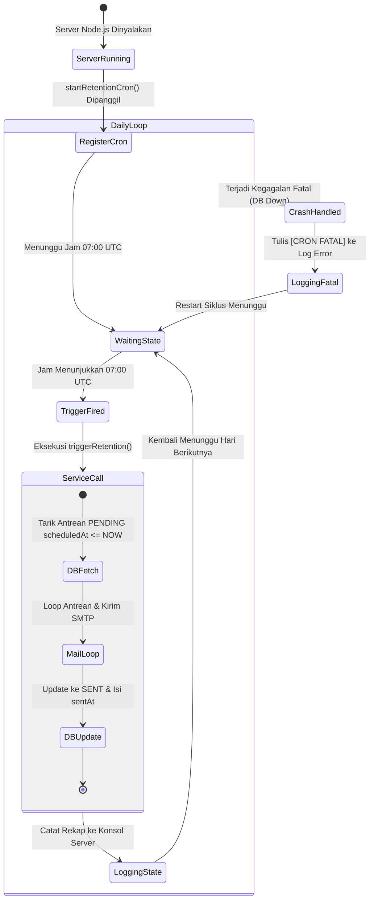

# 📅 Otomatisasi Jadwal Harian (node-cron) — Scheduler

**Status**: ✅ Selesai | **Priority Order**: #7.4

---

## 📌 Deskripsi Fitur
Sistem pelacakan kognitif jangka panjang membutuhkan mekanisme pengiriman otomatis tanpa intervensi manual dari administrator kebun binatang. Kuis retensi H+7 (`RETENTION_1W`) dan H+30 (`RETENTION_1M`) wajib dikirimkan tepat waktu setelah jatuh tempo.

Untuk memenuhi kebutuhan ini, **EIS Engine** mengintegrasikan modul penjadwal otomatis terpusat (*Centralized Scheduler*) di latar belakang menggunakan pustaka **`node-cron`**. Penjadwal ini bekerja secara asinkron sejak server backend dinyalakan untuk memeriksa, memproses, dan memicu pengiriman email kuis retensi yang jatuh tempo setiap harinya.

---

## ⚙️ Spesifikasi Penjadwal (Cron Expression)

Penjadwal dikonfigurasikan pada berkas `src/scheduler/retention.scheduler.js` menggunakan sintaks ekspresi cron standar:

| Komponen | Spesifikasi |
| :--- | :--- |
| **Sintaks Ekspresi Cron** | `0 7 * * *` |
| **Interval Eksekusi** | Setiap hari sekali pada pukul **07:00 AM UTC** (setara pukul **14:00 WIB** / Waktu Indonesia Barat) |
| **Pustaka Integrasi** | `node-cron` |

---

## 🔄 Diagram Alur Pemrosesan Terjadwal

Berikut adalah visualisasi siklus hidup otomatis dari pemicu penjadwal hingga pengiriman email massal:



---

## 🏆 Aturan Bisnis (Business Rules)

1. **Optimasi Waktu Penerimaan Email (Daily Optimal Timing):**
   Ekspresi cron `0 7 * * *` dipilih secara sengaja untuk mengeksekusi pengiriman pada pukul 14:00 WIB (Waktu Indonesia Barat). Ini merupakan waktu optimal yang disesuaikan dengan psikologi pengunjung kebun binatang yang umumnya membuka kotak surat elektronik mereka pada siang hari setelah jam makan siang.
2. **Resiliensi Kegagalan Tingkat Tinggi (Cron Crash Tolerance):**
   Seluruh pemanggilan asinkron di dalam callback cron dibungkus oleh blok `try/catch` global. Jika terjadi kegagalan fatal pada database PostgreSQL (Supabase) saat jam jatuh tempo tiba, **scheduler tidak akan menghentikan kestabilan server Node.js utama** (aplikasi tidak akan mati/crash). Sistem hanya mencatat pesan log `[CRON FATAL]` dan akan mencoba menjalankan kembali siklus pada keesokan harinya.
3. **Kemudahan Pengujian & Integrasi Staging:**
   Selain mengandalkan pemicu otomatis harian dari scheduler, antrean retensi dapat dipicu secara paksa kapan saja demi mempermudah tim pengembang melakukan pengujian fitur di staging dengan menembak HTTP POST request ke endpoint `/api/v1/retention/trigger` menggunakan otentikasi header `x-cron-secret`.

---

## 🛠️ Referensi Implementasi Kode

Integrasi penjadwal cron diimplementasikan secara bersih pada modul scheduler:

- **Cron Service Entrypoint:** [retention.scheduler.js](file:///home/rafi/Documents/tugas-kuliah/semester4/software%20engginer%20prak/EIS-engine/src/scheduler/retention.scheduler.js)

```javascript
import cron from 'node-cron';
import { triggerRetention } from '../services/retention.service.js';

export const startRetentionCron = () => {
  cron.schedule('0 7 * * *', async () => {
    console.log(`[CRON] Memulai eksekusi antrean email retensi pada: ${new Date().toISOString()}`);
    try {
      const result = await triggerRetention();
      console.log(`[CRON] Selesai. Total antrean: ${result.processedCount}. Sukses: ${result.successCount}. Gagal: ${result.failCount}.`);
    } catch (error) {
      console.error('[CRON FATAL] Error di Cron Retention:', error.message);
    }
  });
};
```

---

## 🧪 Skenario Verifikasi Manual

Karena `node-cron` berjalan secara internal di dalam memori server Node.js, pembuktian keaktifannya diuji melalui pemantauan log konsol server dan keselarasan unit test pada layer service:

1. **Uji Keaktifan In-Memory:**
   * **Metode:** Menjalankan server aplikasi utama (`npm run dev`) dan mengubah sementara ekspresi cron menjadi `* * * * *` (setiap menit) di lingkungan lokal/development.
   * **Hasil Diharapkan:** Konsol server secara berkala mencetak string log `[CRON] Memulai eksekusi antrean email retensi...` setiap menitnya, membuktikan modul scheduler berjalan lancar di latar belakang.
2. **Uji Resiliensi Sistem Unit Test:**
   * **Metode:** Mengeksekusi rangkaian uji unit `npm test tests/retention.test.js`.
   * **Hasil Diharapkan:** Seluruh skenario pengujian pemicu antrean (`triggerRetention`) lulus 100% tanpa adanya *leak* memori atau ketidaksesuaian status.
