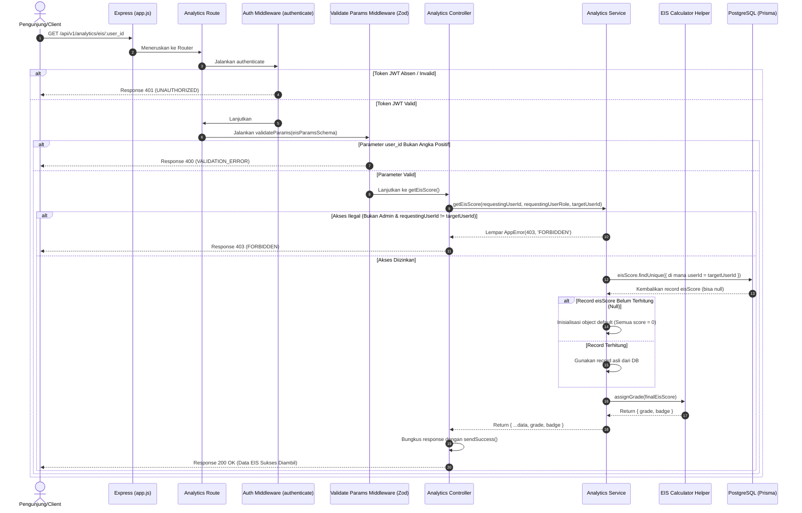

# 📊 Ambil Skor EIS Pengunjung — GET /api/v1/analytics/eis/:user_id

**Status**: ✅ Selesai | **Priority Order**: #8.1

---

## 📌 Deskripsi Fitur
**Educational Index Score (EIS)** adalah profil penilaian pembelajaran kognitif komprehensif multi-pilar yang dihitung oleh sistem **EIS Engine** untuk setiap pengunjung. EIS menilai tiga dimensi utama:
1. **Dimensi Pengetahuan (Cognitive Gain):** Mengukur selisih kuis pra-kunjungan dan pasca-kunjungan.
2. **Dimensi Keaktifan (Active Engagement):** Mengukur durasi kunjungan dan jumlah interaksi media di kandang satwa.
3. **Dimensi Daya Ingat (Memory Retention):** Mengukur hasil kuis ingatan H+7 dan H+30.

Endpoint terproteksi ini digunakan oleh Client untuk memuat rangkuman lengkap skor EIS milik pengunjung bersangkutan. Sistem juga secara otomatis mengonversikan nilai akhir tersebut ke dalam predikat huruf kelulusan (*Grade*) dan tanda kehormatan digital (*Badge*) yang dihitung dinamis di sisi server.

---

## ⚙️ Detail Endpoint

| Komponen | Spesifikasi |
| :--- | :--- |
| **HTTP Method** | `GET` |
| **URL Path** | `/api/v1/analytics/eis/:user_id` |
| **Autentikasi** | ☑ Terproteksi (Memerlukan Bearer JWT Token) |
| **Headers** | `Authorization: Bearer <JWT_TOKEN>` |

---

## 🗂️ Skema Validasi Request (Zod)

Sistem menggunakan pustaka **Zod** untuk memastikan parameter ID pengguna dilewatkan secara aman. Skema didefinisikan pada `src/validators/analytics.validator.js` dalam bentuk `eisParamsSchema`:

```javascript
export const eisParamsSchema = z.object({
  user_id: z.coerce.number().int().positive('user_id harus berupa angka positif')
});
```

### Format Parameter URL
```bash
GET /api/v1/analytics/eis/1
```

---

## 🔄 Diagram Alur Proses (Sequence Diagram)

Berikut adalah visualisasi alur otorisasi kepemilikan dan kalkulasi predikat EIS:



---

## 💾 Konteks Skema Database (Prisma)

Data skor EIS disimpan pada tabel terpusat `eis_scores` yang memuat record historis agregasi pilar evaluasi (`prisma/schema.prisma`):

```prisma
model EisScore {
  id                   Int          @id @default(autoincrement())
  userId               Int          @unique @map("user_id")
  sessionId            Int?         @map("session_id")
  
  // Pilar 1: Pengetahuan (Cognitive)
  preZooScore          Int          @map("pre_zoo_score")
  postZooScore         Int          @map("post_zoo_score")
  knowledgeGainScore   Int          @map("knowledge_gain_score")
  
  // Pilar 2: Ketertarikan (Engagement)
  totalDurationSeconds Int          @map("total_duration_seconds")
  totalExhibitsVisited Int          @map("total_exhibits_visited")
  engagementScore      Int          @map("engagement_score")
  
  // Pilar 3: Daya Ingat (Retention)
  retention1wScore     Int?         @map("retention_1w_score")
  retention1mScore     Int?         @map("retention_1m_score")
  retentionScore       Int          @map("retention_score")
  
  // Akumulasi
  finalEisScore        Int          @map("final_eis_score")
  calculatedAt         DateTime?    @map("calculated_at")
  updatedAt            DateTime     @updatedAt @map("updated_at")

  user                 User         @relation(fields: [userId], references: [id], onDelete: Cascade)
  session              VisitSession? @relation(fields: [sessionId], references: [id], onDelete: SetNull)

  @@map("eis_scores")
}
```

---

## 🏆 Aturan Bisnis (Business Rules)

1. **Aturan Hak Akses Privasi Belajar (Access Control Rules):**
   Rangkuman skor EIS bersifat pribadi. Pengunjung biasa **hanya diizinkan** melihat skor EIS miliknya sendiri (`requestingUserId === targetUserId`). **Hanya Administrator (`role === 'ADMIN'`)** yang dikecualikan dari kepemilikan ini untuk memantau data seluruh pengunjung. Pelanggaran aturan privasi ini melempar error HTTP 403 `FORBIDDEN`.
2. **Penanganan Pengunjung Baru (Zero-Case Initializer):**
   Bagi pengunjung yang baru terdaftar dan belum pernah melakukan petualangan di kebun binatang (sehingga data kueri di database bernilai `null`), sistem **tidak menolak dengan error**. Server secara cerdas mengembalikan data respon ramah dengan default seluruh skor bernilai **`0`** (misalnya `preZooScore: 0`, `finalEisScore: 0`) dengan predikat kelulusan terendah/default.
3. **Konversi Lencana & Grade Dinamis (Server-side Grade Mapping):**
   Sistem menghitung predikat huruf (`grade`) dan lencana penghargaan (`badge`) di sisi server menggunakan helper `assignGrade` berdasarkan skor akhir `finalEisScore` skala 0-100:
   * **Skor $\ge 80$:** Grade **`A`**, Badge **`"Penjelajah Konservasi"`**
   * **Skor $60 - 79$:** Grade **`B`**, Badge **`"Pecinta Satwa"`**
   * **Skor $40 - 59$:** Grade **`C`**, Badge **`"Pengamat Fauna"`**
   * **Skor $< 40$:** Grade **`D`**, Badge **`"Pemula Hijau"`**

---

## 📥 Format Response Sukses (200 OK)

### 1. Contoh Response dengan Data EIS Terhitung
```json
{
  "success": true,
  "message": "Data skor EIS berhasil diambil",
  "data": {
    "userId": 1,
    "sessionId": 1,
    "preZooScore": 40,
    "postZooScore": 80,
    "knowledgeGainScore": 40,
    "totalDurationSeconds": 5400,
    "totalExhibitsVisited": 7,
    "engagementScore": 88,
    "retention1wScore": 80,
    "retention1mScore": 70,
    "retentionScore": 75,
    "finalEisScore": 85,
    "calculatedAt": "2026-05-30T12:06:07.000Z",
    "updatedAt": "2026-05-30T12:06:07.000Z",
    "grade": "A",
    "badge": "Penjelajah Konservasi"
  }
}
```

### 2. Contoh Response untuk Pengunjung Baru (Belum Memiliki Record DB)
```json
{
  "success": true,
  "message": "Data skor EIS berhasil diambil",
  "data": {
    "userId": 1,
    "sessionId": null,
    "preZooScore": 0,
    "postZooScore": 0,
    "knowledgeGainScore": 0,
    "totalDurationSeconds": 0,
    "totalExhibitsVisited": 0,
    "engagementScore": 0,
    "retention1wScore": null,
    "retention1mScore": null,
    "retentionScore": 0,
    "finalEisScore": 0,
    "calculatedAt": null,
    "updatedAt": null,
    "grade": "D",
    "badge": "Pemula Hijau"
  }
}
```

---

## ⚠️ Penanganan Error & Pengecualian

### 1. HTTP 400 Bad Request — `VALIDATION_ERROR`
Terjadi jika format parameter `user_id` di URL bukan berupa bilangan bulat positif.
```json
{
  "success": false,
  "code": "VALIDATION_ERROR",
  "message": "user_id harus berupa angka positif"
}
```

### 2. HTTP 403 Forbidden — `FORBIDDEN`
Terjadi jika pengunjung biasa mencoba membobol atau mengintip skor EIS milik pengguna lain.
```json
{
  "success": false,
  "code": "FORBIDDEN",
  "message": "Anda tidak memiliki akses untuk melihat skor EIS user lain"
}
```

---

## 🛠️ Referensi Implementasi Kode

- **Routing Layer:** [analytics.routes.js](file:///home/rafi/Documents/tugas-kuliah/semester4/software%20engginer%20prak/EIS-engine/src/routes/analytics.routes.js#L14)
- **Validation Schema:** [analytics.validator.js](file:///home/rafi/Documents/tugas-kuliah/semester4/software%20engginer%20prak/EIS-engine/src/validators/analytics.validator.js#L3-L5)
- **Controller Handler:** [analytics.controller.js](file:///home/rafi/Documents/tugas-kuliah/semester4/software%20engginer%20prak/EIS-engine/src/controllers/analytics.controller.js#L4-L16)
- **Service Layer Logic:** [analytics.service.js](file:///home/rafi/Documents/tugas-kuliah/semester4/software%20engginer%20prak/EIS-engine/src/services/analytics.service.js#L5-L64)
- **Grade Helper Utility:** [eisCalculator.js](file:///home/rafi/Documents/tugas-kuliah/semester4/software%20engginer%20prak/EIS-engine/src/utils/eisCalculator.js)

---

## 🧪 Skenario Uji Coba (Test Cases)

Semua pengujian untuk skor EIS diimplementasikan di [analytics.test.js](file:///home/rafi/Documents/tugas-kuliah/semester4/software%20engginer%20prak/EIS-engine/tests/analytics.test.js#L143-L222):

1. **Skenario Positif:**
   * **Deskripsi:** Memanggil skor EIS menggunakan token JWT milik sendiri dan target `user_id` yang sesuai serta memiliki data di database.
   * **Hasil Diharapkan:** HTTP Status `200 OK`, `success: true`, mengembalikan data EIS lengkap serta properti `grade` dan `badge` terhitung sah.
2. **Skenario Positif — Kasus Pengunjung Baru:**
   * **Deskripsi:** Menarik skor EIS milik sendiri ketika record data belum terbuat di database (bernilai `null` di kueri Prisma).
   * **Hasil Diharapkan:** HTTP Status `200 OK`, `success: true`, payload data mengembalikan skor awal berformat angka `0` dengan aman.
3. **Skenario Negatif — Pelanggaran Otorisasi Privasi:**
   * **Deskripsi:** Menggunakan token JWT milik user 2 untuk melihat parameter `:user_id` milik user 1.
   * **Hasil Diharapkan:** HTTP Status `403 Forbidden`, `success: false`, `code: "FORBIDDEN"`.
4. **Skenario Positif — Admin Bebas Akses:**
   * **Deskripsi:** Menggunakan token JWT admin (role `ADMIN`) untuk menembak parameter `:user_id` milik pengunjung biasa mana pun.
   * **Hasil Diharapkan:** HTTP Status `200 OK`, `success: true`, data EIS pengunjung terkait berhasil dimuat.
