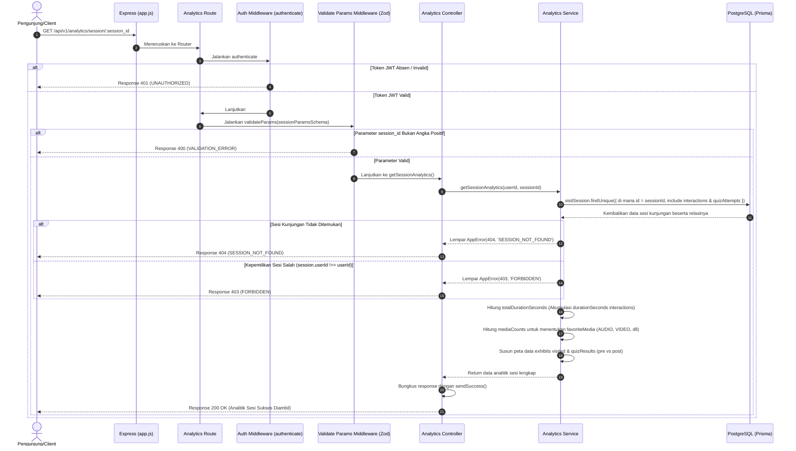

# 📈 Analitik Detil Sesi Kunjungan — GET /api/v1/analytics/session/:session_id

**Status**: ✅ Selesai | **Priority Order**: #8.2

---

## 📌 Deskripsi Fitur
Setiap kali pengunjung masuk dan beraktivitas di kebun binatang, sistem merekam perjalanannya di bawah satu payung sesi kunjungan (`VisitSession`). 

Endpoint terproteksi ini digunakan oleh Client untuk memuat analisis mendalam (*deep analytics*) mengenai satu sesi kunjungan spesifik pengunjung. Respon data menyajikan ringkasan performa yang kaya: total durasi belajar, total area kandang yang dikunjungi, jenis media edukasi yang paling disukai/sering diklik, riwayat kandang beserta log simulator sains, hingga performa kognitif kuis pra-kunjungan (`PRE_ZOO`) dan pasca-kunjungan (`POST_ZOO`).

---

## ⚙️ Detail Endpoint

| Komponen | Spesifikasi |
| :--- | :--- |
| **HTTP Method** | `GET` |
| **URL Path** | `/api/v1/analytics/session/:session_id` |
| **Autentikasi** | ☑ Terproteksi (Memerlukan Bearer JWT Token) |
| **Headers** | `Authorization: Bearer <JWT_TOKEN>` |

---

## 🗂️ Skema Validasi Request (Zod)

Sistem menggunakan middleware **Zod** untuk menyaring parameter ID sesi kunjungan agar terhindar dari input berbahaya atau `NaN`. Skema didefinisikan pada `src/validators/analytics.validator.js` dalam bentuk `sessionParamsSchema`:

```javascript
export const sessionParamsSchema = z.object({
  session_id: z.coerce.number().int().positive('session_id harus berupa angka positif')
});
```

### Format Parameter URL
```bash
GET /api/v1/analytics/session/1
```

---

## 🔄 Diagram Alur Proses (Sequence Diagram)

Berikut adalah visualisasi alur pemuatan relasi sesi, kalkulasi waktu akumulatif, penentuan media terpopuler, dan pengembalian analitik sesi:



---

## 💾 Konteks Skema Database (Prisma)

Analitik sesi dimuat dengan melakukan kueri gabungan (*eager loading*) ke tabel `visit_sessions`, `interactions`, `interactive_lab_logs`, dan `user_quiz_attempts` (`prisma/schema.prisma`):

```prisma
model VisitSession {
  id             Int               @id @default(autoincrement())
  userId         Int               @map("user_id")
  visitDate      DateTime          @map("visit_date") @db.Date
  checkInAt      DateTime          @default(now()) @map("check_in_at")
  checkOutAt     DateTime?         @map("check_out_at")
  isCompleted    Boolean           @default(false) @map("is_completed")
  createdAt      DateTime          @default(now()) @map("created_at")

  interactions   Interaction[]
  quizAttempts   UserQuizAttempt[]
  eisScores      EisScore[]

  @@map("visit_sessions")
}
```

---

## 🏆 Aturan Bisnis (Business Rules)

1. **Proteksi Hak Kepemilikan Sesi (Ownership Enforcement):**
   Analitik sesi menyajikan jejak rekam pergerakan kandang, durasi presisi, serta hasil kuis kognitif personal pengunjung. Demi menjaga kerahasiaan data pribadi, pengunjung **hanya diizinkan** memuat analitik dari sesi kunjungan milik dirinya sendiri (`session.userId === userId`). Jika melanggar, sistem melempar error HTTP 403 `FORBIDDEN`.
2. **Kalkulasi Akumulatif Durasi Belajar Sesi (Cumulative Learning Duration):**
   Total durasi belajar pada ringkasan sesi (`totalDurationSeconds`) dihitung secara dinamis dari akumulasi kolom `durationSeconds` seluruh interaksi kandang yang terekam pada sesi tersebut:
   $$\text{totalDurationSeconds} = \sum (\text{interaction.durationSeconds} \text{ or } 0)$$
3. **Penganalisis Gaya Belajar Terfavorit (Deterministic Favorite Media Selector):**
   Sistem secara cerdas memetakan preferensi gaya belajar pengunjung berdasarkan frekuensi pemutaran/klik jenis media pembelajaran di semua kandang satwa yang dijelajahi:
   - Kolom `clickedAudio`, `clickedVideo`, `clickedVisual` (`IMAGE_INFOGRAPHIC`), dan `clickedInteractive` (`INTERACTIVE_LAB`) dihitung kuantitasnya.
   - Jenis media dengan jumlah klik terbanyak dinobatkan sebagai **`favoriteMedia`**. Jika tidak ada satu pun media yang diklik, favoriteMedia akan bernilai `null`.

---

## 📥 Format Response Sukses (200 OK)

Jika data sesi ditemukan dan lolos verifikasi otorisasi, sistem mengembalikan status **`200 OK`**:

```json
{
  "success": true,
  "message": "Data analitik sesi berhasil diambil",
  "data": {
    "sessionSummary": {
      "sessionId": 1,
      "userId": 1,
      "visitDate": "2026-05-15T00:00:00.000Z",
      "checkInAt": "2026-05-15T08:30:00.000Z",
      "checkOutAt": "2026-05-15T14:00:00.000Z",
      "isCompleted": true,
      "totalDurationSeconds": 1620,
      "totalExhibitsVisited": 2,
      "favoriteMedia": "AUDIO"
    },
    "exhibits": [
      {
        "interactionId": 1,
        "exhibitId": 3,
        "exhibitName": "Harimau Sumatera",
        "zoneName": "Zona Mamalia",
        "startTime": "2026-05-15T09:00:00.000Z",
        "endTime": "2026-05-15T09:15:00.000Z",
        "durationSeconds": 900,
        "mediaClicked": {
          "audio": true,
          "video": false,
          "visual": false,
          "interactive": true
        },
        "labLogs": []
      },
      {
        "interactionId": 2,
        "exhibitId": 4,
        "exhibitName": "Gajah Sumatra",
        "zoneName": "Zona Mamalia",
        "startTime": "2026-05-15T09:30:00.000Z",
        "endTime": "2026-05-15T09:42:00.000Z",
        "durationSeconds": 720,
        "mediaClicked": {
          "audio": false,
          "video": true,
          "visual": true,
          "interactive": false
        },
        "labLogs": []
      }
    ],
    "quizResults": {
      "preTest": {
        "attemptId": 10,
        "quizId": 1,
        "quizTitle": "Pre Zoo Quiz",
        "totalQuestions": 10,
        "correctAnswers": 4,
        "finalScore": 40,
        "startedAt": "2026-05-15T08:35:00.000Z",
        "completedAt": "2026-05-15T08:45:00.000Z"
      },
      "postTest": {
        "attemptId": 11,
        "quizId": 2,
        "quizTitle": "Post Zoo Quiz",
        "totalQuestions": 10,
        "correctAnswers": 8,
        "finalScore": 80,
        "startedAt": "2026-05-15T13:45:00.000Z",
        "completedAt": "2026-05-15T13:55:00.000Z"
      }
    }
  }
}
```

---

## ⚠️ Penanganan Error & Pengecualian

### 1. HTTP 403 Forbidden — `FORBIDDEN`
Terjadi jika pengunjung mencoba melihat rincian analitik sesi kunjungan milik orang lain.
```json
{
  "success": false,
  "code": "FORBIDDEN",
  "message": "Anda tidak memiliki akses untuk melihat analitik sesi ini"
}
```

### 2. HTTP 404 Not Found — `SESSION_NOT_FOUND`
Terjadi jika ID sesi kunjungan (`session_id`) yang diminta tidak terdaftar di database.
```json
{
  "success": false,
  "code": "SESSION_NOT_FOUND",
  "message": "Sesi kunjungan tidak ditemukan"
}
```

---

## 🛠️ Referensi Implementasi Kode

- **Routing Layer:** [analytics.routes.js](file:///home/rafi/Documents/tugas-kuliah/semester4/software%20engginer%20prak/EIS-engine/src/routes/analytics.routes.js#L17)
- **Validation Schema:** [analytics.validator.js](file:///home/rafi/Documents/tugas-kuliah/semester4/software%20engginer%20prak/EIS-engine/src/validators/analytics.validator.js#L7-L9)
- **Controller Handler:** [analytics.controller.js](file:///home/rafi/Documents/tugas-kuliah/semester4/software%20engginer%20prak/EIS-engine/src/controllers/analytics.controller.js#L18-L29)
- **Service Layer Logic:** [analytics.service.js](file:///home/rafi/Documents/tugas-kuliah/semester4/software%20engginer%20prak/EIS-engine/src/services/analytics.service.js#L66-L191)

---

## 🧪 Skenario Uji Coba (Test Cases)

Semua pengujian untuk analitik sesi diimplementasikan di [analytics.test.js](file:///home/rafi/Documents/tugas-kuliah/semester4/software%20engginer%20prak/EIS-engine/tests/analytics.test.js#L225-L343):

1. **Skenario Positif:**
   * **Deskripsi:** Mengambil detail analitik sesi aktif milik sendiri yang memiliki jejak interaksi kandang dan pengerjaan kuis.
   * **Hasil Diharapkan:** HTTP Status `200 OK`, `success: true`, data sesi lengkap terisi dengan durasi terhitung akurat.
2. **Skenario Positif — Perhitungan Durasi Akumulatif:**
   * **Deskripsi:** Memverifikasi jika properti `totalDurationSeconds` merupakan hasil penjumlahan akurat dari seluruh interaksi kandang.
   * **Hasil Diharapkan:** Properti `totalDurationSeconds` bernilai `1620` (penjumlahan dari `900` detik kandang harimau dan `720` detik kandang gajah).
3. **Skenario Positif — Penentuan Media Terpopuler:**
   * **Deskripsi:** Memverifikasi jika properti `favoriteMedia` dihitung secara benar berdasarkan jumlah klik tertinggi.
   * **Hasil Diharapkan:** Mengembalikan jenis media terpopuler yang sesuai dengan jumlah klik terbanyak (misal `"VIDEO"`).
4. **Skenario Negatif — Pelanggaran Otorisasi Kepemilikan Sesi:**
   * **Deskripsi:** Mengakses `session_id` milik orang lain menggunakan token JWT milik sendiri.
   * **Hasil Diharapkan:** HTTP Status `403 Forbidden`, `success: false`, `code: "FORBIDDEN"`.
5. **Skenario Negatif — ID Sesi Tidak Ditemukan:**
   * **Deskripsi:** Mengirim request untuk ID sesi kunjungan palsu (misalnya `999`).
   * **Hasil Diharapkan:** HTTP Status `404 Not Found`, `success: false`, `code: "SESSION_NOT_FOUND"`.
