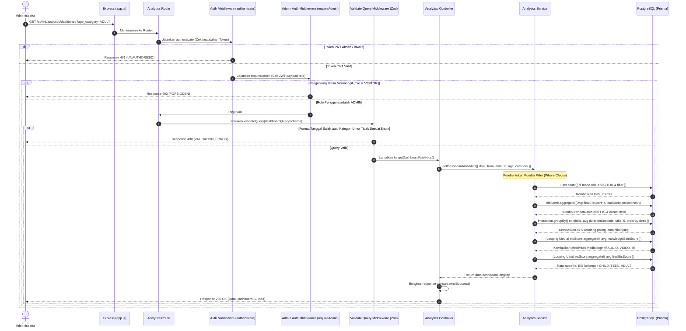

# 🖥️ Dashboard Analitik Eksekutif (Admin) — GET /api/v1/analytics/dashboard

**Status**: ✅ Selesai | **Priority Order**: #8.3

---

## 📌 Deskripsi Fitur
Sebagai alat bantu pengambilan keputusan (*decision support tool*) bagi manajemen kebun binatang, sistem **EIS Engine** menyediakan panel pemantauan analitik terpusat (*Centralized Executive Dashboard*).

Endpoint terproteksi tingkat tinggi ini digunakan oleh petugas Administrator untuk menarik ringkasan data statistik massal pengunjung secara real-time. Data agregasi yang disuguhkan mencakup ringkasan jumlah pengunjung, rata-rata skor EIS, rata-rata durasi kunjungan, daftar 5 kandang satwa terpopuler (berdasarkan durasi), efektivitas media pembelajaran terhadap peningkatan kognitif (*Knowledge Gain*), hingga performa belajar antar kelompok umur pengunjung.

---

## ⚙️ Detail Endpoint

| Komponen | Spesifikasi |
| :--- | :--- |
| **HTTP Method** | `GET` |
| **URL Path** | `/api/v1/analytics/dashboard` |
| **Autentikasi** | ☑ Terproteksi (Memerlukan Bearer JWT Token + Otorisasi Admin) |
| **Headers** | `Authorization: Bearer <JWT_TOKEN>` |

---

## 🗂️ Skema Validasi Request (Zod)

Sistem menggunakan middleware **Zod** untuk menyaring parameter query pencarian (*Query Parameters*) opsional. Skema didefinisikan pada `src/validators/analytics.validator.js` dalam bentuk `dashboardQuerySchema`:

```javascript
export const dashboardQuerySchema = z.object({
  date_from: z.string().regex(/^\d{4}-\d{2}-\d{2}$/, 'Format date_from harus YYYY-MM-DD').optional(),
  date_to: z.string().regex(/^\d{4}-\d{2}-\d{2}$/, 'Format date_to harus YYYY-MM-DD').optional(),
  age_category: z.enum(['CHILD', 'TEEN', 'ADULT'], {
    errorMap: () => ({ message: 'Kategori umur harus berupa CHILD, TEEN, atau ADULT' })
  }).optional()
});
```

### Format Parameter Query URL (Contoh Lengkap)
```bash
GET /api/v1/analytics/dashboard?date_from=2026-01-01&date_to=2026-12-31&age_category=ADULT
```

### Rincian Aturan Validasi Field Query
1. **`date_from`** (String, Optional):
   - Tanggal batas awal kunjungan. Wajib berformat string ISO **`YYYY-MM-DD`** (misal `"2026-05-01"`).
2. **`date_to`** (String, Optional):
   - Tanggal batas akhir kunjungan. Wajib berformat string ISO **`YYYY-MM-DD`**.
3. **`age_category`** (Enum, Optional):
   - Membatasi agregasi hanya untuk satu kategori usia tertentu: `CHILD`, `TEEN`, atau `ADULT`.

---

## 🔄 Diagram Alur Proses (Sequence Diagram)

Berikut adalah visualisasi alur otorisasi lapis ganda, pemrosesan query filter dinamis, dan kalkulasi agregasi statistik massal:



---

## 🏆 Aturan Bisnis (Business Rules)

1. **Proteksi Otorisasi Lapis Ganda (Dual-Layer Admin Authentication):**
   Statistik dashboard memuat informasi penting mengenai performa bisnis kebun binatang dan rekapitulasi data massal. Oleh karena itu, endpoint ini dilindungi gerbang berlapis:
   * **`authenticate`:** Memerlukan token JWT yang sah.
   * **`requireAdmin`:** Membaca payload token terdekripsi dan mewajibkan properti `role === 'ADMIN'`. Panggilan dari pengunjung dengan role default `VISITOR` langsung dihadang dengan HTTP 403 `FORBIDDEN`.
2. **Kondisi Penyaringan Dinamis (Dynamic Multi-Filtering Clause):**
   Administrator dibebaskan menyaring dashboard secara interaktif. Sistem mendukung tiga filter opsional: rentang tanggal (`date_from` - `date_to`) dan kategori usia (`age_category`). Seluruh kueri agregasi di database (jumlah pengunjung, rata-rata EIS, 5 kandang terpopuler) otomatis menyesuaikan diri dengan parameter yang aktif.
3. **Penyaring Kandang Satwa Terpopuler (Top Exhibit Selector):**
   Kandang satwa terpopuler dihitung berdasarkan **rata-rata durasi detik** (`durationSeconds`) yang dihabiskan pengunjung di kandang tersebut. Sistem menarik 5 data teratas (`take: 5`) dengan pengurutan menurun (`desc`) dan secara relasional memetakan ID ke nama kandang satwa asli.
4. **Analisis Efektivitas Pembelajaran Media (Media Cognitive Effectiveness Analyser):**
   Sistem memetakan efektivitas tiap tipe media pembelajaran (`AUDIO`, `VIDEO`, `IMAGE_INFOGRAPHIC`, `INTERACTIVE_LAB`) dengan mengukur rata-rata skor peningkatan kognitif (`knowledgeGainScore`) dari sekelompok pengunjung yang memutar/klik media pembelajaran tersebut saat menjelajah kandang.

---

## 📥 Format Response Sukses (200 OK)

Bila diakses oleh Administrator dengan token yang sah, sistem mengembalikan status **`200 OK`**:

```json
{
  "success": true,
  "message": "Dashboard analitik berhasil diambil",
  "data": {
    "summary": {
      "total_visitors": 1250,
      "avg_eis_score": 72.0,
      "avg_duration_minutes": 180.0
    },
    "top_exhibits": [
      {
        "exhibit_id": 3,
        "exhibit_name": "Harimau Sumatera",
        "avg_duration": 900.0
      },
      {
        "exhibit_id": 4,
        "exhibit_name": "Gajah Sumatra",
        "avg_duration": 720.0
      }
    ],
    "media_effectiveness": [
      {
        "media_type": "AUDIO",
        "avg_knowledge_gain": 45.0
      },
      {
        "media_type": "VIDEO",
        "avg_knowledge_gain": 45.0
      },
      {
        "media_type": "IMAGE_INFOGRAPHIC",
        "avg_knowledge_gain": 45.0
      },
      {
        "media_type": "INTERACTIVE_LAB",
        "avg_knowledge_gain": 45.0
      }
    ],
    "age_category_performance": [
      {
        "age_category": "CHILD",
        "avg_eis_score": 72.0
      },
      {
        "age_category": "TEEN",
        "avg_eis_score": 72.0
      },
      {
        "age_category": "ADULT",
        "avg_eis_score": 72.0
      }
    ]
  }
}
```

---

## ⚠️ Penanganan Error & Pengecualian

### 1. HTTP 400 Bad Request — `VALIDATION_ERROR`
Terjadi jika format parameter filter tanggal keliru (bukan YYYY-MM-DD) atau kategori usia tidak terdaftar pada enum.
```json
{
  "success": false,
  "code": "VALIDATION_ERROR",
  "message": "Format date_from harus YYYY-MM-DD"
}
```

### 2. HTTP 403 Forbidden — `FORBIDDEN`
Terjadi jika pengunjung biasa (`role === 'VISITOR'`) mencoba membobol dashboard panel administrator.
```json
{
  "success": false,
  "code": "FORBIDDEN",
  "message": "Akses ditolak. Endpoint ini hanya untuk Administrator."
}
```

---

## 🛠️ Referensi Implementasi Kode

- **Routing Layer:** [analytics.routes.js](file:///home/rafi/Documents/tugas-kuliah/semester4/software%20engginer%20prak/EIS-engine/src/routes/analytics.routes.js#L11)
- **Validation Schema:** [analytics.validator.js](file:///home/rafi/Documents/tugas-kuliah/semester4/software%20engginer%20prak/EIS-engine/src/validators/analytics.validator.js#L11-L17)
- **Admin Auth Middleware:** [adminAuth.middleware.js](file:///home/rafi/Documents/tugas-kuliah/semester4/software%20engginer%20prak/EIS-engine/src/middleware/adminAuth.middleware.js)
- **Controller Handler:** [analytics.controller.js](file:///home/rafi/Documents/tugas-kuliah/semester4/software%20engginer%20prak/EIS-engine/src/controllers/analytics.controller.js#L31-L41)
- **Service Layer Logic:** [analytics.service.js](file:///home/rafi/Documents/tugas-kuliah/semester4/software%20engginer%20prak/EIS-engine/src/services/analytics.service.js#L193-L359)

---

## 🧪 Skenario Uji Coba (Test Cases)

Semua pengujian untuk dashboard admin diimplementasikan di [analytics.test.js](file:///home/rafi/Documents/tugas-kuliah/semester4/software%20engginer%20prak/EIS-engine/tests/analytics.test.js#L346-L457):

1. **Skenario Positif:**
   * **Deskripsi:** Mengakses dashboard analitik menggunakan token JWT admin (`role = 'ADMIN'`) tanpa filter.
   * **Hasil Diharapkan:** HTTP Status `200 OK`, `success: true`, mengembalikan statistik agregasi massal `summary`, `top_exhibits`, `media_effectiveness`, dan `age_category_performance`.
2. **Skenario Positif — Penyaringan Rentang Tanggal:**
   * **Deskripsi:** Memanggil dashboard menggunakan token admin dengan query parameter rentang tanggal `date_from` dan `date_to` yang valid.
   * **Hasil Diharapkan:** HTTP Status `200 OK`, `success: true`, kueri database pada Prisma (`count` dan `aggregate`) berjalan membawa payload filter tanggal.
3. **Skenario Positif — Penyaringan Kategori Usia:**
   * **Deskripsi:** Memanggil dashboard menggunakan token admin dengan filter `age_category = 'ADULT'`.
   * **Hasil Diharapkan:** HTTP Status `200 OK`, `success: true`, kueri database pada Prisma berjalan menyaring record usia dewasa.
4. **Skenario Negatif — Pembatasan Pengunjung Biasa:**
   * **Deskripsi:** Mencoba menembak endpoint dashboard admin menggunakan token JWT ber-role pengunjung (`role = 'VISITOR'`).
   * **Hasil Diharapkan:** HTTP Status `403 Forbidden`, `success: false`, `code: "FORBIDDEN"`.
