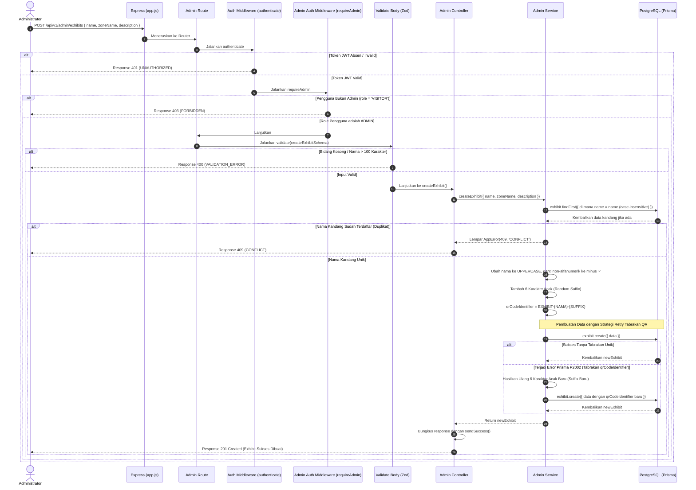

# 🐘 Tambah Kandang Satwa Baru — POST /api/v1/admin/exhibits

**Status**: ✅ Selesai | **Priority Order**: #9.1

---

## 📌 Deskripsi Fitur
Sebagai fondasi pemetaan lokasi fisik satwa di kebun binatang, petugas Administrator harus dapat mendaftarkan kandang satwa baru (`Exhibit`) ke dalam sistem.

Endpoint terproteksi tingkat tinggi ini digunakan untuk membuat record kandang baru. Di layer Service, sistem secara otomatis men-generate **QR Code Identifier terstandarisasi** untuk kandang tersebut. QR Code ini nantinya dicetak sebagai kode QR fisik di depan kandang satwa agar dapat dipindai oleh pengunjung untuk melakukan check-in kunjungan.

---

## ⚙️ Detail Endpoint

| Komponen | Spesifikasi |
| :--- | :--- |
| **HTTP Method** | `POST` |
| **URL Path** | `/api/v1/admin/exhibits` |
| **Autentikasi** | ☑ Terproteksi (Memerlukan Bearer JWT Token + Otorisasi Admin) |
| **Headers** | `Authorization: Bearer <JWT_TOKEN>`, `Content-Type: application/json` |

---

## 🗂️ Skema Validasi Request (Zod)

Sistem menggunakan middleware **Zod** untuk menyaring input body request secara ketat. Skema didefinisikan pada `src/validators/admin.validator.js` dalam bentuk `createExhibitSchema`:

```javascript
export const createExhibitSchema = z.object({
  name: z
    .string({ required_error: 'Nama kandang wajib diisi' })
    .min(1, 'Nama kandang wajib diisi')
    .max(100, 'Nama kandang maksimal 100 karakter'),
  zoneName: z
    .string({ required_error: 'Nama zona wajib diisi' })
    .min(1, 'Nama zona wajib diisi')
    .max(50, 'Nama zona maksimal 50 karakter'),
  description: z.string().optional(),
});
```

### Format Payload Request Body (JSON)
```json
{
  "name": "Gajah Sumatra",
  "zoneName": "Zona Mamalia",
  "description": "Kandang gajah sumatra"
}
```

---

## 🔄 Diagram Alur Proses (Sequence Diagram)

Berikut adalah visualisasi alur validasi role admin, pengecekan duplikasi nama secara case-insensitive, dan pembuatan QR Code otomatis:



---

## 💾 Konteks Skema Database (Prisma)

Data kandang satwa disimpan pada tabel `exhibits` yang mendefinisikan kunci unik mutlak pada identifier QR Code (`prisma/schema.prisma`):

```prisma
model Exhibit {
  id               Int                   @id @default(autoincrement())
  name             String                @unique @db.VarChar(100)
  zoneName         String                @map("zone_name") @db.VarChar(50)
  description      String?               @db.Text
  qrCodeIdentifier String                @unique @map("qr_code_identifier") @db.VarChar(150)
  isActive         Boolean               @default(true) @map("is_active")
  createdAt        DateTime              @default(now()) @map("created_at")

  learningContent  LearningPathContent[]
  media            ExhibitMedia[]
  interactions     Interaction[]
  quizzes          Quiz[]

  @@map("exhibits")
}
```

---

## 🏆 Aturan Bisnis (Business Rules)

1. **Aturan Keunikan Nama Kandang (Unique Name Rule):**
   Nama kandang satwa bersifat unik mutlak dan sistem memvalidasinya secara **case-insensitive** (misalnya, mendaftarkan `"Gajah Sumatra"` akan diblokir jika `"gajah sumatra"` sudah terdaftar di database). Pelanggaran aturan keunikan ini memicu HTTP 409 `CONFLICT`.
2. **Generasi QR Code Terstandarisasi (QR Code Identifier Generation):**
   Untuk menyatukan standardisasi pencetakan QR Code fisik kebun binatang, kolom `qrCodeIdentifier` disusun otomatis menggunakan rumus:
   $$\text{qrCodeIdentifier} = \text{"EXHIBIT-"} + \text{nameUppercase} + \text{"-"} + \text{randomSuffix}$$
   Karakter non-alfanumerik pada nama diubah menjadi tanda minus (`-`), dan ditambahkan 6 huruf/angka acak untuk menjamin keunikan mutlak di database.
3. **Strategi Pemulihan Tabrakan Unik (Collision Recovery Strategy):**
   Jika terjadi tabrakan unik (*unique constraint violation*) pada kolom QR Code akibat 6 karakter acak yang tidak sengaja sama (Prisma error code `P2002`), layer Service secara cerdas menangkap error tersebut dan melakukan **percobaan ulang (retry) sebanyak 1 kali secara transparan** dengan men-generate suffix acak yang baru sebelum meneruskan kegagalan ke client.

---

## 📥 Format Response Sukses (201 Created)

Bila kandang baru berhasil disimpan ke database, sistem mengembalikan status **`213 Created`**:

```json
{
  "success": true,
  "message": "Exhibit berhasil dibuat",
  "data": {
    "id": 3,
    "name": "Gajah Sumatra",
    "zoneName": "Zona Mamalia",
    "description": "Kandang gajah sumatra",
    "qrCodeIdentifier": "EXHIBIT-GAJAH-SUMATRA-A3F9X1",
    "isActive": true,
    "createdAt": "2026-05-30T12:07:20.000Z"
  }
}
```

---

## ⚠️ Penanganan Error & Pengecualian

### 1. HTTP 409 Conflict — `CONFLICT`
Terjadi jika nama kandang satwa yang didaftarkan sudah pernah tersimpan di database.
```json
{
  "success": false,
  "code": "CONFLICT",
  "message": "Nama kandang sudah terdaftar"
}
```

### 2. HTTP 400 Bad Request — `VALIDATION_ERROR`
Terjadi jika kolom `name` atau `zoneName` absen, atau panjang karakter melampaui ketentuan skema Zod.
```json
{
  "success": false,
  "code": "VALIDATION_ERROR",
  "message": "Nama kandang wajib diisi"
}
```

---

## 🛠️ Referensi Implementasi Kode

- **Routing Layer:** [admin.routes.js](file:///home/rafi/Documents/tugas-kuliah/semester4/software%20engginer%20prak/EIS-engine/src/routes/admin.routes.js#L19)
- **Validation Schema:** [admin.validator.js](file:///home/rafi/Documents/tugas-kuliah/semester4/software%20engginer%20prak/EIS-engine/src/validators/admin.validator.js#L3)
- **Controller Handler:** [admin.controller.js](file:///home/rafi/Documents/tugas-kuliah/semester4/software%20engginer%20prak/EIS-engine/src/controllers/admin.controller.js#L5)
- **Service Layer Logic:** [admin.service.js](file:///home/rafi/Documents/tugas-kuliah/semester4/software%20engginer%20prak/EIS-engine/src/services/admin.service.js#L16)

---

## 🧪 Skenario Uji Coba (Test Cases)

Semua pengujian untuk pembuatan kandang diimplementasikan di [admin.test.js](file:///home/rafi/Documents/tugas-kuliah/semester4/software%20engginer%20prak/EIS-engine/tests/admin.test.js#L143-L221):

1. **Skenario Positif:**
   * **Deskripsi:** Membuat kandang baru ber-role `ADMIN` membawa nama dan zona yang valid dan belum terdaftar.
   * **Hasil Diharapkan:** HTTP Status `201 Created`, `success: true`, mengembalikan record lengkap beserta kolom `qrCodeIdentifier` yang terisi otomatis.
2. **Skenario Negatif — Duplikasi Nama Kandang:**
   * **Deskripsi:** Mendaftarkan kandang dengan nama yang sudah ada di database (case-insensitive).
   * **Hasil Diharapkan:** HTTP Status `409 Conflict`, `success: false`, `code: "CONFLICT"`.
3. **Skenario Negatif — Pelanggaran Validasi Panjang Input:**
   * **Deskripsi:** Mendaftarkan kandang dengan properti `name` yang memiliki panjang karakter di atas 100 karakter.
   * **Hasil Diharapkan:** HTTP Status `400 Bad Request`, `success: false`, `code: "VALIDATION_ERROR"`.
4. **Skenario Negatif — Pembatasan Akses Pengunjung:**
   * **Deskripsi:** Mencoba membuat kandang menggunakan token JWT ber-role pengunjung (`role = 'VISITOR'`).
   * **Hasil Diharapkan:** HTTP Status `403 Forbidden`, `success: false`, `code: "FORBIDDEN"`.
