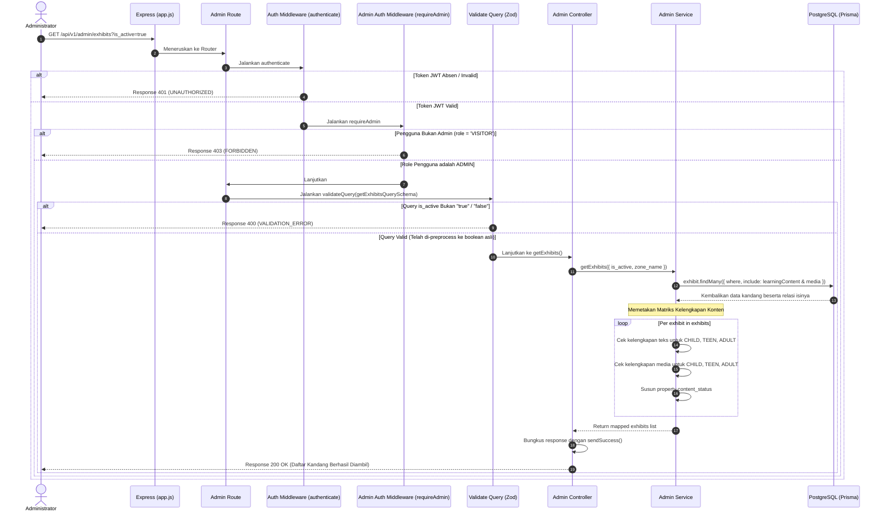

# 📋 Daftar Kandang Satwa & Kelengkapan Konten — GET /api/v1/admin/exhibits

**Status**: ✅ Selesai | **Priority Order**: #9.2

---

## 📌 Deskripsi Fitur
Untuk mengelola kualitas konten edukasi kebun binatang secara berkala, petugas Administrator membutuhkan visibilitas menyeluruh mengenai kandang mana saja yang belum dilengkapi dengan materi teks edukasi maupun media pembelajaran interaktif.

Endpoint terproteksi tingkat tinggi ini digunakan oleh Administrator untuk menarik seluruh daftar kandang satwa dari database. Yang membuat endpoint ini premium adalah penyertaan **Matriks Status Kelengkapan Konten (`content_status`)** secara real-time untuk setiap kategori usia pengunjung (`CHILD`, `TEEN`, `ADULT`) di tiap-tiap kandang. Administrator juga dapat melakukan pemfilteran dinamis berdasarkan status keaktifan kandang dan nama zona.

---

## ⚙️ Detail Endpoint

| Komponen | Spesifikasi |
| :--- | :--- |
| **HTTP Method** | `GET` |
| **URL Path** | `/api/v1/admin/exhibits` |
| **Autentikasi** | ☑ Terproteksi (Memerlukan Bearer JWT Token + Otorisasi Admin) |
| **Headers** | `Authorization: Bearer <JWT_TOKEN>` |

---

## 🗂️ Skema Validasi Request (Zod)

Sistem menggunakan middleware **Zod** dengan pemrosesan awal (*preprocessing*) untuk menyelaraskan query parameter tipe boolean dari string URL. Skema didefinisikan pada `src/validators/admin.validator.js` dalam bentuk `getExhibitsQuerySchema`:

```javascript
export const getExhibitsQuerySchema = z.object({
  is_active: z
    .preprocess((val) => {
      if (typeof val === 'string') {
        const lower = val.trim().toLowerCase();
        if (lower === 'true') return true;
        if (lower === 'false') return false;
      }
      return val;
    }, z.boolean({ invalid_type_error: 'is_active harus berupa boolean' }))
    .optional(),
  zone_name: z.string().optional(),
});
```

### Format Parameter Query URL (Contoh)
```bash
GET /api/v1/admin/exhibits?is_active=true&zone_name=Zona%20Mamalia
```

---

## 🔄 Diagram Alur Proses (Sequence Diagram)

Berikut adalah alur penyaringan parameter query, kueri database dengan gabungan relasi (eager loading), dan penyusunan matriks kelengkapan:



---

## 💾 Konteks Skema Database (Prisma)

Matriks data disusun dinamis dengan menyatukan tabel `exhibits` dengan tabel konten teks `learning_path_contents` dan tabel media edukasi `exhibit_media` (`prisma/schema.prisma`):

```prisma
model LearningPathContent {
  id           Int         @id @default(autoincrement())
  exhibitId    Int         @map("exhibit_id")
  ageCategory  AgeCategory @map("age_category")
  contentTitle String      @map("content_title") @db.VarChar(150)
  contentBody  String      @map("content_body") @db.Text

  exhibit      Exhibit     @relation(fields: [exhibitId], references: [id], onDelete: Cascade)

  @@unique([exhibitId, ageCategory])
  @@map("learning_path_contents")
}

model ExhibitMedia {
  id          Int         @id @default(autoincrement())
  exhibitId   Int         @map("exhibit_id")
  ageCategory AgeCategory @map("age_category")
  mediaType   MediaType   @map("media_type")
  title       String      @db.VarChar(150)
  fileUrl     String      @map("file_url") @db.VarChar(255)

  exhibit     Exhibit     @relation(fields: [exhibitId], references: [id], onDelete: Cascade)

  @@map("exhibit_media")
}
```

---

## 🏆 Aturan Bisnis (Business Rules)

1. **Preprocessing Parameter Boolean (Secure Query Parsing):**
   Zod validator melakukan intercept awal (*preprocess*) pada query `is_active`. Sistem secara ramah mengonversi string `"true"` atau `"TRUE"` menjadi boolean `true`, serta `"false"` atau `"FALSE"` menjadi boolean `false` agar kueri pencarian database Prisma berjalan dengan tipe data native boolean yang sah tanpa error.
2. **Matriks Evaluasi Kualitas Pembelajaran (Age Content Status Matrix):**
   Untuk menyuguhkan visualisasi kelayakan kandang di halaman admin Client, sistem memetakan relasi data menjadi objek `content_status` bersarang (*nested object*):
   * Properti **`text`** (Boolean): Bernilai `true` jika kandang tersebut sudah memiliki materi teks pelajaran (`LearningPathContent`) di kategori usia tersebut.
   * Properti **`media`** (Boolean): Bernilai `true` jika kandang tersebut sudah memiliki materi media interaktif (`ExhibitMedia`) di kategori usia tersebut.
   Ini membantu admin memetakan kurikulum belajar kebun binatang secara instan.

---

## 📥 Format Response Sukses (200 OK)

Jika database memiliki data kandang, sistem mengembalikan status **`200 OK`**:

```json
{
  "success": true,
  "message": "Daftar kandang berhasil diambil",
  "data": [
    {
      "id": 3,
      "name": "Harimau Sumatera",
      "zoneName": "Zona Mamalia",
      "description": "Kandang harimau sumatera",
      "qrCodeIdentifier": "EXHIBIT-HARIMAU-A3F9X",
      "isActive": true,
      "createdAt": "2026-05-30T12:07:20.000Z",
      "content_status": {
        "CHILD": {
          "text": false,
          "media": true
        },
        "TEEN": {
          "text": true,
          "media": false
        },
        "ADULT": {
          "text": true,
          "media": true
        }
      }
    }
  ]
}
```

---

## ⚠️ Penanganan Error & Pengecualian

### 1. HTTP 400 Bad Request — `VALIDATION_ERROR`
Terjadi jika nilai parameter query `is_active` bukan string boolean yang valid (misalnya `is_active=bukanboolean`).
```json
{
  "success": false,
  "code": "VALIDATION_ERROR",
  "message": "is_active harus berupa boolean"
}
```

### 2. HTTP 403 Forbidden — `FORBIDDEN`
Terjadi jika pengunjung biasa mencoba mengintip daftar kontrol panel kandang milik admin.
```json
{
  "success": false,
  "code": "FORBIDDEN",
  "message": "Akses ditolak. Endpoint ini hanya untuk Administrator."
}
```

---

## 🛠️ Referensi Implementasi Kode

- **Routing Layer:** [admin.routes.js](file:///home/rafi/Documents/tugas-kuliah/semester4/software%20engginer%20prak/EIS-engine/src/routes/admin.routes.js#L11)
- **Validation Schema:** [admin.validator.js](file:///home/rafi/Documents/tugas-kuliah/semester4/software%20engginer%20prak/EIS-engine/src/validators/admin.validator.js#L15)
- **Controller Handler:** [admin.controller.js](file:///home/rafi/Documents/tugas-kuliah/semester4/software%20engginer%20prak/EIS-engine/src/controllers/admin.controller.js#L28)
- **Service Layer Logic:** [admin.service.js](file:///home/rafi/Documents/tugas-kuliah/semester4/software%20engginer%20prak/EIS-engine/src/services/admin.service.js#L108)

---

## 🧪 Skenario Uji Coba (Test Cases)

Semua pengujian untuk penarikan daftar kandang diimplementasikan di [admin.test.js](file:///home/rafi/Documents/tugas-kuliah/semester4/software%20engginer%20prak/EIS-engine/tests/admin.test.js#L224-L319):

1. **Skenario Positif:**
   * **Deskripsi:** Menarik seluruh daftar kandang menggunakan token JWT Admin tanpa parameter tambahan.
   * **Hasil Diharapkan:** HTTP Status `200 OK`, `success: true`, mengembalikan daftar kandang lengkap dengan peta properti `content_status` terisi akurat.
2. **Skenario Positif — Filter Keaktifan Kandang:**
   * **Deskripsi:** Menarik daftar kandang dengan query parameter `is_active=true`.
   * **Hasil Diharapkan:** HTTP Status `200 OK`, kueri Prisma berjalan membawa filter `isActive: true`.
3. **Skenario Positif — Filter Nama Zona:**
   * **Deskripsi:** Menarik daftar kandang dengan query parameter `zone_name=Zona Mamalia`.
   * **Hasil Diharapkan:** HTTP Status `200 OK`, kueri Prisma berjalan membawa filter pencarian zona case-insensitive.
4. **Skenario Negatif — Pembatasan Otorisasi Akses:**
   * **Deskripsi:** Mengakses endpoint daftar kandang admin membawa token JWT pengunjung biasa (`role = 'VISITOR'`).
   * **Hasil Diharapkan:** HTTP Status `403 Forbidden`, `success: false`, `code: "FORBIDDEN"`.
