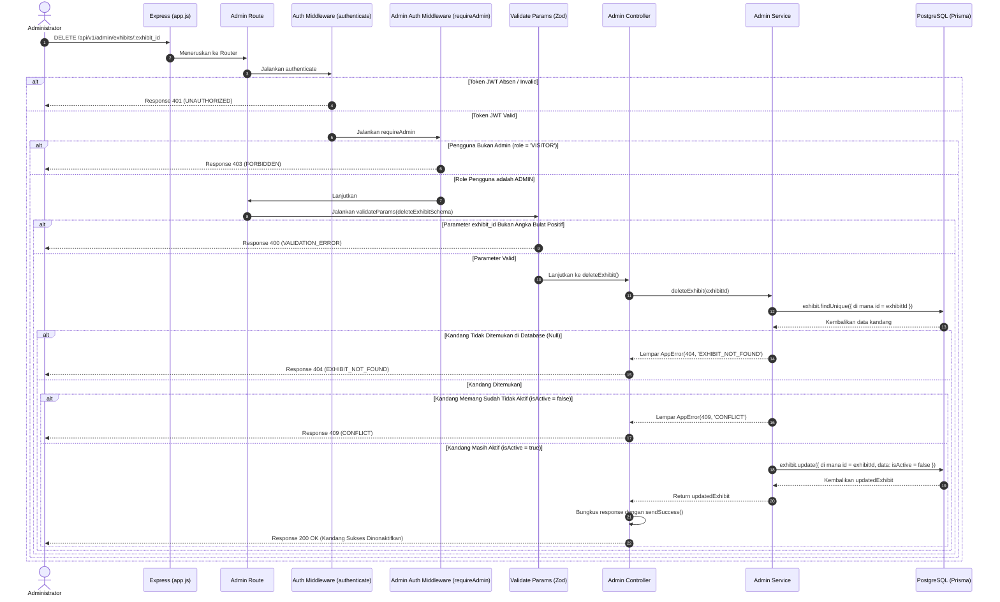

# 🗑️ Nonaktifkan Kandang Satwa (Soft Delete) — DELETE /api/v1/admin/exhibits/:exhibit_id

**Status**: ✅ Selesai | **Priority Order**: #9.3

---

## 📌 Deskripsi Fitur
Apabila terdapat area kandang satwa di kebun binatang yang sedang dalam masa renovasi, satwanya dipindahkan, atau kandang dinonaktifkan secara permanen, petugas Administrator harus dapat menghapus kandang tersebut dari sistem.

Menghapus data kandang secara fisik (`hard delete`) dari database sangat dilarang karena akan merusak integritas data relasional historis kunjungan pengunjung (`interactions` dan `visit_sessions`) di masa lalu. Oleh karena itu, endpoint terproteksi tingkat tinggi ini menerapkan mekanisme **Soft Delete** dengan memperbarui bendera status `isActive` menjadi `false` di database agar kandang tidak lagi dapat diakses oleh pengunjung baru tanpa merusak database historis.

---

## ⚙️ Detail Endpoint

| Komponen | Spesifikasi |
| :--- | :--- |
| **HTTP Method** | `DELETE` |
| **URL Path** | `/api/v1/admin/exhibits/:exhibit_id` |
| **Autentikasi** | ☑ Terproteksi (Memerlukan Bearer JWT Token + Otorisasi Admin) |
| **Headers** | `Authorization: Bearer <JWT_TOKEN>` |

---

## 🗂️ Skema Validasi Request (Zod)

Sistem menggunakan middleware **Zod** untuk menyaring keabsahan format ID kandang pada URL parameter. Skema didefinisikan pada `src/validators/admin.validator.js` dalam bentuk `deleteExhibitSchema`:

```javascript
export const deleteExhibitSchema = z.object({
  exhibit_id: z.coerce.number().int().positive(),
});
```

### Format Parameter URL
```bash
DELETE /api/v1/admin/exhibits/3
```

---

## 🔄 Diagram Alur Proses (Sequence Diagram)

Berikut adalah visualisasi alur pengecekan keberadaan kandang, deteksi status aktif, dan eksekusi pembaruan bendera soft delete:



---

## 🏆 Aturan Bisnis (Business Rules)

1. **Aturan Keamanan Penghapusan Lembut (Soft Delete Safety Pattern):**
   Demi menjaga keutuhan data relasional kebun binatang, data kandang **tidak pernah dihapus secara fisik** dari harddisk database. Sistem merubah kolom bendera `isActive` menjadi `false`. QR Code fisik kandang yang terlanjur dicetak di kebun binatang otomatis ditolak saat dipindai oleh pengunjung baru, namun data kunjungan lama pengunjung di kandang tersebut tetap abadi untuk analisis EIS.
2. **Pencegahan Aksi Ganda (Double Inactivation Conflict Rule):**
   Jika area kandang satwa yang ditargetkan memang sudah tidak aktif (`isActive === false`) di database, server menolak melakukan update ulang ke database dan langsung melempar status HTTP 409 `CONFLICT` untuk menghemat kinerja penulisan database.
3. **Penyaringan Eksistensi Kandang (Existence Enforcement):**
   Jika ID kandang satwa (`exhibit_id`) yang dikirimkan tidak terdaftar pada tabel database, sistem langsung melemparkan error HTTP 404 `EXHIBIT_NOT_FOUND`.

---

## 📥 Format Response Sukses (200 OK)

Bila bendera keaktifan kandang berhasil diperbarui menjadi tidak aktif, sistem mengembalikan status **`200 OK`**:

```json
{
  "success": true,
  "message": "Kandang berhasil dinonaktifkan",
  "data": {
    "id": 3,
    "name": "Harimau Sumatera",
    "zoneName": "Zona Mamalia",
    "description": "Kandang harimau sumatera",
    "qrCodeIdentifier": "EXHIBIT-HARIMAU-A3F9X",
    "isActive": false,
    "createdAt": "2026-05-30T12:07:20.000Z"
  }
}
```

---

## ⚠️ Penanganan Error & Pengecualian

### 1. HTTP 404 Not Found — `EXHIBIT_NOT_FOUND`
Terjadi jika ID kandang satwa (`exhibit_id`) yang ditargetkan tidak terdaftar di database.
```json
{
  "success": false,
  "code": "EXHIBIT_NOT_FOUND",
  "message": "Kandang tidak ditemukan"
}
```

### 2. HTTP 409 Conflict — `CONFLICT`
Terjadi jika kandang satwa yang ditargetkan memang sudah dalam status tidak aktif (`isActive = false`).
```json
{
  "success": false,
  "code": "CONFLICT",
  "message": "Kandang sudah tidak aktif"
}
```

---

## 🛠️ Referensi Implementasi Kode

- **Routing Layer:** [admin.routes.js](file:///home/rafi/Documents/tugas-kuliah/semester4/software%20engginer%20prak/EIS-engine/src/routes/admin.routes.js#L29)
- **Validation Schema:** [admin.validator.js](file:///home/rafi/Documents/tugas-kuliah/semester4/software%20engginer%20prak/EIS-engine/src/validators/admin.validator.js#L29-L31)
- **Controller Handler:** [admin.controller.js](file:///home/rafi/Documents/tugas-kuliah/semester4/software%20engginer%20prak/EIS-engine/src/controllers/admin.controller.js#L47)
- **Service Layer Logic:** [admin.service.js](file:///home/rafi/Documents/tugas-kuliah/semester4/software%20engginer%20prak/EIS-engine/src/services/admin.service.js#L184)

---

## 🧪 Skenario Uji Coba (Test Cases)

Semua pengujian untuk penonaktifan kandang diimplementasikan di [admin.test.js](file:///home/rafi/Documents/tugas-kuliah/semester4/software%20engginer%20prak/EIS-engine/tests/admin.test.js#L322-L397):

1. **Skenario Positif:**
   * **Deskripsi:** Menonaktifkan kandang yang berstatus aktif menggunakan token JWT Admin yang sah.
   * **Hasil Diharapkan:** HTTP Status `200 OK`, `success: true`, properti data `isActive` berubah menjadi `false`.
2. **Skenario Negatif — ID Kandang Tidak Terdaftar:**
   * **Deskripsi:** Mengirim request DELETE dengan ID kandang palsu yang tidak ada di database (misal `999`).
   * **Hasil Diharapkan:** HTTP Status `404 Not Found`, `success: false`, `code: "EXHIBIT_NOT_FOUND"`.
3. **Skenario Negatif — Kandang Memang Sudah Tidak Aktif:**
   * **Deskripsi:** Mengirim request DELETE untuk kandang satwa yang status keaktifannya di database memang sudah bernilai `false`.
   * **Hasil Diharapkan:** HTTP Status `409 Conflict`, `success: false`, `code: "CONFLICT"`.
4. **Skenario Negatif — Parameter ID Bukan Angka:**
   * **Deskripsi:** Mengirim request DELETE membawa parameter `:exhibit_id` bertuliskan huruf (misal `"notanumber"`).
   * **Hasil Diharapkan:** HTTP Status `400 Bad Request`, `success: false`, `code: "VALIDATION_ERROR"`.
