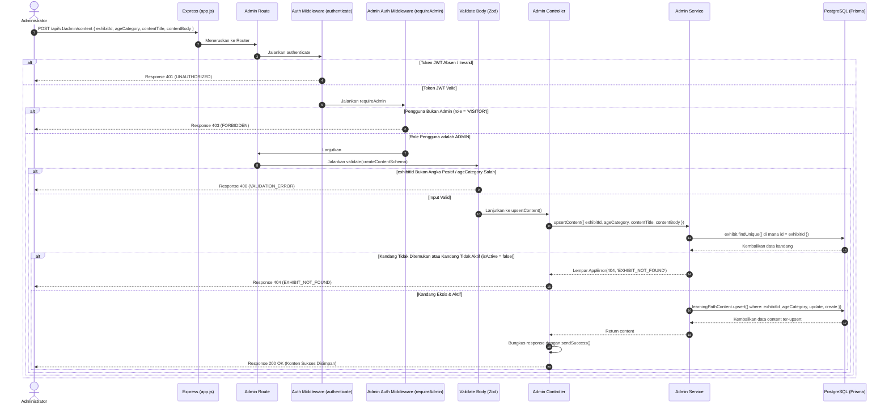

# 📝 Kelola Konten Edukasi Kandang (Upsert) — POST /api/v1/admin/content

**Status**: ✅ Selesai | **Priority Order**: #9.4

---

## 📌 Deskripsi Fitur
Pembelajaran edukatif adaptif di **EIS Engine** menyesuaikan materi teks penjelasan satwa berdasarkan tingkat pemahaman usia pengunjung (`CHILD`, `TEEN`, `ADULT`).

Endpoint terproteksi tingkat tinggi ini digunakan oleh Administrator untuk mengunggah atau memperbarui konten edukasi teks satwa. Untuk menjamin kemudahan pemeliharaan data tanpa memecah logika create dan update di Client, endpoint ini memanfaatkan **Prisma Upsert** atomik berbasis kunci komposit unik. Jika materi untuk kategori usia di kandang tersebut belum terdaftar, sistem akan membuat record baru; jika sudah ada, sistem akan menimpa isinya dengan data terbaru.

---

## ⚙️ Detail Endpoint

| Komponen | Spesifikasi |
| :--- | :--- |
| **HTTP Method** | `POST` |
| **URL Path** | `/api/v1/admin/content` |
| **Autentikasi** | ☑ Terproteksi (Memerlukan Bearer JWT Token + Otorisasi Admin) |
| **Headers** | `Authorization: Bearer <JWT_TOKEN>`, `Content-Type: application/json` |

---

## 🗂️ Skema Validasi Request (Zod)

Sistem menggunakan middleware **Zod** untuk menyeleksi keabsahan payload input body secara ketat. Skema didefinisikan pada `src/validators/admin.validator.js` dalam bentuk `createContentSchema`:

```javascript
export const createContentSchema = z.object({
  exhibitId: z
    .number({ required_error: 'exhibitId wajib diisi' })
    .int('exhibitId harus berupa integer')
    .positive('exhibitId harus berupa angka positif'),
  ageCategory: z.enum(['CHILD', 'TEEN', 'ADULT'], {
    required_error: 'ageCategory wajib diisi',
    invalid_type_error: 'ageCategory harus berupa CHILD, TEEN, atau ADULT',
  }),
  contentTitle: z
    .string({ required_error: 'contentTitle wajib diisi' })
    .min(1, 'contentTitle wajib diisi')
    .max(150, 'contentTitle maksimal 150 karakter'),
  contentBody: z
    .string({ required_error: 'contentBody wajib diisi' })
    .min(1, 'contentBody wajib diisi'),
});
```

### Format Payload Request Body (JSON)
```json
{
  "exhibitId": 3,
  "ageCategory": "ADULT",
  "contentTitle": "Harimau Sumatera & Konservasi",
  "contentBody": "Harimau Sumatera adalah..."
}
```

---

## 🔄 Diagram Alur Proses (Sequence Diagram)

Berikut adalah visualisasi alur validasi gerbang admin, pengecekan keaktifan kandang, dan operasi upsert komposit di database:



---

## 💾 Konteks Skema Database (Prisma)

Data konten edukasi teks diikat menggunakan constraint kunci unik gabungan `exhibitId` dan `ageCategory` pada tabel `learning_path_contents` (`prisma/schema.prisma`):

```prisma
model LearningPathContent {
  id           Int         @id @default(autoincrement())
  exhibitId    Int         @map("exhibit_id")
  ageCategory  AgeCategory @map("age_category")
  contentTitle String      @map("content_title") @db.VarChar(150)
  contentBody  String      @map("content_body") @db.Text

  exhibit      Exhibit     @relation(fields: [exhibitId], references: [id], onDelete: Cascade)

  @@unique([exhibitId, ageCategory])
  @@map("learning_path_contents")
}
```

---

## 🏆 Aturan Bisnis (Business Rules)

1. **Aturan Kandang Wajib Aktif (Active Exhibit Checking):**
   Teks pembelajaran edukasi tidak boleh digantungkan pada kandang hantu yang tidak eksis atau kandang yang sudah dinonaktifkan (`isActive === false`). Sistem secara ketat memeriksa data kandang terlebih dahulu; jika tidak memenuhi kriteria keaktifan, server langsung melempar error HTTP 404 `EXHIBIT_NOT_FOUND`.
2. **Kebijakan Penyimpanan Upsert Atomik (Composite Upsert Policy):**
   Kombinasi field `exhibitId` dan `ageCategory` merupakan kunci komposit unik (`@@unique([exhibitId, ageCategory])`). Sistem memanfaatkan perintah kueri Prisma `upsert` secara atomik di mana:
   - Jika kombinasi kandang + kategori umur belum terdaftar, server **membuat baris baru** (status HTTP `200 OK`).
   - Jika sudah terdaftar, server langsung **memperbarui (overwrite) judul dan teks isi** tanpa membuat record duplikat baru untuk menghemat ruang tabel database.

---

## 📥 Format Response Sukses (200 OK)

Bila konten berhasil ter-upsert (dibuat/diperbarui), sistem mengembalikan status **`200 OK`**:

```json
{
  "success": true,
  "message": "Konten edukasi berhasil disimpan",
  "data": {
    "id": 1,
    "exhibitId": 3,
    "ageCategory": "ADULT",
    "contentTitle": "Harimau Sumatera & Konservasi",
    "contentBody": "Harimau Sumatera adalah...",
    "createdAt": "2026-05-30T12:07:43.000Z",
    "updatedAt": "2026-05-30T12:07:43.000Z"
  }
}
```

---

## ⚠️ Penanganan Error & Pengecualian

### 1. HTTP 404 Not Found — `EXHIBIT_NOT_FOUND`
Terjadi jika ID kandang satwa (`exhibitId`) yang ditargetkan tidak terdaftar atau kandang tersebut berstatus tidak aktif (`isActive = false`).
```json
{
  "success": false,
  "code": "EXHIBIT_NOT_FOUND",
  "message": "Kandang tidak ditemukan"
}
```

### 2. HTTP 400 Bad Request — `VALIDATION_ERROR`
Terjadi jika format inputan body tidak lengkap, tipe data salah, atau `ageCategory` melenceng dari pilihan CHILD, TEEN, ADULT.
```json
{
  "success": false,
  "code": "VALIDATION_ERROR",
  "message": "ageCategory harus berupa CHILD, TEEN, atau ADULT"
}
```

---

## 🛠️ Referensi Implementasi Kode

- **Routing Layer:** [admin.routes.js](file:///home/rafi/Documents/tugas-kuliah/semester4/software%20engginer%20prak/EIS-engine/src/routes/admin.routes.js#L37)
- **Validation Schema:** [admin.validator.js](file:///home/rafi/Documents/tugas-kuliah/semester4/software%20engginer%20prak/EIS-engine/src/validators/admin.validator.js#L33)
- **Controller Handler:** [admin.controller.js](file:///home/rafi/Documents/tugas-kuliah/semester4/software%20engginer%20prak/EIS-engine/src/controllers/admin.controller.js#L60)
- **Service Layer Logic:** [admin.service.js](file:///home/rafi/Documents/tugas-kuliah/semester4/software%20engginer%20prak/EIS-engine/src/services/admin.service.js#L222)

---

## 🧪 Skenario Uji Coba (Test Cases)

Semua pengujian untuk upsert konten diimplementasikan di [admin.test.js](file:///home/rafi/Documents/tugas-kuliah/semester4/software%20engginer%20prak/EIS-engine/tests/admin.test.js#L400-L492):

1. **Skenario Positif — Penyimpanan Record Baru (Create):**
   * **Deskripsi:** Mengirimkan payload konten lengkap untuk kandang aktif yang belum memiliki teks materi di kategori usia tersebut.
   * **Hasil Diharapkan:** HTTP Status `200 OK`, `success: true`, mengembalikan record baru dari database.
2. **Skenario Positif — Penimpaan Record Lama (Update):**
   * **Deskripsi:** Mengirimkan payload baru untuk kombinasi `exhibitId` dan `ageCategory` yang sudah pernah tersimpan di database.
   * **Hasil Diharapkan:** HTTP Status `200 OK`, `success: true`, data lama ter-overwrite dengan sukses tanpa menduplikasi data.
3. **Skenario Negatif — Kandang Satwa Tidak Eksis/Tidak Aktif:**
   * **Deskripsi:** Mengunggah materi untuk ID kandang palsu yang tidak terdaftar di database (misal `999`).
   * **Hasil Diharapkan:** HTTP Status `404 Not Found`, `success: false`, `code: "EXHIBIT_NOT_FOUND"`.
4. **Skenario Negatif — Pelanggaran Otorisasi Akses:**
   * **Deskripsi:** Mengunggah konten edukasi membawa token JWT pengunjung biasa (`role = 'VISITOR'`).
   * **Hasil Diharapkan:** HTTP Status `403 Forbidden`, `success: false`, `code: "FORBIDDEN"`.
