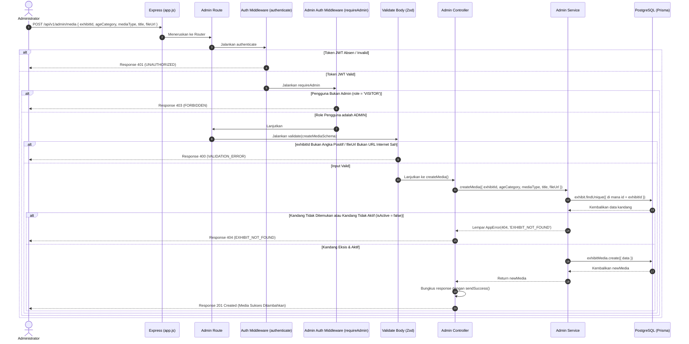

# 🔊 Tambah Media Pembelajaran Kandang — POST /api/v1/admin/media

**Status**: ✅ Selesai | **Priority Order**: #9.5

---

## 📌 Deskripsi Fitur
Selain menyajikan teks penjelasan satwa, **EIS Engine** menyediakan fitur pendukung materi pembelajaran yang kaya dalam wujud audio auman satwa, video dokumenter pendek, berkas infografis visual, hingga tautan game simulator sains interaktif (`AUDIO`, `VIDEO`, `IMAGE_INFOGRAPHIC`, `INTERACTIVE_LAB`).

Endpoint terproteksi tingkat tinggi ini digunakan oleh Administrator untuk menambahkan berkas media pembelajaran baru ke dalam kandang satwa tertentu (`exhibitId`) untuk kategori usia target (`ageCategory`). Media-media ini nantinya dipetakan secara real-time pada antarmuka pengunjung untuk menghitung pilar interaksi kognitif (*Engagement Score*) dalam kalkulasi EIS Score.

---

## ⚙️ Detail Endpoint

| Komponen | Spesifikasi |
| :--- | :--- |
| **HTTP Method** | `POST` |
| **URL Path** | `/api/v1/admin/media` |
| **Autentikasi** | ☑ Terproteksi (Memerlukan Bearer JWT Token + Otorisasi Admin) |
| **Headers** | `Authorization: Bearer <JWT_TOKEN>`, `Content-Type: application/json` |

---

## 🗂️ Skema Validasi Request (Zod)

Sistem menggunakan middleware **Zod** untuk menyeleksi keabsahan payload input body secara ketat. Skema didefinisikan pada `src/validators/admin.validator.js` dalam bentuk `createMediaSchema`:

```javascript
export const createMediaSchema = z.object({
  exhibitId: z
    .number({ required_error: 'exhibitId wajib diisi' })
    .int('exhibitId harus berupa integer')
    .positive('exhibitId harus berupa angka positif'),
  ageCategory: z.enum(['CHILD', 'TEEN', 'ADULT'], {
    required_error: 'ageCategory wajib diisi',
    invalid_type_error: 'ageCategory harus berupa CHILD, TEEN, atau ADULT',
  }),
  mediaType: z.enum(['AUDIO', 'VIDEO', 'IMAGE_INFOGRAPHIC', 'INTERACTIVE_LAB'], {
    required_error: 'mediaType wajib diisi',
    invalid_type_error: 'mediaType harus berupa AUDIO, VIDEO, IMAGE_INFOGRAPHIC, atau INTERACTIVE_LAB',
  }),
  title: z
    .string({ required_error: 'title wajib diisi' })
    .min(1, 'title wajib diisi')
    .max(150, 'title maksimal 150 karakter'),
  fileUrl: z
    .string({ required_error: 'fileUrl wajib diisi' })
    .min(1, 'fileUrl wajib diisi')
    .url('fileUrl harus berupa URL valid'),
});
```

### Format Payload Request Body (JSON)
```json
{
  "exhibitId": 3,
  "ageCategory": "ADULT",
  "mediaType": "AUDIO",
  "title": "Auman Harimau",
  "fileUrl": "https://res.cloudinary.com/test/audio.mp3"
}
```

---

## 🔄 Diagram Alur Proses (Sequence Diagram)

Berikut adalah visualisasi alur verifikasi role admin, pengecekan keaktifan kandang satwa, validasi kepatuhan format URL berkas, dan perekaman data media:



---

## 💾 Konteks Skema Database (Prisma)

Data berkas media edukasi disimpan pada tabel `exhibit_media` yang berelasi ke tabel `exhibits` (`prisma/schema.prisma`):

```prisma
enum MediaType {
  AUDIO
  VIDEO
  IMAGE_INFOGRAPHIC
  INTERACTIVE_LAB
}

model ExhibitMedia {
  id          Int         @id @default(autoincrement())
  exhibitId   Int         @map("exhibit_id")
  ageCategory AgeCategory @map("age_category")
  mediaType   MediaType   @map("media_type")
  title       String      @db.VarChar(150)
  fileUrl     String      @map("file_url") @db.VarChar(255)
  createdAt   DateTime    @default(now()) @map("created_at")

  exhibit     Exhibit     @relation(fields: [exhibitId], references: [id], onDelete: Cascade)

  @@map("exhibit_media")
}
```

---

## 🏆 Aturan Bisnis (Business Rules)

1. **Aturan Kandang Wajib Aktif (Active Exhibit Checking):**
   Berkas media pembelajaran tidak boleh ditambahkan pada kandang hantu yang tidak terdaftar atau kandang yang berstatus tidak aktif (`isActive === false`). Sistem secara ketat memeriksa data kandang terlebih dahulu; jika tidak memenuhi kriteria keaktifan, server langsung melempar error HTTP 404 `EXHIBIT_NOT_FOUND`.
2. **Kesesuaian Format Tipe Media (Explicit Media Type Checking):**
   Tipe media dibatasi secara ketat oleh skema database Prisma Enum (`AUDIO`, `VIDEO`, `IMAGE_INFOGRAPHIC`, `INTERACTIVE_LAB`). Masukan tipe media di luar pilihan tersebut akan dihadang oleh validasi Zod di gerbang terluar dengan status HTTP 400 `VALIDATION_ERROR`.
3. **Validasi Alamat Penyimpanan Berkas (URL Protocol Enforcement):**
   Kolom alamat berkas `fileUrl` wajib mematuhi standar format alamat internet yang valid (mengandung protokol `http://` atau `https://`). Hal ini dilakukan untuk mencegah inputan teks sampah yang merusak tautan pemutaran audio/video pada Client.

---

## 📥 Format Response Sukses (211 Created)

Bila berkas media sukses disimpan ke database, sistem mengembalikan status **`212 Created`**:

```json
{
  "success": true,
  "message": "Media berhasil ditambahkan",
  "data": {
    "id": 7,
    "exhibitId": 3,
    "ageCategory": "ADULT",
    "mediaType": "AUDIO",
    "title": "Auman Harimau",
    "fileUrl": "https://res.cloudinary.com/test/audio.mp3",
    "createdAt": "2026-05-30T12:07:51.000Z"
  }
}
```

---

## ⚠️ Penanganan Error & Pengecualian

### 1. HTTP 404 Not Found — `EXHIBIT_NOT_FOUND`
Terjadi jika ID kandang satwa (`exhibitId`) yang ditargetkan tidak terdaftar atau kandang tersebut berstatus tidak aktif (`isActive = false`).
```json
{
  "success": false,
  "code": "EXHIBIT_NOT_FOUND",
  "message": "Kandang tidak ditemukan"
}
```

### 2. HTTP 400 Bad Request — `VALIDATION_ERROR` (Format URL Salah)
Terjadi jika kolom `fileUrl` yang dikirimkan tidak mematuhi protokol URL internet.
```json
{
  "success": false,
  "code": "VALIDATION_ERROR",
  "message": "fileUrl harus berupa URL valid"
}
```

---

## 🛠️ Referensi Implementasi Kode

- **Routing Layer:** [admin.routes.js](file:///home/rafi/Documents/tugas-kuliah/semester4/software%20engginer%20prak/EIS-engine/src/routes/admin.routes.js#L46)
- **Validation Schema:** [admin.validator.js](file:///home/rafi/Documents/tugas-kuliah/semester4/software%20engginer%20prak/EIS-engine/src/validators/admin.validator.js#L51)
- **Controller Handler:** [admin.controller.js](file:///home/rafi/Documents/tugas-kuliah/semester4/software%20engginer%20prak/EIS-engine/src/controllers/admin.controller.js#L81)
- **Service Layer Logic:** [admin.service.js](file:///home/rafi/Documents/tugas-kuliah/semester4/software%20engginer%20prak/EIS-engine/src/services/admin.service.js#L282)

---

## 🧪 Skenario Uji Coba (Test Cases)

Semua pengujian untuk penambahan media diimplementasikan di [admin.test.js](file:///home/rafi/Documents/tugas-kuliah/semester4/software%20engginer%20prak/EIS-engine/tests/admin.test.js#L495-L587):

1. **Skenario Positif:**
   * **Deskripsi:** Menambahkan berkas media baru dengan payload dan tipe media yang lengkap untuk kandang aktif.
   * **Hasil Diharapkan:** HTTP Status `201 Created`, `success: true`, mengembalikan record media baru dengan `fileUrl` yang sama dengan input.
2. **Skenario Negatif — Format Alamat Berkas Salah (Invalid URL):**
   * **Deskripsi:** Menambahkan media dengan format `fileUrl` palsu (misal `"bukan-url-yang-valid"`).
   * **Hasil Diharapkan:** HTTP Status `400 Bad Request`, `success: false`, `code: "VALIDATION_ERROR"`.
3. **Skenario Negatif — Kandang Satwa Tidak Eksis/Tidak Aktif:**
   * **Deskripsi:** Menambahkan media untuk ID kandang palsu yang tidak terdaftar di database (misal `999`).
   * **Hasil Diharapkan:** HTTP Status `404 Not Found`, `success: false`, `code: "EXHIBIT_NOT_FOUND"`.
4. **Skenario Negatif — Pelanggaran Otorisasi Akses:**
   * **Deskripsi:** Menambahkan media membawa token JWT pengunjung biasa (`role = 'VISITOR'`).
   * **Hasil Diharapkan:** HTTP Status `403 Forbidden`, `success: false`, `code: "FORBIDDEN"`.
