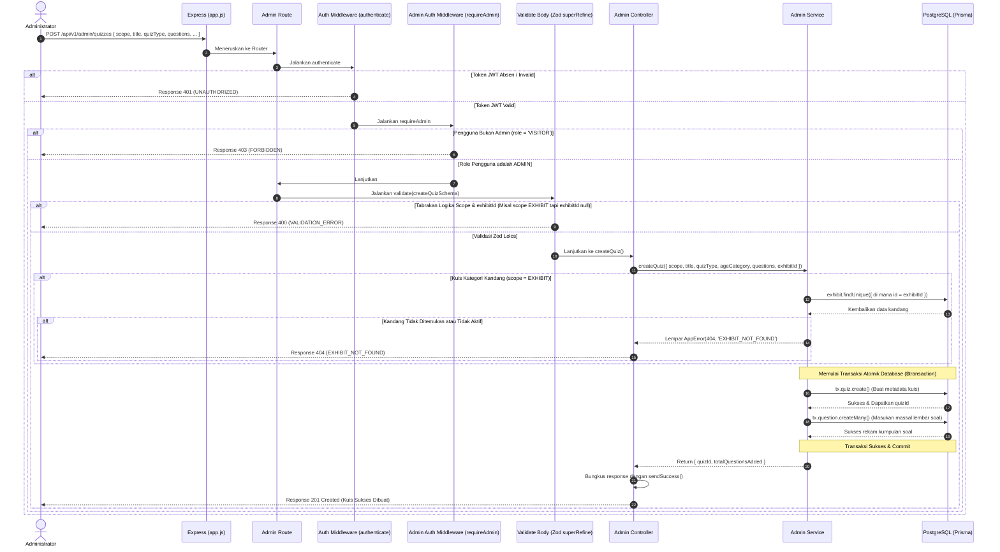

# 📝 Tambah Kuis & Soal Atomik — POST /api/v1/admin/quizzes

**Status**: ✅ Selesai | **Priority Order**: #9.6

---

## 📌 Deskripsi Fitur
Sistem kuis adaptif kognitif di **EIS Engine** membutuhkan pengelolaan materi kuis yang fleksibel untuk kuis pra-kunjungan (`PRE_ZOO`), pasca-kunjungan (`POST_ZOO`), kuis ingatan H+7 (`RETENTION_1W`), maupun H+30 (`RETENTION_1M`).

Endpoint terproteksi tingkat tinggi ini digunakan oleh Administrator untuk mendaftarkan kuis baru beserta rincian kumpulan lembar soal pilihan gandanya secara atomik di database. Yang membuat endpoint ini premium adalah pembungkusan transaksi menggunakan **Prisma `$transaction`** untuk mencegah kuis tersimpan tanpa pertanyaan (kondisi data yatim-piatu), serta validasi komposit Zod (`superRefine`) untuk memastikan kecocokan cakupan wilayah kuis (*Quiz Scope*).

---

## ⚙️ Detail Endpoint

| Komponen | Spesifikasi |
| :--- | :--- |
| **HTTP Method** | `POST` |
| **URL Path** | `/api/v1/admin/quizzes` |
| **Autentikasi** | ☑ Terproteksi (Memerlukan Bearer JWT Token + Otorisasi Admin) |
| **Headers** | `Authorization: Bearer <JWT_TOKEN>`, `Content-Type: application/json` |

---

## 🗂️ Skema Validasi Request (Zod & superRefine)

Sistem menggunakan middleware **Zod** dengan validasi komposit tambahan (`superRefine`) untuk memverifikasi logika kondisional antar kolom. Skema didefinisikan pada `src/validators/admin.validator.js` dalam bentuk `createQuizSchema`:

```javascript
export const createQuizSchema = z
  .object({
    exhibitId: z
      .number({ invalid_type_error: 'exhibitId harus berupa angka' })
      .int('exhibitId harus berupa integer')
      .positive('exhibitId harus berupa angka positif')
      .nullable()
      .optional(),
    scope: z.enum(['GLOBAL', 'EXHIBIT'], {
      required_error: 'scope wajib diisi',
      invalid_type_error: 'scope harus berupa GLOBAL atau EXHIBIT',
    }),
    title: z
      .string({ required_error: 'title wajib diisi' })
      .min(1, 'title wajib diisi')
      .max(150, 'title maksimal 150 karakter'),
    quizType: z.enum(['PRE_ZOO', 'POST_ZOO', 'RETENTION_1W', 'RETENTION_1M'], {
      required_error: 'quizType wajib diisi',
      invalid_type_error: 'quizType harus berupa PRE_ZOO, POST_ZOO, RETENTION_1W, atau RETENTION_1M',
    }),
    ageCategory: z.enum(['CHILD', 'TEEN', 'ADULT'], {
      required_error: 'ageCategory wajib diisi',
      invalid_type_error: 'ageCategory harus berupa CHILD, TEEN, atau ADULT',
    }),
    questions: z
      .array(
        z.object({
          questionText: z
            .string({ required_error: 'questionText wajib diisi' })
            .min(1, 'questionText wajib diisi'),
          optionA: z.string({ required_error: 'optionA wajib diisi' }).min(1, 'optionA wajib diisi'),
          optionB: z.string({ required_error: 'optionB wajib diisi' }).min(1, 'optionB wajib diisi'),
          optionC: z.string({ required_error: 'optionC wajib diisi' }).min(1, 'optionC wajib diisi'),
          optionD: z.string({ required_error: 'optionD wajib diisi' }).min(1, 'optionD wajib diisi'),
          correctOption: z.enum(['A', 'B', 'C', 'D'], {
            required_error: 'correctOption wajib diisi',
            invalid_type_error: 'correctOption harus berupa A, B, C, atau D',
          }),
          points: z
            .number({ invalid_type_error: 'points harus berupa angka' })
            .int('points harus berupa integer')
            .nonnegative('points tidak boleh negatif')
            .default(10)
            .optional(),
        })
      )
      .min(1, 'questions harus berisi minimal 1 item'),
  })
  .superRefine((data, ctx) => {
    if (data.scope === 'EXHIBIT' && (data.exhibitId === undefined || data.exhibitId === null)) {
      ctx.addIssue({
        code: z.ZodIssueCode.custom,
        message: 'exhibitId wajib diisi jika scope adalah EXHIBIT',
        path: ['exhibitId'],
      });
    }
    if (data.scope === 'GLOBAL' && data.exhibitId !== undefined && data.exhibitId !== null) {
      ctx.addIssue({
        code: z.ZodIssueCode.custom,
        message: 'exhibitId harus null jika scope adalah GLOBAL',
        path: ['exhibitId'],
      });
    }
  });
```

### Format Payload Request Body (JSON)
```json
{
  "exhibitId": null,
  "scope": "GLOBAL",
  "title": "Kuis Awal Kebun Binatang — Dewasa",
  "quizType": "PRE_ZOO",
  "ageCategory": "ADULT",
  "questions": [
    {
      "questionText": "Apa status konservasi Harimau Sumatera?",
      "optionA": "Rentan",
      "optionB": "Terancam",
      "optionC": "Kritis",
      "optionD": "Punah",
      "correctOption": "C",
      "points": 10
    }
  ]
}
```

---

## 🔄 Diagram Alur Proses (Sequence Diagram)

Berikut adalah visualisasi alur validasi komposit gerbang Zod, pemeriksaan keaktifan kandang lokal, serta eksekusi transaksi atomik dua arah di database:



---

## 💾 Konteks Skema Database (Prisma)

Proses pembuatan kuis secara relasional merekam metadata kuis pada tabel `quizzes` dan soal pilihan ganda pada tabel `questions` (`prisma/schema.prisma`):

```prisma
model Quiz {
  id          Int               @id @default(autoincrement())
  exhibitId   Int?              @map("exhibit_id")
  scope       QuizScope         @default(GLOBAL)
  title       String            @db.VarChar(100)
  quizType    QuizType          @map("quiz_type")
  ageCategory AgeCategory       @map("age_category")
  createdAt   DateTime          @default(now()) @map("created_at")

  exhibit     Exhibit?          @relation(fields: [exhibitId], references: [id], onDelete: Cascade)
  questions   Question[]
  attempts    UserQuizAttempt[]

  @@map("quizzes")
}

model Question {
  id            Int      @id @default(autoincrement())
  quizId        Int      @map("quiz_id")
  questionText  String   @map("question_text") @db.Text
  optionA       String   @map("option_a") @db.VarChar(100)
  optionB       String   @map("option_b") @db.VarChar(100)
  optionC       String   @map("option_c") @db.VarChar(100)
  optionD       String   @map("option_d") @db.VarChar(100)
  correctOption String   @map("correct_option") @db.VarChar(1)
  points        Int      @default(10)

  quiz          Quiz     @relation(fields: [quizId], references: [id], onDelete: Cascade)

  @@map("questions")
}
```

---

## 🏆 Aturan Bisnis (Business Rules)

1. **Aturan Hak Validasi Cakupan Wilayah (Quiz Scope Constraints):**
   * **Kuis Kandang Lokal (`scope === 'EXHIBIT'`):** Kuis wajib terikat erat pada area satwa tertentu. Administrator wajib melampirkan `exhibitId` bilangan positif yang merujuk pada kandang aktif. Jika `exhibitId` kosong atau tidak aktif, server melempar error.
   * **Kuis Global Sesi (`scope === 'GLOBAL'`):** Kuis ditujukan secara menyeluruh pada aplikasi. Kolom `exhibitId` wajib bernilai **`null`**.
   Aturan kondisional komposit ini dijamin secara mutlak oleh saringan Zod `superRefine` di layer terluar.
2. **Transaksi Atomik Dua Arah (Atomic $transaction):**
   Mengingat pembuatan kuis melibatkan penulisan ke 2 tabel database sekaligus (tabel kuis `quizzes` dan tabel soal `questions` secara massal), penulisan dibungkus di dalam **Prisma `$transaction`**. Jika terjadi kegagalan jaringan atau salah satu soal gagal disimpan (misalnya kunci jawaban melanggar format enum), seluruh transaksi di-rollback penuh sehingga database bersih dari data kuis sampah tanpa soal.
3. **Penyaringan Format Kunci Jawaban Soal (Correct Option Checking):**
   Demi keabsahan penilaian otomatis, kolom kunci jawaban `correctOption` pada tiap soal wajib bernilai tepat satu karakter kapital di antara: **`A`, `B`, `C`, atau `D`**. Sistem langsung memblokir request jika dikirimkan pilihan di luar itu (misal `"E"` atau `"a"` huruf kecil).

---

## 📥 Format Response Sukses (201 Created)

Bila metadata kuis dan kumpulan soal berhasil direkam tanpa cacat transaksi, sistem mengembalikan status **`201 Created`**:

```json
{
  "success": true,
  "message": "Kuis berhasil dibuat",
  "data": {
    "quizId": 1,
    "totalQuestionsAdded": 1
  }
}
```

---

## ⚠️ Penanganan Error & Pengecualian

### 1. HTTP 400 Bad Request — `VALIDATION_ERROR` (Pelanggaran superRefine)
Terjadi jika kolom `scope` bernilai `EXHIBIT` namun `exhibitId` dikirimkan bernilai kosong / `null`.
```json
{
  "success": false,
  "code": "VALIDATION_ERROR",
  "message": "exhibitId wajib diisi jika scope adalah EXHIBIT"
}
```

### 2. HTTP 404 Not Found — `EXHIBIT_NOT_FOUND`
Terjadi jika kuis diset untuk kandang lokal (`EXHIBIT`), namun `exhibitId` tidak terdaftar atau kandang tersebut berstatus tidak aktif.
```json
{
  "success": false,
  "code": "EXHIBIT_NOT_FOUND",
  "message": "Kandang tidak ditemukan"
}
```

---

## 🛠️ Referensi Implementasi Kode

- **Routing Layer:** [admin.routes.js](file:///home/rafi/Documents/tugas-kuliah/semester4/software%20engginer%20prak/EIS-engine/src/routes/admin.routes.js#L55)
- **Validation Schema:** [admin.validator.js](file:///home/rafi/Documents/tugas-kuliah/semester4/software%20engginer%20prak/EIS-engine/src/validators/admin.validator.js#L74)
- **Controller Handler:** [admin.controller.js](file:///home/rafi/Documents/tugas-kuliah/semester4/software%20engginer%20prak/EIS-engine/src/controllers/admin.controller.js#L106)
- **Service Layer Logic:** [admin.service.js](file:///home/rafi/Documents/tugas-kuliah/semester4/software%20engginer%20prak/EIS-engine/src/services/admin.service.js#L334)

---

## 🧪 Skenario Uji Coba (Test Cases)

Semua pengujian untuk pembuatan kuis atomik diimplementasikan di [admin.test.js](file:///home/rafi/Documents/tugas-kuliah/semester4/software%20engginer%20prak/EIS-engine/tests/admin.test.js#L590-L753):

1. **Skenario Positif — Pembuatan Kuis Global:**
   * **Deskripsi:** Membuat kuis baru ber-scope `GLOBAL` (`exhibitId: null`) membawa array lembar soal pilihan ganda yang valid menggunakan token JWT Admin.
   * **Hasil Diharapkan:** HTTP Status `201 Created`, `success: true`, mengembalikan ID kuis terdaftar dan total soal ditambahkan bernilai `1` via `$transaction`.
2. **Skenario Positif — Pembuatan Kuis Kandang (Exhibit):**
   * **Deskripsi:** Membuat kuis ber-scope `EXHIBIT` dikaitkan ke `exhibitId: 3` yang berstatus aktif di database.
   * **Hasil Diharapkan:** HTTP Status `201 Created`, `success: true`, `$transaction` sukses dijalankan di database.
3. **Skenario Negatif — Pelanggaran Logika superRefine (Scope Exhibit but ExhibitId Null):**
   * **Deskripsi:** Mengirim request kuis scope `EXHIBIT` membawa kolom `exhibitId: null`.
   * **Hasil Diharapkan:** HTTP Status `400 Bad Request`, `success: false`, `code: "VALIDATION_ERROR"`.
4. **Skenario Negatif — Kumpulan Soal Kosong:**
   * **Deskripsi:** Mengirim request pembuatan kuis dengan array soal kosong `questions: []`.
   * **Hasil Diharapkan:** HTTP Status `400 Bad Request`, `success: false`, `code: "VALIDATION_ERROR"`.
5. **Skenario Negatif — Pelanggaran Otorisasi Akses:**
   * **Deskripsi:** Menambahkan kuis membawa token JWT pengunjung biasa (`role = 'VISITOR'`).
   * **Hasil Diharapkan:** HTTP Status `403 Forbidden`, `success: false`, `code: "FORBIDDEN"`.
