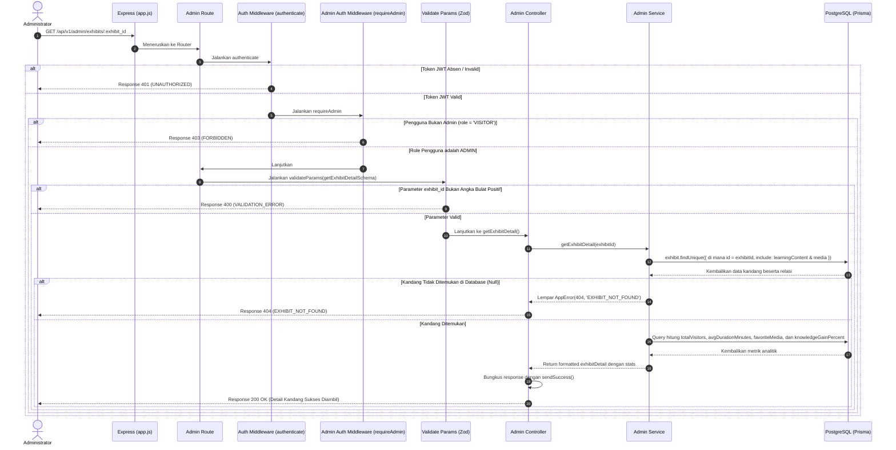

# 🔍 Detail Kandang Satwa (Get Exhibit Detail) — GET /api/v1/admin/exhibits/:exhibit_id

**Status**: ✅ Selesai | **Priority Order**: #9.7

---

## 📌 Deskripsi Fitur
Panel Admin memerlukan detail informasi yang komprehensif tentang suatu kandang satwa untuk ditampilkan pada halaman penyuntingan detail kandang dan pemantauan performa edukasi.

Endpoint ini mengambil seluruh data terkait satu kandang satwa dari database, mencakup:
1. Informasi dasar kandang (nama, zona, deskripsi, QR Code, status keaktifan).
2. Status kelengkapan materi edukasi dan media untuk setiap kategori usia (CHILD, TEEN, ADULT).
3. Relasi data materi pembelajaran (`learningContent`) secara utuh.
4. Relasi data berkas media pembelajaran (`media`) secara utuh.
5. Metrik analitik performa kandang (`stats`), yang dikalkulasi secara dinamis dari tabel log interaksi dan riwayat EIS Score pengunjung.

---

## ⚙️ Detail Endpoint

| Komponen | Spesifikasi |
| :--- | :--- |
| **HTTP Method** | `GET` |
| **URL Path** | `/api/v1/admin/exhibits/:exhibit_id` |
| **Autentikasi** | ☑ Terproteksi (Memerlukan Bearer JWT Token + Otorisasi Admin) |
| **Headers** | `Authorization: Bearer <JWT_TOKEN>` |

---

## 🗂️ Skema Validasi Request (Zod)

Sistem menggunakan middleware **Zod** untuk menyaring keabsahan format ID kandang pada URL parameter. Skema didefinisikan pada `src/validators/admin.validator.js` dalam bentuk `getExhibitDetailSchema`:

```javascript
export const getExhibitDetailSchema = z.object({
  exhibit_id: z.coerce.number().int().positive(),
});
```

### Format Parameter URL
```bash
GET /api/v1/admin/exhibits/3
```

---

## 🔄 Diagram Alur Proses (Sequence Diagram)

Berikut adalah visualisasi alur otentikasi admin, validasi input parameter, pengambilan relasi database PostgreSQL, hingga perhitungan statistik pengunjung:



---

## 🏆 Aturan Bisnis (Business Rules)

1. **Otorisasi Khusus Administrator (Admin Enforcement):**
   Hanya pengguna dengan token JWT yang memiliki peranan `role === 'ADMIN'` yang diperbolehkan mengakses detail data internal ini.
2. **Kalkulasi Metrik Analitik Dinamis (Dynamic Analytics Calculation):**
   * **`totalVisitors`**: Dihitung dari jumlah baris interaksi unik pengunjung pada kandang tersebut.
   * **`avgDurationMinutes`**: Diperoleh dari rata-rata nilai kolom `durationSeconds` (dalam detik) di tabel `interactions` yang dikonversi ke satuan menit terdekat.
   * **`favoriteMedia`**: Ditentukan berdasarkan frekuensi klik jenis media tertinggi (Audio, Video, Infografis, atau Lab) dari data interaksi pengunjung.
   * **`knowledgeGainPercent`**: Rata-rata dari nilai `knowledgeGainScore` pada tabel `eis_scores` yang terkait dengan sesi kunjungan di kandang bersangkutan.
3. **Format Tanggal dan File URL Terstandarisasi:**
   Seluruh relasi media yang dikirimkan menyertakan atribut `created_at` (dalam format ISO string) dan file URL eksternal yang siap dikonsumsi langsung oleh browser frontend.

---

## 📥 Format Response Sukses (200 OK)

Jika data kandang dengan ID yang dikirimkan berhasil ditemukan, sistem akan mengembalikan status **`200 OK`**:

```json
{
  "success": true,
  "message": "Detail kandang berhasil diambil",
  "data": {
    "id": 3,
    "name": "Harimau Sumatera",
    "zone_name": "Zona Mamalia",
    "description": "Kandang harimau sumatera",
    "qr_code_identifier": "EXHIBIT-HARIMAU-A3F9X",
    "is_active": true,
    "created_at": "2026-05-30T12:07:20.000Z",
    "content_status": {
      "CHILD": {
        "text": false,
        "media": true
      },
      "TEEN": {
        "text": true,
        "media": false
      },
      "ADULT": {
        "text": true,
        "media": true
      }
    },
    "media": [
      {
        "id": 7,
        "exhibitId": 3,
        "ageCategory": "ADULT",
        "mediaType": "AUDIO",
        "title": "Auman Harimau",
        "fileUrl": "https://res.cloudinary.com/test/audio.mp3",
        "created_at": "2026-05-30T12:15:00.000Z"
      }
    ],
    "learningContent": [
      {
        "id": 1,
        "exhibitId": 3,
        "ageCategory": "ADULT",
        "contentTitle": "Harimau Sumatera & Konservasi",
        "contentBody": "Harimau Sumatera adalah...",
        "updatedAt": "2026-05-30T12:10:00.000Z"
      }
    ],
    "stats": {
      "totalVisitors": 10,
      "avgDurationMinutes": 10,
      "favoriteMedia": "Audio",
      "knowledgeGainPercent": 40
    }
  }
}
```

---

## ⚠️ Penanganan Error & Pengecualian

### 1. HTTP 404 Not Found — `EXHIBIT_NOT_FOUND`
Terjadi jika ID kandang satwa (`exhibit_id`) yang diminta tidak ditemukan di database.
```json
{
  "success": false,
  "code": "EXHIBIT_NOT_FOUND",
  "message": "Kandang tidak ditemukan"
}
```

### 2. HTTP 400 Bad Request — `VALIDATION_ERROR`
Terjadi jika format parameter ID pada URL path bukan merupakan bilangan bulat positif.
```json
{
  "success": false,
  "code": "VALIDATION_ERROR",
  "message": "Validation failed",
  "errors": [
    {
      "code": "invalid_type",
      "expected": "number",
      "received": "nan",
      "path": ["exhibit_id"],
      "message": "Expected number, received nan"
    }
  ]
}
```

---

## 🛠️ Referensi Implementasi Kode

- **Routing Layer:** [admin.routes.js](file:///home/rafi/Documents/tugas-kuliah/semester4/software%20engginer%20prak/EIS-engine/src/routes/admin.routes.js#L19-L26)
- **Validation Schema:** [admin.validator.js](file:///home/rafi/Documents/tugas-kuliah/semester4/software%20engginer%20prak/EIS-engine/src/validators/admin.validator.js#L33-L35)
- **Controller Handler:** [admin.controller.js](file:///home/rafi/Documents/tugas-kuliah/semester4/software%20engginer%20prak/EIS-engine/src/controllers/admin.controller.js#L43-L57)
- **Service Layer Logic:** [admin.service.js](file:///home/rafi/Documents/tugas-kuliah/semester4/software%20engginer%20prak/EIS-engine/src/services/admin.service.js#L215-L344)

---

## 🧪 Skenario Uji Coba (Test Cases)

Semua pengujian untuk penayangan detail kandang diimplementasikan di [admin.test.js](file:///home/rafi/Documents/tugas-kuliah/semester4/software%20engginer%20prak/EIS-engine/tests/admin.test.js#L764-L826):

1. **Skenario Positif:**
   * **Deskripsi:** Meminta detail kandang menggunakan ID kandang yang sah dengan token JWT Admin.
   * **Hasil Diharapkan:** HTTP Status `200 OK`, `success: true`, mengembalikan data kandang beserta relasi materi, media, dan statistik.
2. **Skenario Negatif — ID Kandang Tidak Terdaftar:**
   * **Deskripsi:** Meminta detail dengan ID kandang yang tidak terdaftar di database (misal `999`).
   * **Hasil Diharapkan:** HTTP Status `404 Not Found`, `success: false`, `code: "EXHIBIT_NOT_FOUND"`.
3. **Skenario Negatif — Parameter ID Bukan Angka:**
   * **Deskripsi:** Meminta detail kandang dengan mengirimkan parameter `:exhibit_id` bertipe huruf (misal `"notanumber"`).
   * **Hasil Diharapkan:** HTTP Status `400 Bad Request`, `success: false`, `code: "VALIDATION_ERROR"`.
4. **Skenario Negatif — Pengguna Bukan Admin:**
   * **Deskripsi:** Meminta detail kandang menggunakan token JWT visitor umum (`role = 'VISITOR'`).
   * **Hasil Diharapkan:** HTTP Status `403 Forbidden`, `success: false`, `code: "FORBIDDEN"`.
